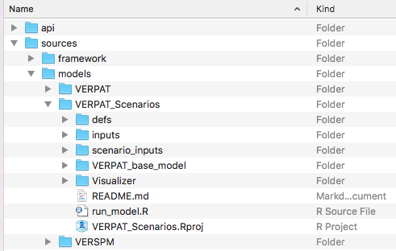
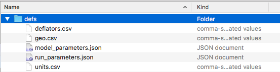
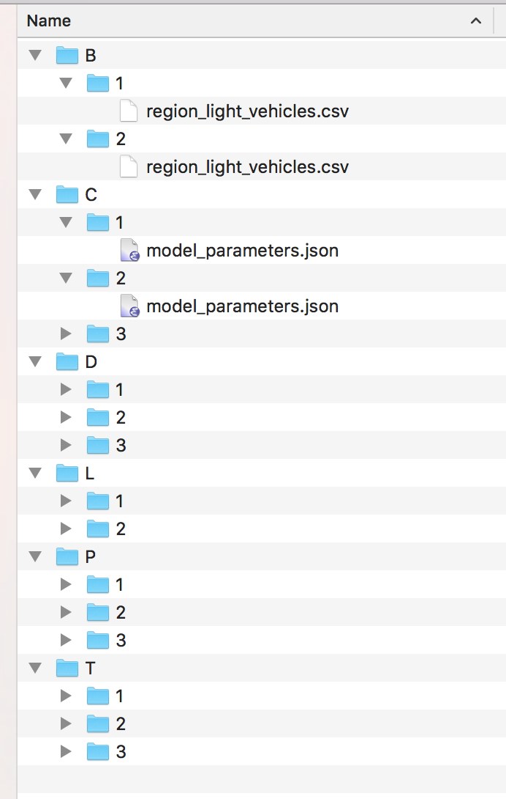
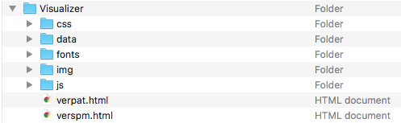
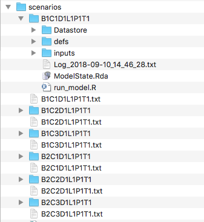
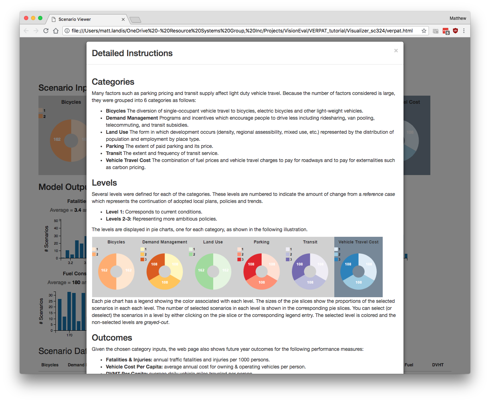
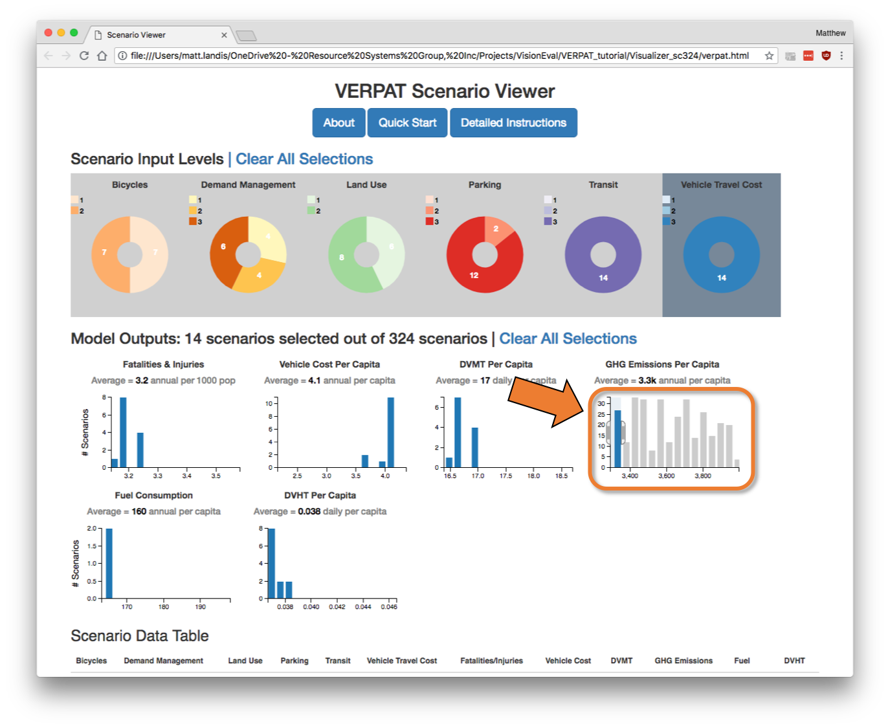
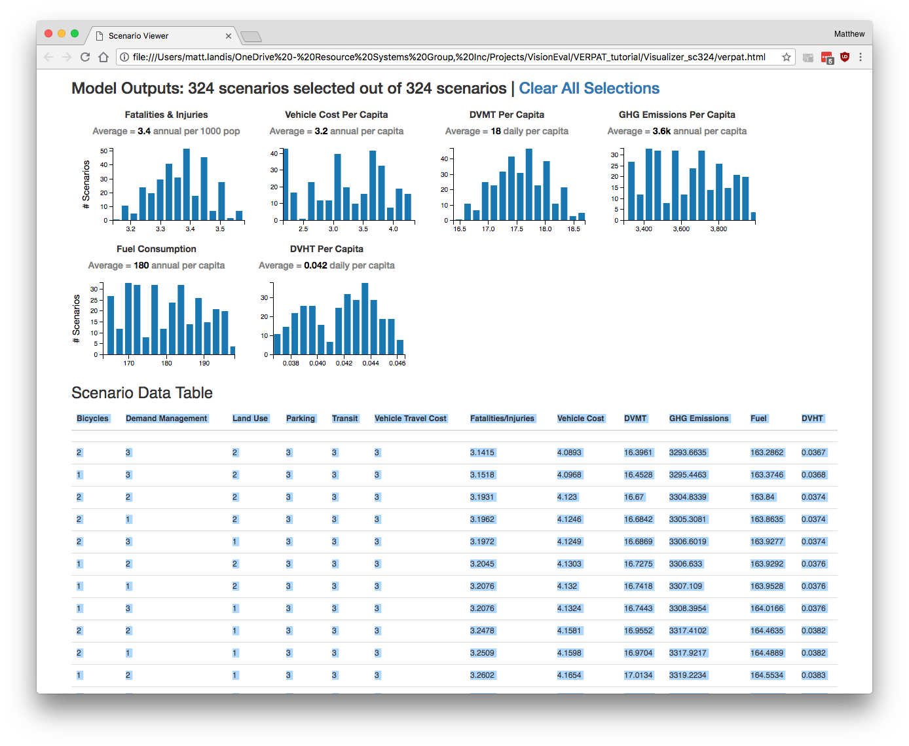

Strategic planning often requires the assessment of large numbers of future scenarios, each assessing a different combination of prioritizations, policy decisions, and constraints.  The [VEScenarios module](https://github.com/visioneval/VisionEval/tree/add_scenario/sources/modules/VEScenario) provides the capability to quickly set up, run, and visualize large numbers of VERPAT scenarios using a baseline scenario combined with multiple changes to model inputs.  The VEScenarios module and a model directory (`VERPAT_Scenarios`) with sample data for Multnomah County, Oregon, are automatically installed when following the [installation instructions](https://github.com/visioneval/VisionEval/wiki/Getting-Started#installation-and-setup).  

### Directory structure

The directory structure for `VERPAT_Scenarios` contains the following files and directories:



#### VERPAT_base_model

The `VERPAT_base_model` directory contains the inputs and R script necessary to run the base scenario, as described in [[Running the Model | VERPAT-Tutorial-Running-the-Model]].  

The `defs` folder holds the [model definition files](https://github.com/visioneval/VisionEval/wiki/VERPAT-Inputs-and-Parameters#model-definition-files) while the `inputs` folder contains [inputs and parameters](https://github.com/visioneval/VisionEval/wiki/VERPAT-Inputs-and-Parameters#input-files) needed for the modules.  The `run_model.R` script calls each of the VERPAT modules in turn.  

#### defs

The `VERPAT_Scenarios/defs` directory contains the same files as the `VERPAT_base_model/defs` directory:



but the `model_parameters.json` file differs between `VERPAT_base_model/defs` and `VERPAT_Scenarios/defs` in that the latter version contains just four parameters specifying the locations of inputs and outputs, as well as the number of processors (`NWorkers`) to use. The default is 4, but be sure to set this to a number appropriate to your machine.


```js
[
  {
    "NAME": "ModelFolder",
    "VALUE": "VERPAT_base_model",
    "TYPE": "character",
    "UNITS": "NA",
    "PROHIBIT": "NA",
    "SIZE": 20,
    "ISELEMENTOF": ""
  },
  {
    "NAME": "ScenarioInputFolder",
    "VALUE": "scenario_inputs",
    "TYPE": "character",
    "UNITS": "NA",
    "PROHIBIT": "NA",
    "SIZE": 20,
    "ISELEMENTOF": ""
  },
  {
    "NAME" : "ScenarioOutputFolder",
    "VALUE": "scenarios",
   "TYPE": "character",
   "UNITS": "NA",
   "PROHIBIT": "NA",
   "SIZE": 20,
   "ISELEMENTOF": ""
  },
  {
    "NAME" : "NWorkers",
    "VALUE": "4",
    "TYPE" : "integer",
    "UNITS" : "NA",
    "PROHIBIT" : "c('NA', '< 0')",
    "ISELEMENTOF" : ""
  }
]
```


#### inputs

The `inputs` folder in `VERPAT_Scenarios` also differs from that in `VERPAT_base_model`.  In this case, there is only a single file specifying the output data tables that should be exported as CSV files in the `outputs` directory.


#### scenario_inputs

Model scenarios are defined in terms of combinations of individual model input parameters and policy choices.  The various inputs are defined in the `scenario_inputs` folder.

Scenario inputs consist of six folders, one for each of a particular category of input, as described below.  All six folders are required.

Within each folder, there are subfolders containing input files, one per specific input. Each of the folders must contain at least one subfolder named "1", defining the input for the base scenario.  Subsequent numbered folders contain input files modifying parameters of interest, as shown in the screenshots below:

Model inputs not otherwise specified in the `scenario_inputs` directory are drawn from files in `VERPAT_base_model/defs` and `VERPAT_base_model/inputs`



The subfolder names and scenario inputs are defined as follows (input file to modify given in parentheses):

  - B - BikesOrLightVehicles (`region_light_vehicles.csv`)
    - 1 - Base TargetProp and PropSuitable
    - 2 - Double TargetProp and PropSuitable
  - C - Cost (`model_parameters.json`)
    - 1 - Base, no charge
    - 2 - 5 cents per mile
    - 3 - 9 cents per mile
  - D - DemandManagement (`region_commute_options.csv`)
    - 1 - Base
    - 2 - Double all participation rates	
    - 3 - Double all participation rates and transit subsidy level
  - L - LandUse (`bzone_pop_emp_prop.csv`)
    - 1 - Base, growth proportions same as base proportions
    - 2 - Half suburban population and employment growth (-20%, -15%), distribute to urban core R/E (+5%, +3.75%), urban core MU (+10%, +7.5%), and close in communities R/E (+5%, +3.75%)
  - P - ParkingGrowth (`marea_parking_growth.csv`)
    - 1 - Base, existing costs and proportions paid
    - 2 - Increase parking fees to 20% of workforce and 20% of other
    - 3 - Same as 2 but double parking cost
  - T - TransportationSupply (`model_parameters.json`)
    - 1 - Base, supply stays at present level
    - 2 - Double transit supply
    - 3 - Triple transit supply

Running all of these input values will result in 324 total scenarios, which would take several hours to half a day to run.  

To test the multi-scenario capability in less time, reduce the number of scenario inputs by deleting some of the numbered folders, making sure to retain the "1" folder for each of the six options.  

For example, a reasonable test would be to generate six scenarios: use two scenarios for Bikes or Light Vehicles (B) and three scenarios for Cost (C):


Note that if you change the directory structure in `scenario_inputs`, you will have to change `category_config.json` and `scenario_config.json` to match the new directory structure.

#### Visualizer

The `Visualizer` folder contains the HTML, CSS, and javascript libraries needed for displaying the output of the VEScenarios module.  



The visualizer will open in a web browser automatically at the end of the model run.  

To view the output manually once the scenarios have been run, open the `verpat.html` file in your web browser. 

#### run_model.R

The `run_model.R` script in this case runs four modules that create the scenarios from the inputs, runs each, combines the results, and visualizes them using the `Visualizer`.  


### Create and run combinations

The `run_model.R` script can be run as described above in [[Running the  Model | VERPAT-Tutorial-Running-the-Model]].  See the [Getting Started document](https://github.com/visioneval/VisionEval/wiki/Getting-Started#running-verpat-or-verspm-from-within-r) for additional details.

The model automatically builds scenarios by creating all possible combinations of settings found in `scenario_inputs`.  The scenarios to run are found in the newly created `scenarios` directory.





Each directory is essentially a copy of `VERPAT_base_model`, with inputs modified as specified in the `scenario_inputs` directory.  Each scenario directory contains the results of a model run with its own inputs, datastore, and log file.


When finished, the VERPAT Scenario Viewer will automatically open to display the results:


[](VERPAT-Tutorial-images/scenario324_all_selected.png)


### Modify inputs

To modify the scenario inputs, the numbered subdirectories can be created or deleted.  Each directory contains a single input file containing the modified model parameter.  


In the screenshots below, the change in bicycle `TargetProp` is increased from 0.2 to 0.4.  


### View output			

Upon completion of the `run_model.R` script, the Scenario Viewer page will automatically open in a browser:


This file, located in `VERPAT_Scenarios/Visualizer/verpat.html`, is an interactive visualization that shows a number of key output variables for all of the scenarios.  

In addition to the graphic display at the top of the page, the data are also displayed as a table, the header of which is just visible at the bottom of the previous screenshot.

Using this viewer, users can select inputs of land use or policies and view their effects on model outputs, and the process can also be reversed, allowing users to choose desired outcomes and view the policy scenarios that reflect those outcomes.  

Instructions for using the viewer are built in to the page itself.  To access a condensed version of the instructions, click on the Quick Start button at the top of the page:


This opens the instructions for selecting scenarios based on inputs or outputs.  


There is also a button for more detailed instructions:


This provides more detail on the available categories of inputs and their levels as well as more detailed descriptions of the model output shown in the bar charts. Instructions for selecting portions of the charts is included too.



To see which policy choices and land use inputs result in desired outcomes, select a range of values within one outcome.  In this case, the low end of the GHG emissions per capita have been selected:



As the outcome is selected, the bar graphs and the data table at the bottom (not shown) update to show only the scenarios resulting in the selected outcome.  In this case, the low end of GHG emissions per capita are associated with the most ambitious scenarios of parking, transit, and vehicle travel cost.  In contrast, demand management strategies appear to have less impact.

It is also possible to select inputs to view the associated outcomes.  To do so, simply click on the bar corresponding to the desired scenario input.  In this case (below), the most ambitious scenario of demand management is selected to view the impacts on outcome variables.  In this case, the highest level of demand management (doubling participation rates in ridesharing and doubling the transit subsidy) only shifts fatalities & injuries from 3.4 to 3.3 per 1000 and daily vehicle miles traveled per capita from 18 to 17.  Other outcome variables are relatively unaffected. 


### Accessing the data

Accessing the input and output data underlying the graphics is conveniently enabled by the data table at the bottom of the Scenario Viewer page:  



The data table automatically updates in response to any selections above, and can be copied and pasted into a spreadsheet using standard copy and paste keyboard short cuts. 

From the Detailed Instructions on the Scenario Viewer:

> To select the data to copy, double-click in the top left-hand cell, press the Shift key, and then click in the bottom right-hand cell. Once the data has been selected, copy it by pressing the Ctrl c keys for a Windows computer or the Command c keys for an Apple Macintosh computer. Paste as unicode text into the spreadsheet of your choice.

[Overview](Main.md)
