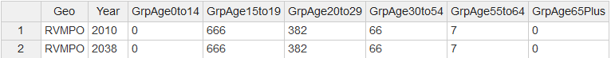
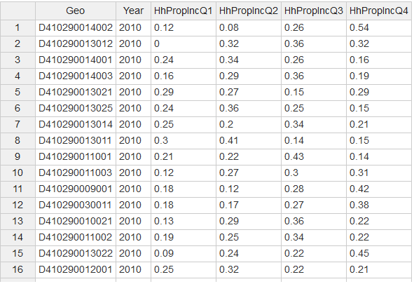
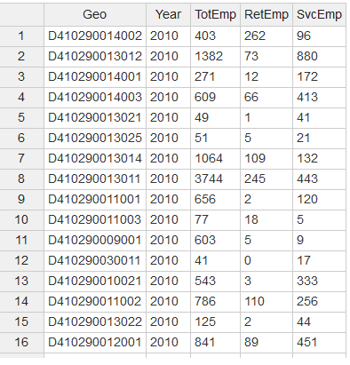
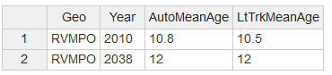

# VERSPM Modules and Outputs
----

The VERSPM model is a compilation of several modules, listed below:

|      MODULE                                                          |     PACKAGE           |
|----------------------------------------------------------------------|-----------------------|
|[CreateHouseholds](#createhouseholds)                                 |VESimHouseholds        |
|[PredictWorkers](#predictworkers)                                     |VESimHouseholds        |
|[AssignLifeCycle](#assignlifecycle)                                   |VESimHouseholds        |
|[PredictIncome](#predictincome)                                       |VESimHouseholds        |
|[PredictHousing](#predicthousing)                                     |VELandUse              |
|[LocateEmployment](#locateemployment)                                 |VELandUse              |
|[AssignLocTypes](#assignloctypes)                                     |VELandUse              |
|[Calculate4DMeasures](#calculate4dmeasures)                           |VELandUse              |
|[CalculateUrbanMixMeasure](#calculateurbanmixmeasure)                 |VELandUse              |
|[AssignParkingRestrictions](#assignparkingrestrictions)               |VELandUse              |
|[AssignDemandManagement](#assigndemandmanagement)                     |VELandUse              |
|[AssignCarSvcAvailability](#assigncarsvcavailability)                 |VELandUse              |
|[AssignTransitService](#assigntransitservice)                         |VETransportSupply      |
|[AssignRoadMiles](#assignroadmiles)                                   |VETransportSupply      |
|[AssignDrivers](#assigndrivers)                                       |VEHouseholdVehicles    |
|[AssignVehicleOwnership](#assignvehicleownership)                     |VEHouseholdVehicles    |
|[AssignVehicleType](#assignvehicletype)                               |VEHouseholdVehicles    |
|[CreateVehicleTable](#createvehicletable)                             |VEHouseholdVehicles    |
|[AssignVehicleAge](#assignvehicleage)                                 |VEHouseholdVehicles    |
|[CalculateVehicleOwnCost](#calculatevehicleowncost)                   |VEHouseholdVehicles    |
|[AdjustVehicleOwnership](#adjustvehicleownership)                     |VEHouseholdVehicles    |
|[CalculateHouseholdDvmt](#calculatehouseholddvmt)                     |VEHouseholdTravel      |
|[CalculateAltModeTrips](#calculatealtmodetrips)                       |VEHouseholdTravel      |
|[CalculateVehicleTrips](#calculatevehicletrips)                       |VEHouseholdTravel      |
|[DivertSovTravel](#divertsovtravel)                                   |VEHouseholdTravel      |
|[Initialize](#initialize-vepowertrainsandfuels)                       |VEPowertrainsAndFuels  |
|[CalculateCarbonIntensity](#calculatecarbonintensity)                 |VEPowertrainsAndFuels  |
|[AssignHhVehiclePowertrain](#assignhhvehiclepowertrain)               |VEPowertrainsAndFuels  |
|[Initialize](#initialize-vetravelperformance)                         |VETravelPerformance    |
|[CalculateBaseRoadDvmt](#calculatebaseroaddvmt)                       |VETravelPerformance    |
|[CalculateFutureRoadDvmt](#calculatefutureroaddvmt)                   |VETravelPerformance    |
|[CalculateRoadPerformance](#calculateroadperformance)                 |VETravelPerformance    |
|[CalculateMpgMpkwhAdjustments](#calculatempgmpkwhadjustments)         |VETravelPerformance    |
|[AdjustHhVehicleMpgMpkwh](#adjusthhvehiclempgmpkwh)                   |VETravelPerformance    |
|[CalculateVehicleOperatingCost](#calculatevehicleoperatingcost)       |VETravelPerformance    |
|[BudgetHouseholdDvmt](#budgethouseholddvmt)                           |VETravelPerformance    |
|[CalculateComEnergyAndEmissions](#calculatecomenergyandemissions)     |VETravelPerformance    |
|[CalculatePtranEnergyAndEmission](#calculateptranenergyandemissions)  |VETravelPerformance    | 
___

Each of these modules use differnet input data. Generally speaking, the VERPSM inputs are classified into the five following categories:

1. **User input model parameters**: These are input parameters (model or scenario specific), defined in [model_parameters.json](#model_parametersjson), that users should review and modify as needed.
2. **Fixed input model parameters**: These are input parameters specific to the model, defined in [model_parameters.json](#model_parametersjson), that users should not typically modify.
3. **User input files**: These are input files (model or scenario specific) that users should review and modify as needed.
4. **Fixed input files**: These are input parameters specific to the model that are fixed.
5. **Internal module inputs**: These are inputs created by other VERSPM modules.

The following section decribes each module, its required inputs, and its generated outputs.

## CreateHouseholds
This module creates simulated households using inputs of population by age group by sumulation year. 

### User Input Files
1. Household population (**_azone_hh_pop_by_age.csv_**): This file contains population estimates/forecasts by age for each of the base and future years. The file format includes number of persons within six age groups:
   * 0-14
   * 15-19
   * 20-29
   * 30-54
   * 55-64
   * 65 Plus

   Here is a snapshot of the file:


2. Household size (**_azone_hhsize_targets.csv_**): This file contains the household-specific targets for the population synthesizer. This file contains two attributes: 
   * **AveHhSize**: Average household size for non-group quarters households
   * **Prop1PerHh**: Proportion of non-group quarters households having only one person

   Here is a snapshot of the file:


3. Group quarter population (**_azone_gq_pop_by_age.csv_**):  This file contains group quarters population estimates/forecasts by age for each of the base and future years. The file format includes number of persons within the following six age categories:
   * 0-14
   * 15-19
   * 20-29
   * 30-54
   * 55-64
   * 65 Plus

   Here is a snapshot of the file:

   
   
### Module Outputs
Households are created with the number of persons in each of six age categories (0-14, 15-19, 20-29, 30-54, 55-64, and 65+) and the total number of persons in the household. Two types of households are created: regular households (i.e. not persons living in group quarters) and group quarters households .

* **HhId**: Unique household ID
* **HhSize**: Number of persons
* **Age0to14**: Persons in 0 to 14 year old age group
* **Age15to19**: Persons in 15 to 19 year old age group
* **Age20to29**: Persons in 20 to 29 year old age group
* **Age30to54**: Persons in 30 to 54 year old age group
* **Age55to64**: Persons in 55 to 64 year old age group
* **Age65Plus**: Persons in 65 or older age group
* **HhType**: Coded household age composition (e.g., `2-1-0-2-0-0`) or `Grp` for group quarters

For more information see [here](https://github.com/gregorbj/VisionEval/blob/898fc016893f5b7dd78507e101c37d04486826b3/sources/modules/VESimHouseholds/inst/module_docs/CreateHouseholds.md)

[Top](#rspm-modules-and-outputs)
___


## PredictWorkers
This module assigns workers by age to households and to non-institutional group quarters population. It is a simple model which predicts workers as a function of the household type and age composition. 

### User Input Files
1. Relative employment (**_azone_relative_employment.csv"_**): This file contains the ratio of workers to persons by age cohort in the model year relative to the model estimation data year. This file contains five age cohorts:
   * **RelEmp15to19**: Ratio of workers to persons age 15 to 19 in model year versus in estimation data year
   * **RelEmp20to29**: Ratio of workers to persons age 20 to 29 in model year versus in estimation data year
   * **RelEmp30to54**: Ratio of workers to persons age 30 to 54 in model year versus in estimation data year
   * **RelEmp55to64**: Ratio of workers to persons age 55 to 64 in model year versus in estimation data year
   * **RelEmp65Plus**: Ratio of workers to persons age 65 or older in model year versus in estimation data year

   Here is a snapshot of the file:


### Internal Module Inputs
|    Package         |      Module                           |   Outputs    | Description                               |
|--------------------|---------------------------------------|--------------|-------------------------------------------|
| VESimHouseholds    | [CreateHouseholds](#createhouseholds) |**Age0to14**  | Persons in 0 to 14 year old age group     |
| VESimHouseholds    | [CreateHouseholds](#createhouseholds) |**Age15to19** | Persons in 15 to 19 year old age group    |
| VESimHouseholds    | [CreateHouseholds](#createhouseholds) |**Age20to29** | Persons in 20 to 29 year old age group    |
| VESimHouseholds    | [CreateHouseholds](#createhouseholds) |**Age30to54** | Persons in 30 to 54 year old age group    |
| VESimHouseholds    | [CreateHouseholds](#createhouseholds) |**Age55to64** | Persons in 55 to 64 year old age group    |
| VESimHouseholds    | [CreateHouseholds](#createhouseholds) |**Age65Plus** | Persons in 65 or older age group          |
| VESimHouseholds    | [CreateHouseholds](#createhouseholds) |**HHType**    | Coded household age composition           |

### Module Outputs
* **Wkr15to19**: Workers in 15 to 19 year old age group
* **Wkr20to29**: Workers in 20 to 29 year old age group
* **Wkr30to54**: Workers in 30 to 54 year old age group
* **Wkr55to64**: Workers in 55 to 64 year old age group
* **Wkr65Plus**: Workers in 65 or older age group
* **Workers**: Total workers
* **NumWkr**: Number of workers residing in the zone

For more information see [here](https://github.com/gregorbj/VisionEval/blob/898fc016893f5b7dd78507e101c37d04486826b3/sources/modules/VESimHouseholds/inst/module_docs/PredictWorkers.md)

[Top](#rspm-modules-and-outputs)
___

## AssignLifeCycle
This module assigns a life cycle category to each household. The life cycle categories are similar, but not the same as, those established for the National Household Travel Survey (NHTS). The age categories used in VisionEval models are broader than those used by the NHTS to identify children of different ages. This is a simple model with set of rules that assigns age group categories based on the age of persons and workers in the household.

### User Input Files
This module has no user input requirements.

### Internal Module Inputs
|    Package         |      Module                           |   Outputs    | Description                               |
|--------------------|---------------------------------------|--------------|-------------------------------------------|
| VESimHouseholds    | [CreateHouseholds](#createhouseholds) |**Age0to14**  | Persons in 0 to 14 year old age group     |
| VESimHouseholds    | [CreateHouseholds](#createhouseholds) |**Age15to19** | Persons in 15 to 19 year old age group    |
| VESimHouseholds    | [CreateHouseholds](#createhouseholds) |**Age20to29** | Persons in 20 to 29 year old age group    |
| VESimHouseholds    | [CreateHouseholds](#createhouseholds) |**Age30to54** | Persons in 30 to 54 year old age group    |
| VESimHouseholds    | [CreateHouseholds](#createhouseholds) |**Age55to64** | Persons in 55 to 64 year old age group    |
| VESimHouseholds    | [CreateHouseholds](#createhouseholds) |**Age65Plus** | Persons in 65 or older age group          |
| VESimHouseholds    | [CreateHouseholds](#createhouseholds) |**HHType**    | Coded household age composition           |
| VESimHouseholds    | [PredictWorkers](#predictworkers)     |**Wrk15to19** | Workers in 15 to 19 year old age group    |
| VESimHouseholds    | [PredictWorkers](#predictworkers)     |**Wrk20to29** | Workers in 20 to 29 year old age group    |
| VESimHouseholds    | [PredictWorkers](#predictworkers)     |**Wrk30to54** | Workers in 30 to 54 year old age group    |
| VESimHouseholds    | [PredictWorkers](#predictworkers)     |**Wrk55to64** | Workers in 55 to 64 year old age group    |
| VESimHouseholds    | [PredictWorkers](#predictworkers)     |**Wrk65Plus** | Workers in 65 or older age group          |

### Module Outputs
* **LifeCycle**: Household life cycle as defined by 2009 NHTS `LIF_CYC` variable

For more information see [here](https://github.com/gregorbj/VisionEval/blob/898fc016893f5b7dd78507e101c37d04486826b3/sources/modules/VESimHouseholds/inst/module_docs/AssignLifeCycle.md)

[Top](#rspm-modules-and-outputs)
___

## PredictIncome
This module predicts the income for each simulated household given the number of workers in each age group and the average per capita income for the `Azone` where the household resides.

### User Input Files
1. Regional income (**_azone_per_cap_inc.csv"_**): This file contains information on regional average per capita household (`HHIncomePC`) and group quarters (`GQIncomePC`) income by forecast year in year 2010 dollars. The data can be obtained from the U.S. Department of Commerce Bureau of Economic Analysis for the current year or from regional or state sources for forecast years. In order to use current year dollars just replace 2010 in column labels with current year. For example, if the data is obtained in year 2015 dollars then the column labels in the file shown below will become `HHIncomePC.2015` and `GQIncomePC.2015`. 

   Here is a snapshot of the file:


### Internal Module Inputs
|    Package         |      Module                           |   Outputs    | Description                               |
|--------------------|---------------------------------------|--------------|-------------------------------------------|
| VESimHouseholds    | [CreateHouseholds](#createhouseholds) |**HHSize**    | Number of persons in the household        |
| VESimHouseholds    | [CreateHouseholds](#createhouseholds) |**Age65Plus** | Persons in 65 or older age group          |
| VESimHouseholds    | [CreateHouseholds](#createhouseholds) |**HHType**    | Coded household age composition           |
| VESimHouseholds    | [PredictWorkers](#predictworkers)     |**Wrk15to19** | Workers in 15 to 19 year old age group    |
| VESimHouseholds    | [PredictWorkers](#predictworkers)     |**Wrk20to29** | Workers in 20 to 29 year old age group    |
| VESimHouseholds    | [PredictWorkers](#predictworkers)     |**Wrk30to54** | Workers in 30 to 54 year old age group    |
| VESimHouseholds    | [PredictWorkers](#predictworkers)     |**Wrk55to64** | Workers in 55 to 64 year old age group    |

### Module Outputs
* **Income**: Total annual household (non-qroup and group quarters) income

For more information see [here](https://github.com/gregorbj/VisionEval/blob/898fc016893f5b7dd78507e101c37d04486826b3/sources/modules/VESimHouseholds/inst/module_docs/PredictIncome.md)

[Top](#rspm-modules-and-outputs)
___

## PredictHousing
This module assigns a housing type, either single-family (`SF`) or multifamily (`MF`) to non-group quarters households based on the respective supplies of `SF` and `MF` dwelling units in the housing market to which the household is assigned (i.e. the `Azone` the household is assigned to) and household characteristics. The model then assigns each household to a `Bzone` based on the household's housing type and income quartile as well as the supply of housing by type and `Bzone` (an input), and the distribution of households by income quartile for each `Bzone` (an input). The module assigns non-institutional group quarters households to `Bzones` based on the supply of group quarters units by `Bzone`.

### User Input Files
1. Dwelling units (**_bzone_dwelling_units.csv_**): This file contains the number single-family, multi-family and group-quarter dwelling units by `Bzone` for each of the base and future years.

   Here is a snapshot of the file:


2. Household proportion by income (**_bzone_hh_inc_qrtl_prop.csv_**): This file contains the proportion of `Bzone` non-group quarters households by quartile of `Azone` household income category for each of the base and future years.

   Here is a snapshot of the file:

 
### Internal Module Inputs
|    Package         |      Module                           |   Outputs    | Description                               |
|--------------------|---------------------------------------|--------------|-------------------------------------------|
| VESimHouseholds    | [CreateHouseholds](#createhouseholds) |**HHSize**    | Number of persons in the household        |
| VESimHouseholds    | [CreateHouseholds](#createhouseholds) |**HHType**    | Coded household age composition           |
| VESimHouseholds    | [CreateHouseholds](#createhouseholds) |**Age15to19** | Persons in 15 to 19 year old age group    |
| VESimHouseholds    | [CreateHouseholds](#createhouseholds) |**Age20to29** | Persons in 20 to 29 year old age group    |
| VESimHouseholds    | [CreateHouseholds](#createhouseholds) |**Age30to54** | Persons in 30 to 54 year old age group    |
| VESimHouseholds    | [CreateHouseholds](#createhouseholds) |**Age55to64** | Persons in 55 to 64 year old age group    |
| VESimHouseholds    | [CreateHouseholds](#createhouseholds) |**Age65Plus** | Persons in 65 or older age group          |
| VESimHouseholds    | [PredictWorkers](#predictworkers)     |**Workers**   | Total workers in the household            |
| VESimHouseholds    | [PredictIncome](#predictincome)       |**Income**    | Total annual income of household          |

### Module Outputs
* **HouseType**: Type of dwelling unit of the household
* **SF**: Number of households living in single family dwelling units in zone
* **MF**: Number of households living in multi-family dwelling units in zone
* **GQ**: Number of persons living in group quarters in zone
* **Pop**: Population residing in zone
* **NumHh**: Number of households in zone
* **NumWkr**: Number of workers in zone

For more information see [here](https://github.com/gregorbj/VisionEval/blob/898fc016893f5b7dd78507e101c37d04486826b3/sources/modules/VELandUse/inst/module_docs/PredictHousing.md)

[Top](#rspm-modules-and-outputs)
___

## LocateEmployment    
This module places employment in `Bzone`s based on input assumptions of employment by type and `Bzone`. The model adjusts the employment numbers to balance with the number of workers in the region. The module creates a worker table and assigns workers to `Bzone` employment locations as a function of the number of jobs in each `Bzone` and the distance between residence and employment `Bzone`s.

### User Input Files
1. Employment data (**_bzone_employment.csv_**): This file contains the total, retail and service employment by zone for each of the base and future years.
   * **TotEmp**: Total number of jobs in zone
   * **RetEmp**: Number of jobs in retail sector in zone
   * **SvcEmp**: Number of jobs in service sector in zone
   
   Here is a snapshot of the file:



2. Zonal latituted longitude (**_bzone_lat_lon.csv_**): This file contains the latitude and longitude of the centroid of the zone.

   Here is a snapshot of the file:


### Internal Module Inputs
|    Package         |      Module                           |   Outputs    | Description                               |
|--------------------|---------------------------------------|--------------|-------------------------------------------|
| VESimHouseholds    | [CreateHouseholds](#createhouseholds) |**HhId**      | Household id                              |
| VESimHouseholds    | [PredictWorkers](#predictworkers)     |**Workers**   | Total workers in the household            |
| VESimHouseholds    | [PredictWorkers](#predictworkers)     |**NumWkr**    | Number of workers residing in the zone    |

### Module Outputs
* **TotEmp**: Total number of jobs in zone
* **RetEmp**: Number of jobs in retail sector in zone
* **SvcEmp**: Number of jobs in service sector in zone
* **WkrId**: Unique worker ID
* **DistanceToWork**: Distance from home to work assuming location at `Bzone` centroid and 'Manhattan' distance

For more information see [here](https://github.com/gregorbj/VisionEval/blob/898fc016893f5b7dd78507e101c37d04486826b3/sources/modules/VELandUse/inst/module_docs/LocateEmployment.md)

[Top](#rspm-modules-and-outputs)
___   
  
## AssignLocTypes    
This module assigns households to location types: `Urban` (located within an urbanized area boundary), `Town` (located in a smaller urban area that does not have enough population to qualify as an urbanized area), and `Rural` (located in an area characterized by low density dispersed development).

### User Input Files
1. Urban dwelling proportion (**_bzone_urban-town_du_proportions.csv_**): This file contains proportion of SF, MF and GQ dwelling units within the urban portion of the zone.
   * **PropUrbanSFDU**: Proportion of single family dwelling units located within the urban portion of the zone
   * **PropUrbanMFDU**: Proportion of multi-family dwelling units located within the urban portion of the zone
   * **PropUrbanGQDU**: Proportion of group quarters accommodations located within the urban portion of the zone
   * **PropTownSFDU**: Proportion of single family dwelling units located within the town portion of the zone
   * **PropTownMFDU**: Proportion of multi-family dwelling units located within the town portion of the zone
   * **PropTownGQDU**: Proportion of group quarters accommodations located within the town portion of the zone
   
   Here is a snapshot of the file:

   
### Internal Module Inputs
|    Package         |      Module                           |   Outputs    | Description                               |
|--------------------|---------------------------------------|--------------|-------------------------------------------|
| VESimHouseholds    | [CreateHouseholds](#createhouseholds) |**HhId**      | Household id                              |
| VESimHouseholds    | [PredictWorkers](#predictworkers)     |**HhSize**    | Number of persons in household            |
| VESimHouseholds    | [PredictIncome](#predictincome)       |**Income**    | Total annual income of household          |
| VELandUse          | [PredictHousing](#predicthousing)     |**HouseType** | Type of dwelling unit of the household    |

### Module Outputs
* **LocType**: Location type (Urban, Town, Rural) of the place where the household resides
* **UrbanPop**: Urbanized area population
* **RuralPop**: Rural (i.e. non-urbanized area) population
* **TownPop**: Town (i.e. urban but non-urbanized area) population 

* **UrbanIncome**: Total household income of the urbanized area population
* **TownIncome**: Total household income of the town (i.e. urban but non-urbanized area) population 
* **RuralIncome**: Total household income of the rural (i.e. non-urbanized area) population

For more information see [here](https://github.com/gregorbj/VisionEval/blob/898fc016893f5b7dd78507e101c37d04486826b3/sources/modules/VELandUse/inst/module_docs/AssignLocTypes.md)

[Top](#rspm-modules-and-outputs)
___
       
## Calculate4DMeasures      
This module calculates several so-called '4D' measures by `Bzone` including density, diversity (i.e. mixing of land uses), transportation network design, and destination accessibility, i.e., the four 'Ds' of density, diversity, design, and destination accessibility. These measures are the same as or are similar to measures included in the Environmental Protection Agency's (EPA) [Smart Location Database](https://www.epa.gov/smartgrowth/smart-location-database-technical-documentation-and-user-guide)

### User Input Files
1. Developable area (**_bzone_unprotected_area.csv_**): This file contains the information about unprotected (i.e., developable) area within the zone. 
   * **UrbanArea**: Area that is `Urban` and unprotected (i.e. developable) within the zone (Acres)
   * **TownArea**: Area that is `Town` and unprotected within the zone (Acres)
   * **RuralArea**: Area that is `Rural` and unprotected within the zone (Acres)

   Here is a snapshot of the file:

   
2. Network density (**_bzone_network_design.csv_**): This file contains the intersection density measured by the number of pedestrian-oriented intersections having four or more legs per square mile (Ref: EPA 2010 Smart Location Database).

   Here is a snapshot of the file:


### Internal Module Inputs
|    Package         |      Module                           |   Outputs    | Description                               |
|--------------------|---------------------------------------|--------------|-------------------------------------------|
| VELandUse          | [PredictHousing](#predicthousing)     |**Pop**       | Population residing in zone               |
| VELandUse          | [PredictHousing](#predicthousing)     |**NumHh**     | Number of households in zone              |
| VELandUse          | [PredictHousing](#predicthousing)     |**NumWkr**    | Number of workers in zone                 |
| VELandUse          | [LocateEmployment](#locateemployment) |**TotEmp**    | Total number of jobs in zone              |
| VELandUse          | [LocateEmployment](#locateemployment) |**RetEmp**    | Number of jobs in retail sector in zone   |
| VELandUse          | [LocateEmployment](#locateemployment) |**SvcEmp**    | Number of jobs in service sector in zone  |

### Module Outputs
* **D1B**: Gross population density (people/acre) on unprotected (i.e. developable) land in zone 
* **D1C**: Gross employment density (jobs/acre) on unprotected land land in zone 
* **D1D**: Gross activity density (employment + households) on unprotected land in zone 
* **D2A_JPHH**: Ratio of jobs to households in zone
* **D2A_WRKEMP**: Ratio of workers to jobs in zone 
* **D2A_EPHHM**: Employment and household entropy measure for zone considering numbers of households, retail jobs, service jobs, and other jobs
* **D5**: Destination accessibility of zone calculated as harmonic mean of jobs within two (2) miles and population within five (5) miles

For more information see [here](https://github.com/gregorbj/VisionEval/blob/898fc016893f5b7dd78507e101c37d04486826b3/sources/modules/VELandUse/inst/module_docs/Calculate4DMeasures.md)

[Top](#rspm-modules-and-outputs)
___

## CalculateUrbanMixMeasure 
This module calculates an urban mixed-use measure based on the 2001 National Household Travel Survey (NHTS) measure of the tract level urban/rural indicator. This measure, developed by Claritas, uses the density of the tract and surrounding tracts to identify the urban/rural context of the tract. The categories include `urban`, `suburban`, `second city`, `town` and `rural`. Mapping of example metropolitan areas shows that places identified as `urban` correspond to central city and inner neighborhoods characterized by mixed use, higher levels of urban accessibility, and higher levels of walk/bike/transit accessibility.

### User Input Files
1. Household neighborhood (**_bzone_urban-mixed-use_prop.csv_**): This file contains the target proportion of households located in mixed-used neighborhoods in each zone. 
   
   * **MixUseProp**: Target for proportion of households located in mixed-use neighborhoods in zone (or `NA` if no target)

   Here is a snapshot of the file:


2. Developable area (**_bzone_unprotected_area.csv_**): This file contains the information about unprotected (i.e., developable) area within the zone. 
   * **UrbanArea**: Area that is `Urban` and unprotected within the zone
   * **TownArea**: Area that is `Town` and unprotected within the zone
   * **RuralArea**: Area that is `Rural` and unprotected within the zone
   
   Here is a snapshot of the file:

   
### Internal Module Inputs
|    Package         |      Module                           |   Outputs    | Description                               |
|--------------------|---------------------------------------|--------------|-------------------------------------------|
| VESimHouseholds    | [CreateHouseholds](#createhouseholds) |**HhId**      | Household id                              |
| VELandUse          | [PredictHousing](#predicthousing)     |**HouseType** | Type of dwelling unit of the household    |
| VELandUse          | [PredictHousing](#predicthousing)     |**NumHh**     | Number of households in zone              |
| VELandUse          | [AssignLocTypes](#assignloctypes)     |**UrbanPop**  | Urbanized area population                 |
| VELandUse          | [AssignLocTypes](#assignloctypes)     |**RuralPop**  | Rural (i.e. non-urbanized area) population|

### Module Outputs
* **IsUrbanMixNbrhd**: Flag identifying whether household is (`1`) or is not (`0`) in an urban, mixed-use neighborhood

For more information see [here](https://github.com/gregorbj/VisionEval/blob/898fc016893f5b7dd78507e101c37d04486826b3/sources/modules/VELandUse/inst/module_docs/CalculateUrbanMixMeasure.md)

[Top](#rspm-modules-and-outputs)
___

## AssignParkingRestrictions
This module identifies parking restrictions and prices affecting households at their residences, workplaces, and other places they are likely to visit in the urban area. The parking restriction/cost information is used by other modules in calculating the cost of vehicle ownership and the cost of vehicle use.

### User Input Files
1. Household neighborhood (**_bzone_parking.csv_**): This file contains the parking information by `Bzone` for each of the base and future years.
   * **PkgSpacesPerSFDU**: Average number of free parking spaces available to residents of single-family dwelling units
   * **PkgSpacesPerMFDU**: Average number of free parking spaces available to residents of multifamily dwelling units
   * **PkgSpacesPerGQ**: Average number of free parking spaces available to group quarters residents
   * **PropWkrPay**: Proportion of workers who pay for parking
   * **PropCashOut**: Proportions of workers paying for parking in a cash-out-buy-back program
   * **PkgCost**: Average daily cost for long-term parking (e.g. paid on monthly basis)
   
   Here is a snapshot of the file:


### Internal Module Inputs
|    Package         |      Module                           |   Outputs    | Description                               |
|--------------------|---------------------------------------|--------------|-------------------------------------------|
| VELandUse          | [PredictHousing](#predicthousing)     |**NumHh**     | Number of households in zone              |
| VELandUse          | [PredictHousing](#predicthousing)     |**HouseType** | Type of dwelling unit of the household    |
| VELandUse          | [LocateEmployment](#locateemployment) |**RetEmp**    | Number of jobs in retail sector in zone   |
| VELandUse          | [LocateEmployment](#locateemployment) |**SvcEmp**    | Number of jobs in service sector in zone  |

### Module Outputs
* **FreeParkingSpaces**: Number of free parking spaces available to the household
* **ParkingUnitCost**: Daily cost for long-term parking (e.g., parking paid for on a monthly basis)
* **OtherParkingCost**: Daily cost for parking at shopping locations or other locations of paid parking not including work
* **PaysForParking**: Does worker pay for parking: `1` = yes, `0` = no
* **IsCashOut**: Is worker part of a cash-out-buy-back program: `1` = yes, `0` = no
* **ParkingCost**: Daily cost for long-term parking (e.g., parking paid for on a monthly basis)

For more information see [here](https://github.com/gregorbj/VisionEval/blob/898fc016893f5b7dd78507e101c37d04486826b3/sources/modules/VELandUse/inst/module_docs/AssignParkingRestrictions.md)

[Top](#rspm-modules-and-outputs)
___

## AssignDemandManagement   
This module assigns demand management program participation to households and to workers. Households are assigned to individualized marketing program participation. Workers are assigned to employee commute options participation. The module computes the net proportional reduction in household daily VMT (DVMT) based on the participation in travel demand management programs.

### User Input Files
1. Demand management (**_bzone_travel_demand_mgt.csv_**): This file contains the information about workers and households participating in demand management programs. 
   * **EcoProp**: Proportion of workers working in `Bzone` who participate in strong employee commute options program
   * **ImpProp**: Proportion of households residing in `Bzone` who participate in strong individualized marketing program

   Here is a snapshot of the file:


### Internal Module Inputs
|    Package         |      Module                           |   Outputs    | Description                               |
|--------------------|---------------------------------------|--------------|-------------------------------------------|
| VESimHouseholds    | [CreateHouseholds](#createhouseholds) |**HhId**      | Household id                              |
| VESimHouseholds    | [CreateHouseholds](#createhouseholds) |**HHSize**    | Number of persons in the household        |
| VESimHouseholds    | [PredictWorkers](#predictworkers)     |**Workers**   | Total workers in the household            |

### Module Outputs
* **IsIMP**: Identifies whether household is participant in travel demand management individualized marketing program (IMP): `1` = yes, `0` = no
* **PropTdmDvmtReduction**: Proportional reduction in household DVMT due to participation in travel demand management programs
* **IsECO**: Identifies whether worker is a participant in travel demand management employee commute options program: `1` = yes, `0` = no

For more information see [here](https://github.com/gregorbj/VisionEval/blob/898fc016893f5b7dd78507e101c37d04486826b3/sources/modules/VELandUse/inst/module_docs/AssignDemandManagement.md)

[Top](#rspm-modules-and-outputs)
___

## AssignCarSvcAvailability 
This module reads in and assigns 'car service' availability in `Bzone`s. Car services include taxis, car sharing services (e.g. Car-To-Go, Zipcar), and future automated taxi services. A high level of car service is increases household car availability -- similar to owning a car. Low levels of car service does not have competitive access time and therefore does not increase household car availability.

### User Input Files
1. Car service availability (**_bzone_carsvc_availability.csv_**): This file contains the information about level of car service availability for `Bzones`.

   Here is a snapshot of the file:


### Internal Module Inputs
This module does not have any internal module inputs

### Module Outputs
* **CarSvcLevel**: Level of car service availability for household. `High` means access is competitive with household owned car; `Low` is not competitive.

For more information see [here](https://github.com/gregorbj/VisionEval/blob/898fc016893f5b7dd78507e101c37d04486826b3/sources/modules/VELandUse/inst/module_docs/AssignCarSvcAvailability.md)

[Top](#rspm-modules-and-outputs)
___

## AssignTransitService 
This module assigns transit service level to the metropolitan area (`Marea`) and neighborhoods (`Bzones`). Annual revenue-miles (i.e. transit miles in revenue service) by transit mode type are read from an input file. The following eight modes are recognized:
* `DR` = Demand-responsive
* `VP` = Vanpool and similar
* `MB` = Standard motor bus
* `RB` = Bus rapid transit and commuter bus
* `MG` = Monorail/automated guideway
* `SR` = Streetcar/trolley bus/inclined plain
* `HR` = Heavy Rail/Light Rail
* `CR` = Commuter Rail/Hybrid Rail/Cable Car/Aerial Tramway

Revenue miles are converted to bus (i.e., `MB`) equivalents using factors derived from urbanized area data from the National Transit Database (NTD). Bus-equivalent revenue miles are used in models which predict vehicle ownership and household DVMT.

Revenue miles by mode type are also translated (using NTD data) into vehicle miles by three vehicle types: van, bus, and rail. Miles by vehicle type are used to calculate public transit energy consumption and emissions.


### User Input Files
1. Transit service for Marea (**_marea_transit_service.csv_**): This file contains annual revenue-miles for different transit modes for metropolitan area.
   * **DRRevMi**: Annual revenue-miles of demand-responsive public transit service
   * **VPRevMi**: Annual revenue-miles of van-pool and similar public transit service
   * **MBRevMi**: Annual revenue-miles of standard bus public transit service
   * **RBRevMi**: Annual revenue-miles of rapid-bus and commuter bus public transit service
   * **MGRevMi**: Annual revenue-miles of monorail and automated guideway public transit service
   * **SRRevMi**: Annual revenue-miles of streetcar and trolleybus public transit service
   * **HRRevMi**: Annual revenue-miles of light rail and heavy rail public transit service
   * **CRRevMi**: Annual revenue-miles of commuter rail, hybrid rail, cable car, and aerial tramway public transit service
   
   Here is a snapshot of the file:


2. Transit service for `Bzone` (**_bzone_transit_service.csv_**): This file supplies the data on relative public transit accessibility for `Bzone`s
   * **D4c**: Aggregate frequency of transit service within 0.25 miles of block group boundary per hour during evening peak period (Ref: EPA 2010 Smart Location Database)
   
   Here is a snapshot of the file:

   
### Internal Module Inputs
|    Package         |      Module                           |   Outputs    | Description                               |
|--------------------|---------------------------------------|--------------|-------------------------------------------|
| VELandUse          | [AssignLocTypes](#assignloctypes)     |**UrbanPop**  | Urbanized area population                 |


### Module Outputs
* **TranRevMiPC**: Ratio of annual bus-equivalent revenue-miles (i.e., revenue-miles at the same productivity - passenger miles per revenue mile - as standard bus) to urbanized area population
* **VanDvmt**: Total daily miles traveled by vans of various sizes to provide demand responsive, vanpool, and similar services.
* **BusDvmt**: Total daily miles traveled by buses of various sizes to provide bus service of various types.
* **RailDvmt**: Total daily miles traveled by light rail, heavy rail, commuter rail, and similar types of vehicles.

For more information see [here](https://github.com/gregorbj/VisionEval/blob/ve_rspm_state/sources/modules/VETransportSupply/inst/module_docs/AssignTransitService.md)

[Top](#rspm-modules-and-outputs)
___

## AssignRoadMiles 
This module assigns freeway and arterial lane-miles to metropolitan areas (`Marea`) and calculates freeway lane-miles per capita.

### User Input Files
1. Lane-Miles for `Marea` (**_marea_lane_miles.csv_**): This file contains inputs on the numbers of freeway lane-miles and arterial lane-miles by `Marea` and year.
   * **FwyLaneMi**: Lane-miles of roadways functionally classified as freeways or expressways in the urbanized portion of the metropolitan area
   * **ArtLaneMi**: Lane-miles of roadways functionally classified as arterials (but not freeways or expressways) in the urbanized portion of the metropolitan area

   Here is a snapshot of the file:


     
### Internal Module Inputs
|    Package         |      Module                           |   Outputs    | Description                               |
|--------------------|---------------------------------------|--------------|-------------------------------------------|
| VELandUse          | [AssignLocTypes](#assignloctypes)     |**UrbanPop**     | Urbanized area population              |


### Module Outputs
* **FwyLaneMiPC**: Ratio of urbanized area freeway and expressway lane-miles to urbanized area population

For more information see [here](https://github.com/gregorbj/VisionEval/blob/ve_rspm_state/sources/modules/VETransportSupply/inst/module_docs/AssignRoadMiles.md)

[Top](#rspm-modules-and-outputs)

___

## AssignDrivers 
This module assigns drivers by age group to each household as a function of the numbers of persons and workers by age group, the household income, land use characteristics, and public transit availability. 

### User Input Files
1. Adjustment proportion for household drivers by age group for the region (**_region_hh_driver_adjust_prop.csv_**): This file specifies the relative driver licensing rate relative to the model estimation data year in order to account for observed or projected changes in licensing rates.
   * **Drv15to19AdjProp**: Target proportion of unadjusted model number of drivers 15 to 19 years old (`1` = no adjustment)
   * **Drv20to29AdjProp**: Target proportion of unadjusted model number of drivers 20 to 29 years old (`1` = no adjustment)
   * **Drv30to54AdjProp**: Target proportion of unadjusted model number of drivers 30 to 54 years old (`1` = no adjustment)
   * **Drv55to64AdjProp**: Target proportion of unadjusted model number of drivers 55 to 64 years old (`1` = no adjustment)
   * **Drv65PlusAdjProp**: Target proportion of unadjusted model number of drivers 65 or older (`1` = no adjustment)
   
   Here is a snapshot of the file:


### Internal Module Inputs
|    Package         |      Module                           |   Outputs    | Description                               |
|--------------------|---------------------------------------|--------------|-------------------------------------------|
| VETransportSupply  | [AssignTransitService](#assigntransitservice)     |**TranRevMiPC**     |Ratio of annual bus-equivalent revenue-miles (i.e. revenue-miles at the same productivity - passenger miles per revenue mile - as standard bus) to urbanized area population              |
| VELandUse          | [Calculate4DMeasures](#calculate4dmeasures)     |**D1B** | Gross population density (people/acre) on unprotected (i.e. developable) land in zone    |
| VESimHouseholds    | [CreateHouseholds](#createhouseholds) |**HhId**      | Household id                              |
| VESimHouseholds    | [CreateHouseholds](#createhouseholds) |**Age15to19** | Persons in 15 to 19 year old age group    |
| VESimHouseholds    | [CreateHouseholds](#createhouseholds) |**Age20to29** | Persons in 20 to 29 year old age group    |
| VESimHouseholds    | [CreateHouseholds](#createhouseholds) |**Age30to54** | Persons in 30 to 54 year old age group    |
| VESimHouseholds    | [CreateHouseholds](#createhouseholds) |**Age55to64** | Persons in 55 to 64 year old age group    |
| VESimHouseholds    | [CreateHouseholds](#createhouseholds) |**Age65Plus** | Persons in 65 or older age group          |
| VESimHouseholds    | [PredictIncome](#predictincome)       |**Income**    | Total annual income of household          |
| VESimHouseholds    | [CreateHouseholds](#createhouseholds) |**HHSize**    | Number of persons in the household        |
| VELandUse          | [CalculateUrbanMixMeasure](#calculateurbanmixmeasure)     |**IsUrbanMixNbrhd** | Flag identifying whether household is (`1`) or is not (`0`) in urban mixed-use neighborhood    |
| VELandUse          | [AssignLocTypes](#assignloctypes) |**LocType**    | Location type (Urban, Town, Rural) of the place where the household resides        |


### Module Outputs
* **Drv15to19**: Number of drivers 15 to 19 years old
* **Drv20to29**: Number of drivers 20 to 29 years old
* **Drv30to54**: Number of drivers 30 to 54 years old
* **Drv55to64**: Number of drivers 55 to 64 years old
* **Drv65Plus**: Number of drivers 65 or older
* **Drivers**: Number of drivers in household
* **DrvAgePersons**: Number of people 15 year old or older in the household

For more information see [here](https://github.com/gregorbj/VisionEval/blob/898fc016893f5b7dd78507e101c37d04486826b3/sources/modules/VEHouseholdVehicles/inst/module_docs/AssignDrivers.md)

[Top](#rspm-modules-and-outputs)

___

## AssignVehicleOwnership 
This module determines the number of vehicles owned or leased by each household as a function of household characteristics, land use characteristics, and transportation system characteristics.

### User Input Files
This module has no user input requirements.

     
### Internal Module Inputs
|    Package         |      Module                           |   Outputs    | Description                               |
|--------------------|---------------------------------------|--------------|-------------------------------------------|
| VETransportSupply          | [AssignTransitService](#assigntransitservice)     |**TranRevMiPC**     | Ratio of annual bus-equivalent revenue-miles to urbanized area population              |
| VELandUse          | [Calculate4DMeasures](#calculate4dmeasures)     |**D1B** | Gross population density (people/acre) on unprotected (i.e. developable) land in zone    |
| VESimHouseholds    | [PredictWorkers](#predictworkers)     |**Workers**   | Total workers in the household            |
| VEHouseholdVehicles    | [AssignDrivers](#assigndrivers)     |**Drivers**   | Number of drivers in household            |
| VESimHouseholds    | [CreateHouseholds](#createhouseholds) |**Age65Plus** | Persons in 65 or older age group          |
| VELandUse          | [PredictHousing](#predicthousing)     |**HouseType** | Type of dwelling unit of the household    |
| VESimHouseholds    | [PredictIncome](#predictincome)       |**Income**    | Total annual income of household          |
| VESimHouseholds    | [CreateHouseholds](#createhouseholds) |**HHSize**    | Number of persons in the household        |
| VELandUse          | [CalculateUrbanMixMeasure](#calculateurbanmixmeasure)     |**IsUrbanMixNbrhd** | Flag identifying whether household is (`1`) or is not (`0`) in urban mixed-use neighborhood    |
| VELandUse    | [AssignLocTypes](#assignloctypes) |**LocType**    | Location type (Urban, Town, Rural) of the place where the household resides        |


### Module Outputs  
* **Vehicles**: Number of automobiles and light trucks owned or leased by the household including high level car service vehicles available to driving-age persons


For more information see [here](https://github.com/gregorbj/VisionEval/blob/develop/sources/modules/VEHouseholdVehicles/inst/module_docs/AssignVehicleOwnership.md)

[Top](#rspm-modules-and-outputs)

___

## AssignVehicleType 
This module identifies how many household vehicles are light trucks and how many are automobiles. Light trucks include pickup trucks, sport utility vehicles, vans, and any other vehicle not classified as a passenger car. Automobiles are vehicles classified as passenger cars.

### User Input Files
1. Light truck proportion for `Azone` (**_azone_lttrk_prop.csv_**): This file specifies the light truck proportion of the vehicle fleet.
   * **LtTrkProp**: Proportion of household vehicles that are light trucks (pickup, SUV, van).
     
   Here is a snapshot of the file:


### Internal Module Inputs
|    Package         |      Module                           |   Outputs    | Description                               |
|--------------------|---------------------------------------|--------------|-------------------------------------------|
| VELandUse          | [Calculate4DMeasures](#calculate4dmeasures)     |**D1B** | Gross population density (people/acre) on unprotected (i.e. developable) land in zone    |
| VESimHouseholds    | [CreateHouseholds](#createhouseholds) |**HhId**      | Household id                              |
| VESimHouseholds    | [CreateHouseholds](#createhouseholds) |**Age0to14** | Persons in 0 to 14 year old age group   |
| VESimHouseholds    | [CreateHouseholds](#createhouseholds) |**Age15to19** | Persons in 15 to 19 year old age group    |
| VEHouseholdVehicles    | [AssignDrivers](#assigndrivers)     |**Drivers**   | Number of drivers in household            |
| VEHouseholdVehicles    | [AssignVehicleOwnership](#assignvehicleownership)     |**Vehicles**   | Number of automobiles and light trucks owned or leased by the household including high level car service vehicles available to driving-age persons           |
| VELandUse          | [PredictHousing](#predicthousing)     |**HouseType** | Type of dwelling unit of the household    |
| VESimHouseholds    | [PredictIncome](#predictincome)       |**Income**    | Total annual income of household          |
| VESimHouseholds    | [CreateHouseholds](#createhouseholds) |**HHSize**    | Number of persons in the household        |
| VELandUse          | [CalculateUrbanMixMeasure](#calculateurbanmixmeasure)     |**IsUrbanMixNbrhd** | Flag identifying whether household is (`1`) or is not (`0`) in urban mixed-use neighborhood    |


### Module Outputs
* **NumLtTrk**: Number of light trucks (pickup, sport-utility vehicle, and van) owned or leased by household
* **NumAuto**: Number of automobiles (i.e., four-tire passenger vehicles that are not light trucks) owned or leased by household

For more information see [here](https://github.com/gregorbj/VisionEval/blob/898fc016893f5b7dd78507e101c37d04486826b3/sources/modules/VEHouseholdVehicles/inst/module_docs/AssignVehicleType.md)

[Top](#rspm-modules-and-outputs)

___

## CreateVehicleTable  
This module creates a vehicle table and populates it with household ID and geography fields.

### User Input Files
1. Car service characteristics for `Azone` (**azone_carsvc_characteristics.csv**): This file specifies the different characteristics for high and low car service levels
   * **HighCarSvcCost**: Average cost in dollars per mile for travel by high service level car service
   * **LowCarSvcCost**: Average cost in dollars per mile for travel by low service level car service
   * **AveCarSvcVehicleAge**: Average age of car service vehicles in years
   * **LtTrkCarSvcSubProp**: The proportion of light-truck owners who would substitute a less-costly car service option for owning their light truck
   * **AutoCarSvcSubProp**: The proportion of automobile owners who would substitute a less-costly car service option for owning their automobile

   Here is a snapshot of the file:


### Internal Module Inputs
|    Package         |      Module                           |   Outputs    | Description                               |
|--------------------|---------------------------------------|--------------|-------------------------------------------|
| VEHouseholdVehicles    | [AssignVehicleOwnership](#assignvehicleownership)     |**Vehicles**   | Number of automobiles and light trucks owned or leased by the household including high level car service vehicles available to driving-age persons           |
| VEHouseholdVehicles    | [AssignDrivers](#assigndrivers)     |**DrvAgePersons**   | Number of people 15 year old or older in the household           |
| VELandUse     | [AssignCarSvcAvailability ](#assigncarsvcavailability)     |**CarSvcLevel**   | Level of car service availability for household. High means access is competitive with household owned car. Low is not competitive.          |

### Module Outputs
* **VehId**: Unique vehicle ID
* **VehicleAccess**: Identifier whether vehicle is owned by household (`Own`), if vehicle is low level car service (`LowCarSvc`), or if vehicle is high level car service (`HighCarSvc`)

For more information see [here](https://github.com/gregorbj/VisionEval/blob/develop/sources/modules/VEHouseholdVehicles/inst/module_docs/CreateVehicleTable.md)

[Top](#rspm-modules-and-outputs)

___

## AssignVehicleAge   
This module assigns vehicle ages to each household vehicle. Vehicle age is assigned as a function of the vehicle type (auto or light truck), household income, and assumed mean vehicle age by vehicle type and `Azone`. Car service vehicles are assigned an age based on input assumptions with no distinction between vehicle type.

### User Input Files
1. Vehicles mean age for `Azone` (**azone_hh_veh_mean_age.csv**): This file provides inputs for mean auto age and mean light truck age in azone.
   * **AutoMeanAge**: Mean age of automobiles owned or leased by households.
   * **LtTrkMeanAge**: Mean age of light trucks owned or leased by households.
 
   Here is a snapshot of the file:


2. Car service characteristics for `Azone` (**azone_carsvc_characteristics.csv**): This file specifies the different characteristics for high and low car service levels
   * **AveCarSvcVehicleAge**: Average age of car service vehicles in years

   Here is a snapshot of the file:


### Internal Module Inputs
|    Package         |      Module                           |   Outputs    | Description                               |
|--------------------|---------------------------------------|--------------|-------------------------------------------|
| VESimHouseholds    | [CreateHouseholds](#createhouseholds) |**HhId**      | Household id                              |
| VEHouseholdVehicles    | [CreateVehicleTable ](#createvehicletable ) |**VehId**      |  Unique vehicle ID                             |
| VESimHouseholds    | [PredictIncome](#predictincome)       |**Income**    | Total annual income of household          |
| VEHouseholdVehicles    | [AssignVehicleOwnership](#assignvehicleownership)     |**Vehicles**   | Number of automobiles and light trucks owned or leased by the household including high level car service vehicles available to driving-age persons           |
| VEHouseholdVehicles    | [AssignVehicleType](#assignvehicletype) |**NumLtTrk**      | Number of light trucks (pickup, sport-utility vehicle, and van) owned or leased by household                             |
| VEHouseholdVehicles    | [AssignVehicleType](#assignvehicletype) |**NumAuto**      | Number of automobiles (i.e. 4-tire passenger vehicles that are not light trucks) owned or leased by household                              |
| VEHouseholdVehicles    | [CreateVehicleTable](#createvehicletable) |**VehicleAccess**      | Identifier whether vehicle is owned by household (Own), if vehicle is low level car service (LowCarSvc), or if vehicle is high level car service (`HighCarSvc`)                             |

### Module Outputs
* **Type**: Vehicle body type: Auto = automobile, LtTrk = light trucks (i.e. pickup, SUV, Van)
* **Age**: Vehicle age in years

For more information see [here](https://github.com/gregorbj/VisionEval/blob/898fc016893f5b7dd78507e101c37d04486826b3/sources/modules/VEHouseholdVehicles/inst/module_docs/AssignVehicleAge.md)

[Top](#rspm-modules-and-outputs)

___

## CalculateVehicleOwnCost  
This module calculates average vehicle ownership cost for each vehicle based on the vehicle type and age using data from the American Automobile Association (AAA). To this are added the cost of parking at the vehicle residence if free parking is not available for all household vehicles. The ownership cost is converted into an average ownership cost per mile by predicting the household DVMT, given the number of owned vehicles and splitting the miles equally among each vehicle.
### User Input Files
1. Vehicle ownership taxes for `Azone` (**azone_hh_veh_own_taxes.csv**): This file provides inputs for flat fees/taxes (i.e. annual cost per vehicle) and ad valorem taxes (i.e. percentage of vehicle value paid in taxes).
   * **VehOwnFlatRateFee**: Annual flat rate tax per vehicle in dollars
   * **VehOwnAdValoremTax**: Annual proportion of vehicle value paid in taxes
   
   Here is a snapshot of the file:

   

2. Proportion of pay-as-you-drive (PAYD) insurance users for `Azone` (**azone_payd_insurance_prop.csv**): This file provides inputs on the proportion of households having PAYD insurance.
   * **PaydHhProp**: Proportion of households in the Azone who have pay-as-you-drive insurance for their vehicles
    
   Here is a snapshot of the file:
   
   

### Internal Module Inputs
|    Package         |      Module                           |   Outputs    | Description                               |
|--------------------|---------------------------------------|--------------|-------------------------------------------|
| VESimHouseholds    | [CreateHouseholds](#createhouseholds) |**HhId**      | Household id                              |
| VEHouseholdVehicles    | [CreateVehicleTable ](#createvehicletable ) |**VehId**      |  Unique vehicle ID                             |
| VEHouseholdVehicles    | [CreateVehicleTable    ](#createvehicletable ) |**VehicleAccess**      |  Identifier whether vehicle is owned by household (`Own`), if vehicle is low level car service (`LowCarSvc`), or if vehicle is high level car service (`HighCarSvc`)                            |
| VEHouseholdVehicles    | [AssignVehicleAge ](#assignvehicleage ) |**Type**      |  Vehicle body type: `Auto` = automobile, `LtTrk` = light trucks (i.e. pickup, SUV, Van)                             |
| VEHouseholdVehicles    | [AssignVehicleAge ](#assignvehicleage ) |**Age**      |  Vehicle age in years                            |
| VELandUse  | [AssignParkingRestrictions ](#assignparkingrestrictions ) |**FreeParkingSpaces**      |  Number of free parking spaces available to the household                           |
| VELandUse  | [AssignParkingRestrictions ](#assignparkingrestrictions ) |**ParkingUnitCost**      | Daily cost for long-term parking (e.g. paid on monthly basis)                         |
| VEHouseholdVehicles    | [AssignDrivers](#assigndrivers)     |**Drivers**   | Number of drivers in household            |
| VEHouseholdVehicles    | [AssignDrivers](#assigndrivers)     |**Drv15to19**   | Number of drivers 15 to 19 years old            |
| VEHouseholdVehicles    | [AssignDrivers](#assigndrivers)     |**Drv20to29**   | Number of drivers 20 to 29 years old            |
| VEHouseholdVehicles    | [AssignDrivers](#assigndrivers)     |**Drv30to54**   | Number of drivers 30 to 54 years old            |
| VEHouseholdVehicles    | [AssignDrivers](#assigndrivers)     |**Drv55to64**   | Number of drivers 55 to 64 years old            |
| VEHouseholdVehicles    | [AssignDrivers](#assigndrivers)     |**Drv65Plus**   | Number of drivers 65 and older                  |
| VESimHouseholds    | [PredictIncome](#predictincome)       |**Income**    | Total annual income of household          |
| VELandUse    | [AssignLocTypes](#assignloctypes) |**LocType**    | Location type (Urban, Town, Rural) of the place where the household resides        |
| VEHouseholdVehicles    | [AssignVehicleType](#assignvehicletype) |**NumLtTrk**      | Number of light trucks (pickup, sport-utility vehicle, and van) owned or leased by household                             |
| VEHouseholdVehicles    | [AssignVehicleType](#assignvehicletype) |**NumAuto**      | Number of automobiles (i.e. 4-tire passenger vehicles that are not light trucks) owned or leased by household                              |


### Module Outputs
* **OwnCost**: Annual cost of vehicle ownership including depreciation, financing, insurance, taxes, and residential parking in dollars
* **OwnCostPerMile**: Annual cost of vehicle ownership per mile of vehicle travel (dollars per mile)
* **InsCost**: Annual vehicle insurance cost in dollars
* **HasPaydIns**: Identifies whether household has pay-as-you-drive insurance for vehicles: 1 = Yes, 0 = no

For more information see [here](https://github.com/gregorbj/VisionEval/blob/898fc016893f5b7dd78507e101c37d04486826b3/sources/modules/VEHouseholdVehicles/inst/module_docs/CalculateVehicleOwnCost.md)

[Top](#rspm-modules-and-outputs)

___

## AdjustVehicleOwnership  
This module adjusts household vehicle ownership based on a comparison of the cost of owning a vehicle per mile of travel compared to the cost per mile of using a car service in locations where the level of car service quality is high. The determination of whether car services are substituted for ownership also depends on input assumptions regarding the average likelihood that an owner would substitute car services for a household vehicle.

### User Input Files
1. Car service characteristics for `Azone` (**azone_carsvc_characteristics.csv**): This file specifies the different characteristics for high and low car service levels
   * **HighCarSvcCost**: Average cost in dollars per mile for travel by high service level car service
   * **LowCarSvcCost**: Average cost in dollars per mile for travel by low service level car service
   * **AveCarSvcVehicleAge**: Average age of car service vehicles in years
   * **LtTrkCarSvcSubProp**: The proportion of light-truck owners who would substitute a less-costly car service option for owning their light truck
   * **AutoCarSvcSubProp**: The proportion of automobile owners who would substitute a less-costly car service option for owning their automobile
   
   Here is a snapshot of the file:


### Internal Module Inputs
|    Package         |      Module                           |   Outputs    | Description                               |
|--------------------|---------------------------------------|--------------|-------------------------------------------|
| VESimHouseholds    | [CreateHouseholds](#createhouseholds) |**HhId**      | Household id                              |
| VEHouseholdVehicles    | [CreateVehicleTable ](#createvehicletable ) |**VehId**      |  Unique vehicle ID                             |
| VEHouseholdVehicles    | [AssignVehicleOwnership](#assignvehicleownership)     |**Vehicles**   | Number of automobiles and light trucks owned or leased by the household including high level car service vehicles available to driving-age persons           |
| VEHouseholdVehicles    | [CreateVehicleTable    ](#createvehicletable ) |**VehicleAccess**      |  Identifier whether vehicle is owned by household (`Own`), if vehicle is low level car service (`LowCarSvc`), or if vehicle is high level car service (`HighCarSvc`)                            |
| VEHouseholdVehicles    | [AssignVehicleType](#assignvehicletype) |**NumLtTrk**      | Number of light trucks (pickup, sport-utility vehicle, and van) owned or leased by household                             |
| VEHouseholdVehicles    | [AssignVehicleType](#assignvehicletype) |**NumAuto**      | Number of automobiles (i.e. 4-tire passenger vehicles that are not light trucks) owned or leased by household                              |
| VELandUse     | [AssignCarSvcAvailability ](#assigncarsvcavailability)     |**CarSvcLevel**   | Level of car service availability for household. High means access is competitive with household owned car. Low is not competitive.          |
| VEHouseholdVehicles    | [AssignVehicleAge ](#assignvehicleage ) |**Type**      |  Vehicle body type: `Auto` = automobile, `LtTrk` = light trucks (i.e. pickup, SUV, Van)                             |
| VEHouseholdVehicles    | [AssignVehicleAge ](#assignvehicleage ) |**Age**      |  Vehicle age in years                            |
ouseholdVehicles    | [CalculateVehicleOwnCost ](#calculatevehicleowncost ) |**OwnCost**      |  Annual cost of vehicle ownership including depreciation, financing, insurance, taxes, and residential parking in dollars                       |
| VEHouseholdVehicles    | [CalculateVehicleOwnCost ](#calculatevehicleowncost ) |**OwnCostPerMile**      |  Annual cost of vehicle ownership per mile of vehicle travel (dollars per mile)                       |
| VEHouseholdVehicles    | [CalculateVehicleOwnCost ](#calculatevehicleowncost ) |**InsCost**      |  Annual vehicle insurance cost in dollars                       |


### Module Outputs
* **VehicleAccess**: Identifier whether vehicle is owned by household (Own), if vehicle is low level car service (`LowCarSvc`), or if vehicle is high level car service (`HighCarSvc`)
* **OwnCost**: Annual cost of vehicle ownership per mile of vehicle travel (dollars per mile)
* **OwnCostPerMile**:Annual cost of vehicle ownership per mile of vehicle travel (dollars per mile)
* **InsCost**: Annual vehicle insurance cost in dollars
* **SwitchToCarSvc**: Identifies whether a vehicle was switched from owned to car service
* **OwnCostSavings**: Annual vehicle ownership cost (depreciation, finance, insurance, taxes) savings in dollars resulting from substituting the use of car services for a household vehicle
* **OwnCost**:Annual household vehicle ownership cost (depreciation, finance, insurance, taxes) savings in dollars
* **Vehicles**:Number of automobiles and light trucks owned or leased by the household including high level car service vehicles available to driving-age persons
* **NumLtTrk**:Number of light trucks (pickup, sport-utility vehicle, and van) owned or leased by household
* **NumAuto**:Number of automobiles (i.e. 4-tire passenger vehicles that are not light trucks) owned or leased by household
* **NumHighCarSvc**:Number of high level service car service vehicles available to the household (difference between number of vehicles owned by the household and number of driving age persons for households having availability of high level car services

For more information see [here](https://github.com/gregorbj/VisionEval/blob/develop/sources/modules/VEHouseholdVehicles/inst/module_docs/AdjustVehicleOwnership.md)

[Top](#rspm-modules-and-outputs)

___


## CalculateHouseholdDvmt  
This module models household average daily vehicle miles traveled as a function of household characteristics, vehicle ownership, and attributes of the neighborhood and metropolitan area where the household resides.
### User Input Files
This module has no user input requirements.

### Internal Module Inputs
|    Package         |      Module                           |   Outputs    | Description                               |
|--------------------|---------------------------------------|--------------|-------------------------------------------|
| VETransportSupply          | [AssignTransitService](#assigntransitservice)     |**TranRevMiPC**     |Ratio of annual bus-equivalent revenue-miles (i.e. revenue-miles at the same productivity - passenger miles per revenue mile - as standard bus) to urbanized area population              |
| VETransportSupply          | [ AssignRoadMiles ](#assignroadmiles)     |**FwyLaneMiPC**     |Ratio of urbanized area freeway and expressway lane-miles to urbanized area population              |
| VELandUse          | [Calculate4DMeasures](#calculate4dmeasures)     |**D1B** | Gross population density (people/acre) on unprotected (i.e., developable) land in zone    |
| VESimHouseholds    | [CreateHouseholds](#createhouseholds) |**Age0to14**  | Persons in 0 to 14 year old age group     |
| VEHouseholdVehicles    | [AssignDrivers](#assigndrivers)     |**Drivers**   | Number of drivers in household            |
| VESimHouseholds    | [PredictWorkers](#predictworkers)     |**Workers**   | Total workers in the household            |
| VESimHouseholds    | [CreateHouseholds](#createhouseholds) |**HHSize**    | Number of persons in the household        |
| VELandUse    | [AssignLocTypes](#assignloctypes) |**LocType**    | Location type (`Urban`, `Town`, `Rural`) of the place where the household resides        |
| VEHouseholdVehicles    | [AssignVehicleOwnership](#assignvehicleownership)     |**Vehicles**   | Number of automobiles and light trucks owned or leased by the household including high level car service vehicles available to driving-age persons           |
| VESimHouseholds    | [PredictIncome](#predictincome)       |**Income**    | Total annual income of household          |
| VELandUse          | [CalculateUrbanMixMeasure](#calculateurbanmixmeasure)     |**IsUrbanMixNbrhd** | Flag identifying whether household is (`1`) or is not (`0`) in urban mixed-use neighborhood    |


### Module Outputs
* **Dvmt**: Average daily vehicle miles traveled by the household in autos or light trucks
* **UrbanHhDvmt**: Average daily vehicle miles traveled in autos or light trucks by households residing in the urbanized portion of the `Marea`
* **TownHhDvmt**: Average daily vehicle miles traveled in autos or light trucks by households residing in town (urban but not urbanized) portion of the `Marea`
* **RuralHhDvmt**: Average daily vehicle miles traveled in autos or light trucks by households residing in the rural (non-urban) portion of the `Marea`


For more information see [here](https://github.com/gregorbj/VisionEval/blob/develop/sources/modules/VEHouseholdTravel/inst/module_docs/CalculateHouseholdDvmt.md)

[Top](#rspm-modules-and-outputs)

___

## CalculateAltModeTrips   
This module calculates household transit trips, walk trips, and bike trips. The models are sensitive to household DVMT so they are run after all household DVMT adjustments (e.g. to account for cost on household DVMT) are made.
### User Input Files
This module has no user input requirements.

### Internal Module Inputs
|    Package         |      Module                           |   Outputs    | Description                               |
|--------------------|---------------------------------------|--------------|-------------------------------------------|
| VETransportSupply          | [AssignTransitService](#assigntransitservice)     |**TranRevMiPC**     |Ratio of annual bus-equivalent revenue-miles (i.e. revenue-miles at the same productivity - passenger miles per revenue mile - as standard bus) to urbanized area population              |
| VELandUse          | [Calculate4DMeasures](#calculate4dmeasures)     |**D1B** | Gross population density (people/acre) on unprotected (i.e. developable) land in zone    |
| VESimHouseholds    | [CreateHouseholds](#createhouseholds) |**Age15to19** | Persons in 15 to 19 year old age group    |
| VESimHouseholds    | [CreateHouseholds](#createhouseholds) |**Age20to29** | Persons in 20 to 29 year old age group    |
| VESimHouseholds    | [CreateHouseholds](#createhouseholds) |**Age30to54** | Persons in 30 to 54 year old age group    |
| VESimHouseholds    | [CreateHouseholds](#createhouseholds) |**Age55to64** | Persons in 55 to 64 year old age group    |
| VESimHouseholds    | [CreateHouseholds](#createhouseholds) |**Age65Plus** | Persons in 65 or older age group          |
| VESimHouseholds    | [CreateHouseholds](#createhouseholds) |**Age0to14**  | Persons in 0 to 14 year old age group     |
| VESimHouseholds    | [CreateHouseholds](#createhouseholds) |**HHSize**    | Number of persons in the household        |
| VELandUse    | [AssignLocTypes](#assignloctypes) |**LocType**    | Location type (`Urban`, `Town`, `Rural`) of the place where the household resides        |
| VEHouseholdVehicles    | [AssignVehicleOwnership](#assignvehicleownership)     |**Vehicles**   | Number of automobiles and light trucks owned or leased by the household including high level car service vehicles available to driving-age persons           |
| VESimHouseholds    | [PredictIncome](#predictincome)       |**Income**    | Total annual income of household          |
| VELandUse          | [CalculateUrbanMixMeasure](#calculateurbanmixmeasure)     |**IsUrbanMixNbrhd** | Flag identifying whether household is (`1`) or is not (`0`) in urban mixed-use neighborhood    |
| VEHouseholdTravel          | [CalculateHouseholdDvmt](#CalculateHouseholdDvmt)     |**Dvmt** | Average daily vehicle miles traveled by the household in autos or light trucks    |


### Module Outputs
* **WalkTrips**: Average number of walk trips per year by household members
* **BikeTrips**: Average number of bicycle trips per year by household members
* **TransitTrips**:Average number of public transit trips per year by household members

For more information see [here](https://github.com/gregorbj/VisionEval/blob/develop/sources/modules/VEHouseholdTravel/inst/module_docs/CalculateAltModeTrips.md)

[Top](#rspm-modules-and-outputs)

___

## CalculateVehicleTrips    
This module calculates average daily vehicle trips for households consistent with the household DVMT. An average trip length model is applied to estimate average length of household trips reflecting the characteristics of the household and the place where they live. The average trip length is divided into the average household DVMT to get an estimate of average number of daily vehicle trips.
### User Input Files
This module has no user input requirements.


### Internal Module Inputs
|    Package         |      Module                           |   Outputs    | Description                               |
|--------------------|---------------------------------------|--------------|-------------------------------------------|
| VETransportSupply          | [ AssignRoadMiles ](#assignroadmiles)     |**FwyLaneMiPC**     |Ratio of urbanized area freeway and expressway lane-miles to urbanized area population              |
| VELandUse          | [Calculate4DMeasures](#calculate4dmeasures)     |**D1B** | Gross population density (people/acre) on unprotected (i.e. developable) land in zone    |
| VESimHouseholds    | [CreateHouseholds](#createhouseholds) |**HHSize**    | Number of persons in the household        |
| VELandUse    | [AssignLocTypes](#assignloctypes) |**LocType**    | Location type (Urban, Town, Rural) of the place where the household resides        |
| VEHouseholdVehicles    | [AssignVehicleOwnership](#assignvehicleownership)     |**Vehicles**   | Number of automobiles and light trucks owned or leased by the household including high level car service vehicles available to driving-age persons           |
| VEHouseholdVehicles    | [AssignDrivers](#assigndrivers)     |**Drivers**   | Number of drivers in household            |
| VESimHouseholds    | [PredictIncome](#predictincome)       |**Income**    | Total annual income of household          |
| VELandUse          | [CalculateUrbanMixMeasure](#calculateurbanmixmeasure)     |**IsUrbanMixNbrhd** | Flag identifying whether household is (`1`) or is not (`0`) in urban mixed-use neighborhood    |
| VEHouseholdTravel          | [CalculateHouseholdDvmt](#CalculateHouseholdDvmt)     |**Dvmt** | Average daily vehicle miles traveled by the household in autos or light trucks    |


### Module Outputs
* **VehicleTrips**: Average number of vehicle trips per day by household members
* **AveVehTripLen**: Average household vehicle trip length in miles

For more information see [here](https://github.com/gregorbj/VisionEval/blob/develop/sources/modules/VEHouseholdTravel/inst/module_docs/CalculateVehicleTrips.md)

[Top](#rspm-modules-and-outputs)

___

## DivertSovTravel    
This module reduces household single-occupant vehicle (SOV) travel to achieve goals that are inputs to the model. The purpose of this module is to enable users to do 'what if' analysis of the potential of light-weight vehicles (e.g. bicycles, electric bikes, electric scooters) and infrastructure to support their use to reduce SOV travel.

Note: SOV DVMT reduction is only applied to households in urban and town location types (LocTypes) because it is unlikely that actions/services could be provided in rural areas that could significantly divert SOV DVMT to bicycles, electric bicycles, scooters or other similar modes.

### User Input Files
1. Proportion of diverted SOVs for `Azone` (**azone_prop_sov_dvmt_diverted.csv**): This file provides inputs for a goal for diverting a portion of SOV travel within a 20-mile tour distance (round trip distance).
   * **PropSovDvmtDiverted**: Goals for the proportion of household DVMT in single occupant vehicle tours with round-trip distances of 20 miles or less be diverted to bicycling or other slow speed modes of travel
   
   Here is a snapshot of the file:


### Internal Module Inputs
|    Package         |      Module                           |   Outputs    | Description                               |
|--------------------|---------------------------------------|--------------|-------------------------------------------|
| VETransportSupply          | [ AssignRoadMiles ](#assignroadmiles)     |**FwyLaneMiPC**     |Ratio of urbanized area freeway and expressway lane-miles to urbanized area population              |
| VELandUse          | [Calculate4DMeasures](#calculate4dmeasures)     |**D1B** | Gross population density (people/acre) on unprotected (i.e. developable) land in zone    |
| VESimHouseholds    | [CreateHouseholds](#createhouseholds) |**HHSize**    | Number of persons in the household        |
| VELandUse    | [AssignLocTypes](#assignloctypes) |**LocType**    | Location type (`Urban`, `Town`, `Rural`) of the place where the household resides        |
| VEHouseholdVehicles    | [AssignVehicleOwnership](#assignvehicleownership)     |**Vehicles**   | Number of automobiles and light trucks owned or leased by the household including high level car service vehicles available to driving-age persons           |
| VEHouseholdVehicles    | [AssignDrivers](#assigndrivers)     |**Drivers**   | Number of drivers in household            |
| VESimHouseholds    | [PredictIncome](#predictincome)       |**Income**    | Total annual income of household          |
| VELandUse          | [CalculateUrbanMixMeasure](#calculateurbanmixmeasure)     |**IsUrbanMixNbrhd** | Flag identifying whether household is (`1`) or is not (`0`) in urban mixed-use neighborhood    |
| VEHouseholdTravel          | [CalculateHouseholdDvmt](#CalculateHouseholdDvmt)     |**Dvmt** | Average daily vehicle miles traveled by the household in autos or light trucks    |
| VESimHouseholds    | [CreateHouseholds](#createhouseholds) |**Age0to14**  | Persons in 0 to 14 year old age group     |
| VESimHouseholds    | [CreateHouseholds](#createhouseholds) |**Age15to19** | Persons in 15 to 19 year old age group    |
| VELandUse          | [PredictHousing](#predicthousing)     |**HouseType** | Type of dwelling unit of the household    |


### Module Outputs
* **PropDvmtDiverted**: Proportion of household DVMT diverted to bicycling, electric bikes, or other 'low-speed' travel modes
* **AveTrpLenDiverted**: Average length in miles of vehicle trips diverted to bicycling, electric bikes, or other 'low-speed' travel modes

For more information see [here](https://github.com/gregorbj/VisionEval/blob/develop/sources/modules/VEHouseholdTravel/inst/module_docs/DivertSovTravel.md)

[Top](#rspm-modules-and-outputs)

___

## Initialize-vepowertrainsandfuels  
This module processes vehicle and fuel characteristics files that model users may optionally supply. When these files are supplied, modules in the package that compute carbon intensities of vehicle travel will use the user-supplied data instead of the datasets that are part of the package (see the `LoadDefaultValues.R` script).
### User Input Files
1. Carbon intensity of electricity for `Azone` (**azone_electricity_carbon_intensity.csv**): This input file is OPTIONAL. It is only needed if the user wants to modify the carbon intensity of electricity.

   * **ElectricityCI**: Carbon intensity of electricity at point of consumption (grams CO2e per megajoule)

   Here is a snapshot of the file:


2. Average fuel carbon intensity of transit for Marea (**marea_transit_ave_fuel_carbon_intensity.csv**): This input file is OPTIONAL. It is only needed if the user wants to modify the average carbon intensity of fuel used by transit.

   * **TransitVanFuelCI**: Average carbon intensity of fuel used by transit vans (grams CO2e per megajoule)
   * **TransitBusFuelCI**: Average carbon intensity of fuel used by transit buses (grams CO2e per megajoule)
   * **TransitRailFuelCI**: Average carbon intensity of fuel used by transit rail vehicles (grams CO2e per megajoule)

    
   Here is a snapshot of the file:

			
3. Biofuels proportions of transit fuels by `Marea`  (**marea_transit_biofuel_mix.csv**): This input file is OPTIONAL. It is only needed if the user wants to modify the biofuel used by transit services.

   * **TransitEthanolPropGasoline**: Ethanol proportion of gasoline used by transit vehicles
   * **TransitBiodieselPropDiesel**: Biodiesel proportion of diesel used by transit vehicles
   * **TransitRngPropCng**: Renewable natural gas proportion of compressed natural gas used by transit vehicles

    
   Here is a snapshot of the file:

			
4. Transit fuels proportions by transit vehicle type and `Marea` (**marea_transit_fuel.csv**): This input file is OPTIONAL. It is only needed if the user wants to modify the transit fuels proportions.

   * **VanPropDiesel**: Proportion of non-electric transit van travel powered by diesel
   * **VanPropGasoline**: Proportion of non-electric transit van travel powered by gasoline
   * **VanPropCng**: Proportion of non-electric transit van travel powered by compressed natural gas
   * **BusPropDiesel**: Proportion of non-electric transit bus travel powered by diesel
   * **BusPropGasoline**: Proportion of non-electric transit bus travel powered by gasoline
   * **BusPropCng**: Proportion of non-electric transit bus travel powered by compressed natural gas
   * **RailPropDiesel**: Proportion of non-electric transit rail travel powered by diesel
   * **RailPropGasoline**: Proportion of non-electric transit rail travel powered by gasoline

    
   Here is a snapshot of the file:
 
			
5. Transit powertrain proportions by transit vehicle type and `Marea` (**marea_transit_powertrain_prop.csv**): This input file is OPTIONAL. It is only needed if the user wants to modify the mixes of transit vehicle powertrains.

   * **VanPropIcev**: Proportion of transit van travel using internal combustion engine powertrains
   * **VanPropHev**: Proportion of transit van travel using hybrid electric powertrains
   * **VanPropBev**: Proportion of transit van travel using battery electric powertrains
   * **BusPropIcev**: Proportion of transit bus travel using internal combustion engine powertrains 
   * **BusPropHev**: Proportion of transit bus travel using hybrid electric powertrains
   * **BusPropBev**: Proportion of transit bus travel using battery electric powertrains
   * **RailPropIcev**: Proportion of transit rail travel using internal combustion engine powertrains
   * **RailPropHev**: Proportion of transit rail travel using hybrid electric powertrains
   * **RailPropEv**: Proportion of transit rail travel using electric powertrains

    
   Here is a snapshot of the file:
 
			
6. Average carbon intensities of fuels by vehicle category for the model region (**region_ave_fuel_carbon_intensity.csv**): This input file is OPTIONAL. It is only needed if the user wants to modify the average carbon density for different vehicle types.

   * **HhFuelCI**: Average carbon intensity of fuels used by household vehicles (grams CO2e per megajoule)
   * **CarSvcFuelCI**: Average carbon intensity of fuels used by car service vehicles (grams CO2e per megajoule)
   * **ComSvcFuelCI**: Average carbon intensity of fuels used by commercial service vehicles (grams CO2e per megajoule)
   * **HvyTrkFuelCI**: Average carbon intensity of fuels used by heavy trucks (grams CO2e per megajoule)
   * **TransitVanFuelCI**: Average carbon intensity of fuels used by transit vans (grams CO2e per megajoule)
   * **TransitBusFuelCI**: Average carbon intensity of fuels used by transit buses (grams CO2e per megajoule)
   * **TransitRailFuelCI**: Average carbon intensity of fuels used by transit rail vehicles (grams CO2e per megajoule)

   Here is a snapshot of the file:	
 
  
7. Car service vehicle powertrain proportions by vehicle type for the model region (**region_carsvc_powertrain_prop.csv**): This input file is OPTIONAL. It is only needed if the user wants to modify the powertrain proportion of car services.

   * **CarSvcAutoPropIcev**: Proportion of car service automobile travel powered by internal combustion engine powertrains
   * **CarSvcAutoPropHev**: Proportion of car service automobile travel powered by hybrid electric powertrains
   * **CarSvcAutoPropBev**: Proportion of car service automobile travel powered by battery electric powertrains
   * **CarSvcLtTrkPropIcev**: Proportion of car service light truck travel powered by internal combustion engine powertrains
   * **CarSvcLtTrkPropHev**: Proportion of car service light truck travel powered by hybrid electric powertrains
   * **CarSvcLtTrkPropBev**: Proportion of car service light truck travel powered by battery electric powertrains
   
   Here is a snapshot of the file:	
 
  
8. Commercial service vehicle powertrain proportions by vehicle type (**region_comsvc_powertrain_prop.csv**): This input file is OPTIONAL. It is only needed if the user wants to modify the powertrain proportion of commercial vehicles.

   * **ComSvcAutoPropIcev**: Proportion of commercial service automobile travel powered by internal combustion engine powertrains
   * **ComSvcAutoPropHev**: Proportion of commercial service automobile travel powered by hybrid electric powertrains
   * **ComSvcAutoPropBev**: Proportion of commercial service automobile travel powered by battery electric powertrains
   * **ComSvcLtTrkPropIcev**: Proportion of commercial service light truck travel powered by internal combustion engine powertrains
   * **ComSvcLtTrkPropHev**: Proportion of commercial service light truck travel powered by hybrid electric powertrains
   * **ComSvcLtTrkPropBev**: Proportion of commercial service light truck travel powered by battery electric powertrainss

    
   Here is a snapshot of the file:	


9. Heavy duty truck powertrain proportions (**region_hvytrk_powertrain_prop.csv**): This input file is OPTIONAL. It is only needed if the user wants to modify the powertrain proportion of heavy duty trucks.

   * **HvyTrkPropIcev**: Proportion of heavy truck travel powered by internal combustion engine powertrains
   * **HvyTrkPropHev**: Proportion of heavy truck travel powered by hybrid electric powertrains
   * **HvyTrkPropBev**: Proportion of heavy truck travel powered by battery electric powertrains
		
   Here is a snapshot of the file:	

	

### Internal Module Inputs

This module uses no datasets that are in the datastore.

### Module Outputs

This module produces no datasets to store in the datastore.

For more information see [here](https://github.com/gregorbj/VisionEval/blob/898fc016893f5b7dd78507e101c37d04486826b3/sources/modules/VEPowertrainsAndFuels/inst/module_docs/Initialize.md)

[Top](#rspm-modules-and-outputs)

___

## CalculateCarbonIntensity     
This module calculates the average carbon intensity of fuels (grams CO2e per megajoule) by transportation mode and vehicle type. The transportation modes and vehicle types are:

|Mode               |Vehicle Types           |
|-------------------|------------------------|
|Household          |automobile, light truck |
|Car Service        |automobile, light truck |
|Commercial Service |automobile, light truck |
|Heavy Truck        |heavy truck             |
|Public Transit     |van, bus, rail          |

Average fuel carbon intensities for public transit vehicles are calculated by `Marea`. The average fuel carbon intensities for the other mode vehicles are calculated for the entire model region. The module also calculates the average carbon intensity of electricity at the `Azone` level. Note that this module uses the user input files only if the user runs [Initialize](#initialize) module. Otherwise the module uses default inputs in the [inst\extdata folder](https://github.com/gregorbj/VisionEval/tree/898fc016893f5b7dd78507e101c37d04486826b3/sources/modules/VEPowertrainsAndFuels/inst/extdata). 

### User Input Files
1. Carbon intensity of electricity for `Azone` (**azone_electricity_carbon_intensity.csv**): This input file is OPTIONAL. It is only needed if the user wants to modify the carbon intensity of electricity.

   * **ElectricityCI**: Carbon intensity of electricity at point of consumption (grams CO2e per megajoule)

   Here is a snapshot of the file:


2. Biofuels proportions of transit fuels by `Marea`  (**marea_transit_biofuel_mix.csv**): This input file is OPTIONAL. It is only needed if the user wants to modify the biofuel used by transit services.

   * **TransitEthanolPropGasoline**: Ethanol proportion of gasoline used by transit vehicles
   * **TransitBiodieselPropDiesel**: Biodiesel proportion of diesel used by transit vehicles
   * **TransitRngPropCng**: Renewable natural gas proportion of compressed natural gas used by transit vehicles

    
   Here is a snapshot of the file:


3. Transit fuels proportions by transit vehicle type and Marea (**marea_transit_fuel.csv**): This input file is OPTIONAL. It is only needed if the user wants to modify the transit fuels proportions.

   * **VanPropDiesel**: Proportion of non-electric transit van travel powered by diesel
   * **VanPropGasoline**: Proportion of non-electric transit van travel powered by gasoline
   * **VanPropCng**: Proportion of non-electric transit van travel powered by compressed natural gas
   * **BusPropDiesel**: Proportion of non-electric transit bus travel powered by diesel
   * **BusPropGasoline**: Proportion of non-electric transit bus travel powered by gasoline
   * **BusPropCng**: Proportion of non-electric transit bus travel powered by compressed natural gas
   * **RailPropDiesel**: Proportion of non-electric transit rail travel powered by diesel
   * **RailPropGasoline**: Proportion of non-electric transit rail travel powered by gasoline
   
   Here is a snapshot of the file:


4. Average carbon intensities of fuels by vehicle category for the model region  (**region_ave_fuel_carbon_intensity.csv**): This input file is OPTIONAL. It is only needed if the user wants to modify the average carbon density for different vehicle types.

   * **HhFuelCI**: Average carbon intensity of fuels used by household vehicles (grams CO2e per megajoule)
   * **CarSvcFuelCI**: Average carbon intensity of fuels used by car service vehicles (grams CO2e per megajoule)
   * **ComSvcFuelCI**: Average carbon intensity of fuels used by commercial service vehicles (grams CO2e per megajoule)
   * **HvyTrkFuelCI**: Average carbon intensity of fuels used by heavy trucks (grams CO2e per megajoule)
   * **TransitVanFuelCI**: Average carbon intensity of fuels used by transit vans (grams CO2e per megajoule)
   * **TransitBusFuelCI**: Average carbon intensity of fuels used by transit buses (grams CO2e per megajoule)
   * **TransitRailFuelCI**: Average carbon intensity of fuels used by transit rail vehicles (grams CO2e per megajoule)

   Here is a snapshot of the file:	
 

### Internal Module Inputs
This module does not have any internal module inputs


### Module Outputs
* **ElectricityCI**: Carbon intensity of electricity at point of consumption (grams CO2e per megajoule)
* **HhAutoFuelCI**: Average carbon intensity of fuels used by household automobiles (grams CO2e per megajoule)
* **HhLtTrkFuelCI**: Average carbon intensity of fuels used by household light trucks (grams CO2e per megajoule)
* **CarSvcAutoFuelCI**: Average carbon intensity of fuels used by car service automobiles (grams CO2e per megajoule)
* **CarSvcLtTrkFuelCI**: Average carbon intensity of fuels used by car service light trucks (grams CO2e per megajoule)
* **ComSvcAutoFuelCI**: Average carbon intensity of fuels used by commercial service automobiles (grams CO2e per megajoule)
* **ComSvcLtTrkFuelCI**: Average carbon intensity of fuels used by commercial service light trucks (grams CO2e per megajoule)
* **HvyTrkFuelCI**: Average carbon intensity of fuels used by heavy trucks (grams CO2e per megajoule)
* **TransitVanFuelCI**: Average carbon intensity of fuel used by transit vans (grams CO2e per megajoule)
* **TransitBusFuelCI**: Average carbon intensity of fuel used by transit buses (grams CO2e per megajoule)
* **TransitRailFuelCI**: Average carbon intensity of fuel used by transit rail vehicles (grams CO2e per megajoule)

For more information see [here](https://github.com/gregorbj/VisionEval/blob/898fc016893f5b7dd78507e101c37d04486826b3/sources/modules/VEPowertrainsAndFuels/inst/module_docs/CalculateCarbonIntensity.md)

[Top](#rspm-modules-and-outputs)

___

## AssignHhVehiclePowertrain     
This module assigns a powertrain type to each household vehicle. The powertrain types are internal combustion engine vehicle (ICEV), hybrid electric vehicle (HEV), plug-in hybrid electric vehicle (PHEV), and battery electric vehicles (BEV). The module also assigns related characteristics to household vehicles including:

* Battery range (for PHEV and BEV)

* Miles per gallon (MPG) and gallons per mile (GPM)

* Miles per kilowatt-hour (MPKWH) and kilowatt-hours per mile (KWHPM)

* Miles per gasoline gallon equivalent (MPGe)

* The proportion of DVMT powered by electricity

* Carbon dioxide equivalent emissions per mile powered by hydrocarbon fuel

* Carbon dioxide equivalent emissions per mile powered by electricity

### User Input Files
1. Charging availability for `Azone` (**azone_charging_availability.csv**): This input file supplies data on proportion of different household types who has available charging 

   * **PropSFChargingAvail**: Proportion of single-family dwellings in Azone that have PEV charging facilties installed or able to be installed
   * **PropMFChargingAvail**: Proportion of multi-family dwelling units in Azone that have PEV charging facilities available
   * **PropGQChargingAvail**: Proportion of group quarters dwelling units in Azone that have PEV charging facilities available
   
   Here is a snapshot of the file:	


  
2. Car service vehicle powertrain proportions by vehicle type for the model region (**region_carsvc_powertrain_prop.csv**): This input file is OPTIONAL. It is only needed if the user wants to modify the powertrain proportion of car services.

   * **CarSvcAutoPropIcev**: Proportion of car service automobile travel powered by internal combustion engine powertrains
   * **CarSvcAutoPropHev**: Proportion of car service automobile travel powered by hybrid electric powertrains
   * **CarSvcAutoPropBev**: Proportion of car service automobile travel powered by battery electric powertrains
   * **CarSvcLtTrkPropIcev**: Proportion of car service light truck travel powered by internal combustion engine powertrains
   * **CarSvcLtTrkPropHev**: Proportion of car service light truck travel powered by hybrid electric powertrains
   * **CarSvcLtTrkPropBev**: Proportion of car service light truck travel powered by battery electric powertrains
   
   Here is a snapshot of the file:	
 


### Internal Module Inputs
|    Package         |      Module                           |   Outputs    | Description                               |
|--------------------|---------------------------------------|--------------|-------------------------------------------|
| VEPowertrainsAndFuels    | [CalculateCarbonIntensity](#calculatecarbonintensity) |**ElectricityCI**      | Carbon intensity of electricity at point of consumption (grams CO2e per megajoule)                             |
| VEPowertrainsAndFuels    | [CalculateCarbonIntensity](#calculatecarbonintensity) |**HhAutoFuelCI**  | Average carbon intensity of fuels used by household automobiles (grams CO2e per megajoule))     |
| VEPowertrainsAndFuels    | [CalculateCarbonIntensity](#calculatecarbonintensity) |**HhLtTrkFuelCI** | Average carbon intensity of fuels used by household light trucks (grams CO2e per megajoule)    |
| VEPowertrainsAndFuels          | [CalculateCarbonIntensity](#calculatecarbonintensity)     |**CarSvcAutoFuelCI** | Average carbon intensity of fuels used by car service automobiles (grams CO2e per megajoule)    |
| VEPowertrainsAndFuels          | [CalculateCarbonIntensity](#calculatecarbonintensity)     |**CarSvcLtTrkFuelCI** | Average carbon intensity of fuels used by car service light trucks (grams CO2e per megajoule)   |
ESimHouseholds    | [CreateHouseholds](#createhouseholds) |**HhId**      | Household id                              |
| VELandUse    | [AssignLocTypes](#assignloctypes) |**LocType**    | Location type (Urban, Town, Rural) of the place where the household resides        |
| VEHouseholdVehicles    | [AssignVehicleOwnership](#assignvehicleownership)     |**Vehicles**   | Number of automobiles and light trucks owned or leased by the household including high level car service vehicles available to driving-age persons           |
| VEHouseholdVehicles    | [AssignVehicleType](#assignvehicletype) |**NumAuto**      | Number of automobiles (i.e. 4-tire passenger vehicles that are not light trucks) owned or leased by household                              |
| VEHouseholdVehicles    | [AssignVehicleType](#assignvehicletype) |**NumLtTrk**      | Number of light trucks (pickup, sport-utility vehicle, and van) owned or leased by household                             |
| VELandUse          | [PredictHousing](#predicthousing)     |**HouseType** | Type of dwelling unit of the household    |
| VEHouseholdTravel          | [CalculateHouseholdDvmt](#CalculateHouseholdDvmt)     |**Dvmt** | Average daily vehicle miles traveled by the household in autos or light trucks    |
| VEHouseholdVehicles    | [CreateVehicleTable ](#createvehicletable ) |**VehId**      |  Unique vehicle ID                             |
| VEHouseholdVehicles    | [AssignVehicleAge ](#assignvehicleage ) |**Type**      |  Vehicle body type: Auto = automobile, LtTrk = light trucks (i.e. pickup, SUV, Van)                             |
| VEHouseholdVehicles    | [AssignVehicleAge ](#assignvehicleage ) |**Age**      |  Vehicle age in years                             |
| VEHouseholdVehicles    | [CreateVehicleTable](#createvehicletable) |**VehicleAccess**      | Identifier whether vehicle is owned by household (Own), if vehicle is low level car service (LowCarSvc), or if vehicle is high level car service (HighCarSvc)                             |


### Module Outputs
* **Powertrain**: Vehicle powertrain type: ICEV = internal combustion engine vehicle, HEV = hybrid electric vehicle, PHEV = plug-in hybrid electric vehicle, BEV = battery electric vehicle, NA = not applicable because is a car service vehicle
* **BatRng**: Miles of travel possible on fully charged battery
* **MPG**: Average miles of vehicle travel powered by fuel per gasoline equivalent gallon
* **GPM**: Average gasoline equivalent gallons per mile of vehicle travel powered by fuel
* **MPKWH**: Average miles of vehicle travel powered by electricity per kilowatt-hour
* **KWHPM**: Average kilowatt-hours per mile of vehicle travel powered by electricity
* **MPGe**: Average miles of vehicle travel per gasoline equivalent gallon (fuel and electric powered)
* **ElecDvmtProp**: Average miles of vehicle travel per gasoline equivalent gallon (fuel and electric powered)
* **FuelCO2ePM**: Average grams of carbon-dioxide equivalents produced per mile of travel powered by fuel
* **ElecCO2ePM**: Average grams of carbon-dioxide equivalents produced per mile of travel powered by electricity


For more information see [here](https://github.com/gregorbj/VisionEval/blob/898fc016893f5b7dd78507e101c37d04486826b3/sources/modules/VEPowertrainsAndFuels/inst/module_docs/AssignHhVehiclePowertrain.md)

[Top](#rspm-modules-and-outputs)


___


## Initialize-vetravelperformance    
This module reads and processes roadway DVMT and operations inputs.
The following input files are optional. If these data are not provided, the model calculates values based on default data included with the package and processed by the `LoadDefaultRoadDvmtValues.R` script.

### User Input Files
1. Base year highway truck dvmt for region (**region_base_year_hvytrk_dvmt.csv**): This input file is OPTIONAL. It is only needed if the user wants to adjust heavy truck dvmt for base year

   * **HvyTrkDvmtGrowthBasis**: Factor used to grow heavy truck DVMT from base year value
   * **HvyTrkDvmt**: Average daily vehicle miles of travel on roadways in the region by heavy trucks during he base year
   * **HvyTrkDvmtUrbanProp**: Proportion of Region heavy truck daily vehicle miles of travel occurring on urbanized area roadways
   
   

   Here is a snapshot of the file:	


2. Base year dvmt for Marea (**marea_base_year_dvmt.csv**): This input file is OPTIONAL. It is only needed if the user wants to modify the adjust dvmt growth factors from base year in by Marea

   * **ComSvcDvmtGrowthBasis**: Factor used to grow commercial service vehicle DVMT in Marea from base year value
   * **HvyTrkDvmtGrowthBasis**: Factor used to grow heavy truck DVMT from base year value
   * **UrbanLdvDvmt**: Average daily vehicle miles of travel on roadways in the urbanized portion of the Marea by light-duty vehicles during the base year
   * **UrbanHvyTrkDvmt**: Average daily vehicle miles of travel on roadways in the urbanized portion of the Marea by heavy trucks during he base year

    
   Here is a snapshot of the file:	

			
3. DVMT split by road class by Marea  (**marea_dvmt_split_by_road_class.csv**): This input file is OPTIONAL. It is only needed if the user wants to modify the dvmt split for different road classes.

   * **LdvFwyArtDvmtProp**: Proportion of light-duty daily vehicle miles of travel in the urbanized portion of the Marea occurring on freeway or arterial roadways
   * **LdvOthDvmtProp**: Proportion of light-duty daily vehicle miles of travel in the urbanized portion of the Marea occurring on other roadways
   * **HvyTrkFwyDvmtProp**: Proportion of heavy truck daily vehicle miles of travel in the urbanized portion of the Marea occurring on freeways
   * **HvyTrkArtDvmtProp**: Proportion of heavy truck daily vehicle miles of travel in the urbanized portion of the Marea occurring on arterial roadways
   * **HvyTrkOthDvmtProp**: Proportion of heavy truck daily vehicle miles of travel in the urbanized portion of the Marea occurring on other roadways
   * **BusFwyDvmtProp**: Proportion of bus daily vehicle miles of travel in the urbanized portion of the Marea occurring on freeways
   * **BusArtDvmtProp**: Proportion of bus daily vehicle miles of travel in the urbanized portion of the Marea occurring on arterial roadways
   * **BusOthDvmtProp**: Proportion of bus daily vehicle miles of travel in the urbanized portion of the Marea occuring on other roadways

   Here is a snapshot of the file:	

			
4. Operations deployment effects on dvmt for Marea (**marea_operations_deployment.csv**): This input file is OPTIONAL. It is only needed if the user wants to modify the proportion of dvmt affected by operations for different road classes.

   * **RampMeterDeployProp**: Proportion of freeway DVMT affected by ramp metering deployment
   * **IncidentMgtDeployProp**: Proportion of freeway DVMT affected by incident management deployment
   * **SignalCoordDeployProp**: Proportion of arterial DVMT affected by signal coordination deployment
   * **AccessMgtDeployProp**: Proportion of arterial DVMT affected by access management deployment
   * **OtherFwyOpsDeployProp**: Proportion of freeway DVMT affected by deployment of other user-defined freeway operations measures
   * **OtherArtOpsDeployProp**: Proportion of arterial DVMT affected by deployment of other user-defined arterial operations measures

   Here is a snapshot of the file:	

			
5. Other operations effects (**other_ops_effectiveness.csv**): This input file is OPTIONAL. It is only needed if the user wants to modify the other delay effects of operations in different road classes

   * **Level**: Congestion levels: None = none, Mod = moderate, Hvy = heavy, Sev = severe, Ext = extreme
   * **Art_Rcr**: Percentage reduction of recurring arterial delay that would occur with full deployment of other user-defined arterial operations measures
   * **Art_NonRcr**: Percentage reduction of non-recurring arterial delay that would occur with full deployment of other user-defined arterial operations measures
   * **Fwy_Rcr**: Percentage reduction of recurring freeway delay that would occur with full deployment of other user-defined freeway operations measures
   * **Fwy_NonRcr**: Percentage reduction of non-recurring freeway delay that would occur with full deployment of other user-defined freeway operations measures
   
   Here is a snapshot of the file:	

			
6. Charges by congestion levels by road class for Marea  (**marea_congestion_charges.csv**): This input file is OPTIONAL. It is only needed if the user wants to modify the charges of vehicle travel for different congestion levels

   * **FwyNoneCongChg**: Charge per mile (U.S. dollars) of vehicle travel on freeways during periods of no congestion
   * **FwyModCongChg**: Charge per mile (U.S. dollars) of vehicle travel on freeways during periods of moderate congestion
   * **FwyHvyCongChg**: Charge per mile (U.S. dollars) of vehicle travel on freeways during periods of heavy congestion
   * **FwySevCongChg**: Charge per mile (U.S. dollars) of vehicle travel on freeways during periods of severe congestion
   * **FwyExtCongChg**: Charge per mile (U.S. dollars) of vehicle travel on freeways during periods of extreme congestion
   * **ArtNoneCongChg**: Charge per mile (U.S. dollars) of vehicle travel on arterials during periods of no congestion
   * **ArtModCongChg**: Charge per mile (U.S. dollars) of vehicle travel on arterials during periods of moderate congestion
   * **ArtHvyCongChg**: Charge per mile (U.S. dollars) of vehicle travel on arterials during periods of heavy congestion
   * **ArtSevCongChg**: Charge per mile (U.S. dollars) of vehicle travel on arterials during periods of severe congestion
   * **ArtExtCongChg**: Charge per mile (U.S. dollars) of vehicle travel on arterials during periods of extreme congestion

   Here is a snapshot of the file:	

 
   

		

### Internal Module Inputs

This module uses no datasets that are in the datastore.


### Module Outputs

This module produces no datasets to store in the datastore.


[Top](#rspm-modules-and-outputs)

___

## CalculateBaseRoadDvmt     
This module calculates base year roadway DVMT by vehicle type (light-duty, heavy truck, bus) and the distribution of roadway DVMT by vehicle type to roadway classes (freeway, arterial, other)
This module uses optional user inputs if [Initialize](#initialize-vetravelperformance) module is run. Otherwise, it uses default data in [inst\extdata folder](https://github.com/gregorbj/VisionEval/tree/develop/sources/modules/VETravelPerformance/inst/extdata)

### User Input Files
1. Base year highway truck dvmt for region (**region_base_year_hvytrk_dvmt.csv**): This input file is OPTIONAL. It is only needed if the user wants to adjust heavy truck dvmt for base year

   * **HvyTrkDvmtGrowthBasis**: Factor used to grow heavy truck DVMT from base year value
   * **HvyTrkDvmt**: Average daily vehicle miles of travel on roadways in the region by heavy trucks during he base year
   * **HvyTrkDvmtUrbanProp**: Proportion of Region heavy truck daily vehicle miles of travel occurring on urbanized area roadways
   
   

   Here is a snapshot of the file:	


2. Base year dvmt for Marea (*marea_base_year_dvmt.csv**): This input file is OPTIONAL. It is only needed if the user wants to modify the adjust dvmt growth factors from base year in by Marea

   * **ComSvcDvmtGrowthBasis**: Factor used to grow commercial service vehicle DVMT in Marea from base year value
   * **HvyTrkDvmtGrowthBasis**: Factor used to grow heavy truck DVMT from base year value
   * **UrbanLdvDvmt**: Average daily vehicle miles of travel on roadways in the urbanized portion of the Marea by light-duty vehicles during the base year
   * **UrbanHvyTrkDvmt**: Average daily vehicle miles of travel on roadways in the urbanized portion of the Marea by heavy trucks during he base year

    
   Here is a snapshot of the file:	


3. DVMT split by road class by Marea  (**marea_dvmt_split_by_road_class.csv**): This input file is OPTIONAL. It is only needed if the user wants to modify the dvmt split for different road classes.

   * **LdvFwyArtDvmtProp**: Proportion of light-duty daily vehicle miles of travel in the urbanized portion of the Marea occurring on freeway or arterial roadways
   * **LdvOthDvmtProp**: Proportion of light-duty daily vehicle miles of travel in the urbanized portion of the Marea occurring on other roadways
   * **HvyTrkFwyDvmtProp**: Proportion of heavy truck daily vehicle miles of travel in the urbanized portion of the Marea occurring on freeways
   * **HvyTrkArtDvmtProp**: Proportion of heavy truck daily vehicle miles of travel in the urbanized portion of the Marea occurring on arterial roadways
   * **HvyTrkOthDvmtProp**: Proportion of heavy truck daily vehicle miles of travel in the urbanized portion of the Marea occurring on other roadways
   * **BusFwyDvmtProp**: Proportion of bus daily vehicle miles of travel in the urbanized portion of the Marea occurring on freeways
   * **BusArtDvmtProp**: Proportion of bus daily vehicle miles of travel in the urbanized portion of the Marea occurring on arterial roadways
   * **BusOthDvmtProp**: Proportion of bus daily vehicle miles of travel in the urbanized portion of the Marea occuring on other roadways

### Internal Module Inputs
|    Package         |      Module                           |   Outputs    | Description                               |
|--------------------|---------------------------------------|--------------|-------------------------------------------|
| VETransportSupply            | [AssignTransitService](#assigntransitservice) |**VanDvmt**      |  Total daily miles traveled by vans of various sizes to provide demand responsive, vanpool, and similar services                            |
| VETransportSupply            | [AssignTransitService](#assigntransitservice) |**BusDvmt**      | Total daily miles traveled by buses of various sizes to provide bus service of various types                           |
| VETransportSupply            | [AssignTransitService](#assigntransitservice)     |**RailDvmt** | Total daily miles traveled by light rail, heavy rail, commuter rail, and similar types of vehicles   |
| VELandUse          | [AssignLocTypes](#assignloctypes)     |**UrbanPop**  | Urbanized area population                 |
| VELandUse          | [AssignLocTypes](#assignloctypes)     |**RuralPop**  | Rural (i.e. non-urbanized area) population|
| VELandUse          | [AssignLocTypes](assignloctypes)     |**RuralIncome**  | Total household income of the rural (i.e. non-urbanized area) population               |
| VELandUse          | [AssignLocTypes](#assignloctypes)     |**UrbanIncome**  | Total household income of the rural (i.e. non-urbanized area) population|
| VEHouseholdTravel          | [CalculateHouseholdDvmt](#calculatehouseholddvmt)     |**UrbanHhDvmt**  | Average daily vehicle miles traveled in autos or light trucks by households residing in the urbanized portion of the Marea               |
| VEHouseholdTravel          | [CalculateHouseholdDvmt](#calculatehouseholddvmt)     |**RuralHhDvmt**  | Average daily vehicle miles traveled in autos or light trucks by households residing in the rural (non-urban) portion of the Marea|

### Module Outputs
* **HvyTrkDvmtUrbanProp**: Proportion of Region heavy truck daily vehicle miles of travel occurring on urbanized area roadways
* **HvyTrkDvmtIncomeFactor**: Ratio of Region base year heavy truck DVMT to household income
* **HvyTrkDvmtPopulationFactor**: Ratio of Region base year heavy truck DVMT to population
* **HvyTrkUrbanDvmt**: Base year Region heavy truck daily vehicle miles of travel in urbanized areas
* **HvyTrkRuralDvmt**: Base year Region heavy truck daily vehicle miles of travel in rural (i.e. non-urbanized) areas
* **ComSvcDvmtHhDvmtFactor**: Ratio of Marea base year commercial service DVMT to household DVMT
* **ComSvcDvmtIncomeFactor**: Ratio of base year commercial service vehicle DVMT to household income
* **ComSvcDvmtPopulationFactor**: Ratio of base year commercial service vehicle DVMT to population
* **HvyTrkDvmtPopulationFactor**: Ratio of base year heavy truck DVMT to population
* **LdvRoadDvmtLdvDemandRatio**: Ratio between light-duty vehicle (LDV) daily vehicle miles of travel (DVMT) on urbanized area roadways in the Marea to the total LDV DVMT of households residing in the urbanized area, the commercial service vehicle travel related to household demand, and LDV public transit DVMT.
* **ComSvcUrbanDvmt**: Commercial service daily vehicle miles of travel associated with Marea urbanized household activity
* **ComSvcRuralDvmt**: Commercial service daily vehicle miles of travel associated with Marea rural household activity
* **LdvFwyArtDvmtProp**: Proportion of light-duty daily vehicle miles of travel in the urbanized portion of the Marea occurring on freeway or arterial roadways
* **LdvOthDvmtProp**: Proportion of light-duty daily vehicle miles of travel in the urbanized portion of the Marea occurring on other roadways
* **HvyTrkFwyDvmtProp**: Proportion of heavy truck daily vehicle miles of travel in the urbanized portion of the Marea occurring on freeways
* **HvyTrkArtDvmtProp**: Proportion of heavy truck daily vehicle miles of travel in the urbanized portion of the Marea occurring on arterial roadways
* **HvyTrkOthDvmtProp**: Proportion of heavy truck daily vehicle miles of travel in the urbanized portion of the Marea occurring on other roadways
* **BusFwyDvmtProp**: Proportion of bus daily vehicle miles of travel in the urbanized portion of the Marea occurring on freeways
* **BusArtDvmtProp**: Proportion of bus daily vehicle miles of travel in the urbanized portion of the Marea occurring on arterial roadways
* **BusOthDvmtProp**: Proportion of bus daily vehicle miles of travel in the urbanized portion of the Marea occuring on other roadways
* **LdvFwyArtDvmt**: Light-duty daily vehicle miles of travel in the urbanized portion of the Marea occurring on freeway or arterial roadways
* **LdvOthDvmt**: Light-duty daily vehicle miles of travel in the urbanized portion of the Marea occurring on other roadways
* **HvyTrkFwyDvmt**: Heavy truck daily vehicle miles of travel in the urbanized portion of the Marea occurring on freeways
* **HvyTrkArtDvmt**:Heavy truck daily vehicle miles of travel in the urbanized portion of the Marea occurring on arterial roadways
* **HvyTrkOthDvmt**: Heavy truck daily vehicle miles of travel in the urbanized portion of the Marea occurring on other roadways
* **BusFwyDvmt**: Bus daily vehicle miles of travel in the urbanized portion of the Marea occurring on freeways
* **BusArtDvmt**: Bus daily vehicle miles of travel in the urbanized portion of the Marea occurring on arterial roadways
* **BusOthDvmt**: Bus daily vehicle miles of travel in the urbanized portion of the Marea occuring on other roadways


[Top](#rspm-modules-and-outputs)

___

## CalculateFutureRoadDvmt     
This module calculates future year roadway DVMT by vehicle type (light-duty, heavy truck, bus) and the distribution of roadway DVMT by vehicle type to roadway classes (freeway, arterial, other)
This module uses optional user inputs if [Initialize](#initialize-vetravelperformance) module is run. Otherwise, it uses default data in [inst\extdata folder](https://github.com/gregorbj/VisionEval/tree/develop/sources/modules/VETravelPerformance/inst/extdata)

### User Input Files
1. Base year highway truck dvmt for region (**region_base_year_hvytrk_dvmt.csv**): This input file is OPTIONAL. It is only needed if the user wants to adjust heavy truck dvmt for base year

   * **HvyTrkDvmtGrowthBasis**: Factor used to grow heavy truck DVMT from base year value
   
2. Base year dvmt for Marea (*marea_base_year_dvmt.csv**): This input file is OPTIONAL. It is only needed if the user wants to modify the adjust dvmt growth factors from base year in by Marea

   * **ComSvcDvmtGrowthBasis**: Factor used to grow commercial service vehicle DVMT in Marea from base year value
     
   Here is a snapshot of the file:	

   

    Here is a snapshot of the file:	


### Internal Module Inputs
|    Package         |      Module                           |   Outputs    | Description                               |
|--------------------|---------------------------------------|--------------|-------------------------------------------|
| VETravelPerformance          | [CalculateBaseRoadDvmt](#calculatebaseroaddvmt)       |**HvyTrkDvmtIncomeFactor**  |  Ratio of Region base year heavy truck DVMT to household income     |
| vetravelperformance          | [CalculateBaseRoadDvmt](#calculatebaseroaddvmt)       |**HvyTrkDvmtUrbanProp** | proportion of region heavy truck daily vehicle miles of travel occurring on urbanized area roadways    |
| VETravelPerformance          | [CalculateBaseRoadDvmt](#calculatebaseroaddvmt)       |**HvyTrkDvmtPopulationFactor** | Ratio of Region base year heavy truck DVMT to population   |
| VETravelPerformance          | [CalculateBaseRoadDvmt](#calculatebaseroaddvmt)       |**LdvFwyArtDvmtProp** |  Proportion of light-duty daily vehicle miles of travel in the urbanized portion of the Marea occurring on freeway or arterial roadways    |
| VETravelPerformance          | [CalculateBaseRoadDvmt](#calculatebaseroaddvmt)       |**LdvOthDvmtProp** | Proportion of light-duty daily vehicle miles of travel in the urbanized portion of the Marea occurring on other roadways    |
| VETravelPerformance          | [CalculateBaseRoadDvmt](#calculatebaseroaddvmt)       |**HvyTrkFwyDvmtProp** | Proportion of heavy truck daily vehicle miles of travel in the urbanized portion of the Marea occurring on freeways  |
| VETravelPerformance          | [CalculateBaseRoadDvmt](#calculatebaseroaddvmt)       |**LdvOthDvmtProp** | Proportion of heavy truck daily vehicle miles of travel in the urbanized portion of the Marea occurring on freeways   |
| VETravelPerformance          | [CalculateBaseRoadDvmt](#calculatebaseroaddvmt)       |**HvyTrkFwyDvmtProp** | Proportion of heavy truck daily vehicle miles of travel in the urbanized portion of the Marea occurring on arterial roadways    |
| VETravelPerformance          | [CalculateBaseRoadDvmt](#calculatebaseroaddvmt)       |**HvyTrkArtDvmtProp** | Proportion of heavy truck daily vehicle miles of travel in the urbanized portion of the Marea occurring on arterial roadways   |
| VETravelPerformance          | [CalculateBaseRoadDvmt](#calculatebaseroaddvmt)       |**HvyTrkOthDvmtProp**      |Proportion of heavy truck daily vehicle miles of travel in the urbanized portion of the Marea occurring on other roadways                             |
| VETravelPerformance          | [CalculateBaseRoadDvmt](#calculatebaseroaddvmt)       |**BusFwyDvmtProp**    |  Proportion of bus daily vehicle miles of travel in the urbanized portion of the Marea occurring on freeways     |
| VETravelPerformance          | [CalculateBaseRoadDvmt](#calculatebaseroaddvmt)       |**BusArtDvmtProp**   | Proportion of bus daily vehicle miles of travel in the urbanized portion of the Marea occurring on arterial roadways         |
| VETravelPerformance            | [CalculateBaseRoadDvmt](#calculatebaseroaddvmt) |**BusOthDvmtProp**      |  Proportion of bus daily vehicle miles of travel in the urbanized portion of the Marea occuring on other roadways                           |
| VETravelPerformance            | [CalculateBaseRoadDvmt](#calculatebaseroaddvmt) |**ComSvcDvmtHhDvmtFactor**      |  Ratio of Marea base year commercial service DVMT to household DVMT                       |
| VETravelPerformance            | [CalculateBaseRoadDvmt](#calculatebaseroaddvmt)     |**ComSvcDvmtIncomeFactor** |  Ratio of base year commercial service vehicle DVMT to household income  |
| VELandUse          | [CalculateBaseRoadDvmt](#calculatebaseroaddvmt)     |**ComSvcDvmtPopulationFactor**  | Ratio of base year commercial service vehicle DVMT to population                 |
| VELandUse          | [CalculateBaseRoadDvmt](#calculatebaseroaddvmt)     |**HvyTrkDvmtPopulationFactor**  | Ratio of base year heavy truck DVMT to population
| VELandUse          | [CalculateBaseRoadDvmt](calculatebaseroaddvmt)     |**LdvRoadDvmtLdvDemandRatio**  | Ratio between light-duty vehicle (LDV) daily vehicle miles of travel (DVMT) on urbanized area roadways in the Marea to the total LDV DVMT of households residing in the urbanized area, the commercial service vehicle travel related to household demand, and LDV public transit DVMT              |
| VETransportSupply            | [AssignTransitService](#assigntransitservice) |**VanDvmt**      |  Total daily miles traveled by vans of various sizes to provide demand responsive, vanpool, and similar services                            |
| VETransportSupply            | [AssignTransitService](#assigntransitservice) |**BusDvmt**      | Total daily miles traveled by buses of various sizes to provide bus service of various types                           |
| VELandUse          | [AssignLocTypes](#assignloctypes)     |**UrbanPop**  | Urbanized area population                 |
| VELandUse          | [AssignLocTypes](#assignloctypes)     |**RuralPop**  | Rural (i.e. non-urbanized area) population|
| VELandUse          | [AssignLocTypes](assignloctypes)     |**RuralIncome**  | Total household income of the rural (i.e. non-urbanized area) population               |
| VELandUse          | [AssignLocTypes](#assignloctypes)     |**UrbanIncome**  | Total household income of the rural (i.e. non-urbanized area) population|
| VEHouseholdTravel          | [CalculateHouseholdDvmt](#calculatehouseholddvmt)     |**UrbanHhDvmt**  | Average daily vehicle miles traveled in autos or light trucks by households residing in the urbanized portion of the Marea               |
| VEHouseholdTravel          | [CalculateHouseholdDvmt](#calculatehouseholddvmt)     |**RuralHhDvmt**  | Average daily vehicle miles traveled in autos or light trucks by households residing in the rural (non-urban) portion of the Marea|

### Module Outputs
* **HvyTrkUrbanDvmt**: Base year Region heavy truck daily vehicle miles of travel in urbanized areas
* **HvyTrkRuralDvmt**: Base year Region heavy truck daily vehicle miles of travel in rural (i.e. non-urbanized) areas
* **ComSvcUrbanDvmt**: Commercial service daily vehicle miles of travel associated with Marea urbanized household activity
* **ComSvcRuralDvmt**: Commercial service daily vehicle miles of travel associated with Marea rural household activity
* **LdvFwyArtDvmt**: Light-duty daily vehicle miles of travel in the urbanized portion of the Marea occurring on freeway or arterial roadways
* **LdvOthDvmt**: Light-duty daily vehicle miles of travel in the urbanized portion of the Marea occurring on other roadways
* **HvyTrkFwyDvmt**: Heavy truck daily vehicle miles of travel in the urbanized portion of the Marea occurring on freeways
* **HvyTrkArtDvmt**:Heavy truck daily vehicle miles of travel in the urbanized portion of the Marea occurring on arterial roadways
* **HvyTrkOthDvmt**: Heavy truck daily vehicle miles of travel in the urbanized portion of the Marea occurring on other roadways
* **BusFwyDvmt**: Bus daily vehicle miles of travel in the urbanized portion of the Marea occurring on freeways
* **BusArtDvmt**: Bus daily vehicle miles of travel in the urbanized portion of the Marea occurring on arterial roadways
* **BusOthDvmt**: Bus daily vehicle miles of travel in the urbanized portion of the Marea occuring on other roadways


[Top](#rspm-modules-and-outputs)

___

## CalculateRoadPerformance      

This module splits light-duty vehicle (LDV) daily vehicle miles of travel DVHT between freeways and arterials as a function of relative speeds and congestion prices. Speeds and prices are combined to calculate an average 'effective' speed for freeways and for arterials. The ratio of freeway and arterial 'effective' speeds and a split factor calculated for the metropolitan area are used to split the LDV DVMT. Iteration is used to find an equilibrium split value. In addition to the LDV freeway DVMT and arterial DVMT, the following performance measures are saved to the datastore:

* Average freeway speed by congestion level;

* Average arterial speed by congestion level;

* Average freeway delay by congestion level;

* Average arterial delay by congestion level;

* Freeway DVMT proportions by congestion level;

* Arterial DVMT proportions by congestion level;

* Average amount paid per mile in congestion pricing fees; and,

* Vehicle hours of delay by vehicle type.

### User Input Files
1. Operations deployment effects on dvmt for Marea (**marea_operations_deployment.csv**): This input file is OPTIONAL. It is only needed if the user wants to modify the proportion of dvmt affected by operations for different road classes.

   * **RampMeterDeployProp**: Proportion of freeway DVMT affected by ramp metering deployment
   * **IncidentMgtDeployProp**: Proportion of freeway DVMT affected by incident management deployment
   * **SignalCoordDeployProp**: Proportion of arterial DVMT affected by signal coordination deployment
   * **AccessMgtDeployProp**: Proportion of arterial DVMT affected by access management deployment
   * **OtherFwyOpsDeployProp**: Proportion of freeway DVMT affected by deployment of other user-defined freeway operations measures
   * **OtherArtOpsDeployProp**: Proportion of arterial DVMT affected by deployment of other user-defined arterial operations measures

   Here is a snapshot of the file:	


2. Other operations effects (**other_ops_effectiveness.csv**): This input file is OPTIONAL. It is only needed if the user wants to modify the other delay effects of operations in different road classes

   * **Level**: Congestion levels: None = none, Mod = moderate, Hvy = heavy, Sev = severe, Ext = extreme
   * **Art_Rcr**: Percentage reduction of recurring arterial delay that would occur with full deployment of other user-defined arterial operations measures
   * **Art_NonRcr**: Percentage reduction of non-recurring arterial delay that would occur with full deployment of other user-defined arterial operations measures
   * **Fwy_Rcr**: Percentage reduction of recurring freeway delay that would occur with full deployment of other user-defined freeway operations measures
   * **Fwy_NonRcr**: Percentage reduction of non-recurring freeway delay that would occur with full deployment of other user-defined freeway operations measures
   
   Here is a snapshot of the file:	


3. Charges by congestion levels by road class for Marea  (**marea_congestion_charges.csv**): This input file is OPTIONAL. It is only needed if the user wants to modify the charges of vehicle travel for different congestion levels

   * **FwyNoneCongChg**: Charge per mile (U.S. dollars) of vehicle travel on freeways during periods of no congestion
   * **FwyModCongChg**: Charge per mile (U.S. dollars) of vehicle travel on freeways during periods of moderate congestion
   * **FwyHvyCongChg**: Charge per mile (U.S. dollars) of vehicle travel on freeways during periods of heavy congestion
   * **FwySevCongChg**: Charge per mile (U.S. dollars) of vehicle travel on freeways during periods of severe congestion
   * **FwyExtCongChg**: Charge per mile (U.S. dollars) of vehicle travel on freeways during periods of extreme congestion
   * **ArtNoneCongChg**: Charge per mile (U.S. dollars) of vehicle travel on arterials during periods of no congestion
   * **ArtModCongChg**: Charge per mile (U.S. dollars) of vehicle travel on arterials during periods of moderate congestion
   * **ArtHvyCongChg**: Charge per mile (U.S. dollars) of vehicle travel on arterials during periods of heavy congestion
   * **ArtSevCongChg**: Charge per mile (U.S. dollars) of vehicle travel on arterials during periods of severe congestion
   * **ArtExtCongChg**: Charge per mile (U.S. dollars) of vehicle travel on arterials during periods of extreme congestion

   Here is a snapshot of the file:	

 

### User Input Parameters
**Value of time (valueoftime)** : This parameter set the value of time (base cost year dollars per hour).  It should be defined in [model_parameters.json]

   ```json
 {"NAME": "ValueOfTime", 
   "VALUE": "16", 
   "TYPE": "double", 
   "UNITS": "base cost year dollars per hour"
  }
   ```  
### Internal Module Inputs
|    Package         |      Module                           |   Outputs    | Description                               |
|--------------------|---------------------------------------|--------------|-------------------------------------------|
| VELandUse          | [AssignLocTypes](#assignloctypes)     |**UrbanPop**  | Urbanized area population                 |
| VETransportSupply          | [AssignRoadMiles](#assignroadmiles)     |**FwyLaneMi**  | Lane-miles of roadways functionally classified as freeways or expressways in the urbanized portion of the metropolitan area                 |
| VETravelPerformance          | [CalculateBaseRoadDvmt](#calculatebaseroaddvmt)     |**LdvFwyArtDvmt**  | Light-duty daily vehicle miles of travel in the urbanized portion of the Marea occurring on freeway or arterial roadways               |
| VETravelPerformance          | [CalculateBaseRoadDvmt](#calculatebaseroaddvmt)     |**LdvOthDvmt**  | Light-duty daily vehicle miles of travel in the urbanized portion of the Marea occurring on freeway or arterial roadways                 |
| VETravelPerformance          | [CalculateBaseRoadDvmt](#calculatebaseroaddvmt)     |**HvyTrkFwyDvmt**  | Heavy truck daily vehicle miles of travel in the urbanized portion of the Marea occurring on freeways              |
| VETravelPerformance          | [CalculateBaseRoadDvmt](#calculatebaseroaddvmt)     |**HvyTrkArtDvmt**    | Heavy truck daily vehicle miles of travel in the urbanized portion of the Marea occurring on arterial roadways               |
| VETravelPerformance          | [CalculateBaseRoadDvmt](#calculatebaseroaddvmt)     |**HvyTrkOthDvmt**  | Light-duty daily vehicle miles of travel in the urbanized portion of the Marea occurring on other roadways               |
| VETravelPerformance          | [CalculateBaseRoadDvmt](#calculatebaseroaddvmt)     |**BusFwyDvmt**  | Bus daily vehicle miles of travel in the urbanized portion of the Marea occurring on freeways                 |
| VETravelPerformance          | [CalculateBaseRoadDvmt](#calculatebaseroaddvmt)     |**BusArtDvmt**  | Bus daily vehicle miles of travel in the urbanized portion of the Marea occurring on arterial roadways              |
| VETravelPerformance          | [CalculateBaseRoadDvmt](#calculatebaseroaddvmt)     |**BusOthDvmt**    | Bus daily vehicle miles of travel in the urbanized portion of the Marea occuring on other roadways               |
| VELandUse          | [Calculate4DMeasures](#calculate4dmeasures)     |**UrbanArea**  |  Area that is Urban and unprotected (i.e. developable) within the zone              |


### Module Outputs
* **LdvFwyDvmt**: Light-duty daily vehicle miles of travel in the urbanized portion of the Marea occurring on freeways
* **LdvArtDvmt**: Light-duty daily vehicle miles of travel in the urbanized portion of the Marea occurring on arterial roadways
* **FwyNoneCongSpeed**: Average freeway speed (miles per hour) when there is no congestion
* **FwyModCongSpeed**: Average freeway speed (miles per hour) when congestion is moderate
* **FwyHvyCongSpeed**: Average freeway speed (miles per hour) when congestion is heavy
* **FwySevCongSpeed**: Average freeway speed (miles per hour) when congestion is severe
* **FwyExtCongSpeed**: Average freeway speed (miles per hour) when congestion is extreme
* **ArtNoneCongSpeed**: Average arterial speed (miles per hour) when there is no congestion
* **ArtModCongSpeed**: Average arterial speed (miles per hour) when congestion is moderate
* **ArtHvyCongSpeed**: Average arterial speed (miles per hour) when congestion is heavy
* **ArtSevCongSpeed**: Average arterial speed (miles per hour) when congestion is severe
* **ArtExtCongSpeed**: Average arterial speed (miles per hour) when congestion is extreme
* **OthSpd**: Average speed (miles per hour) on other roadways
* **AveLdvSpd**: Average light-duty vehicle speed (miles per hour) on all roadways weighted by the proportions of light-duty vehicle travel
* **FwyNoneCongDelay**: Average freeway delay (hours per mile) occurring when there is no congestion
* **FwyModCongDelay**: Average freeway delay (hours per mile) occurring when congestion is moderate
* **FwyHvyCongDelay**: Average freeway delay (hours per mile) occurring when congestion is heavy
* **FwySevCongDelay**: Average freeway delay (hours per mile) occurring when congestion is severe
* **FwyExtCongDelay**: Average freeway delay (hours per mile) occurring when congestion is extreme
* **ArtNoneCongDelay**: Average arterial delay (hours per mile) occurring when there is no congestion
* **ArtModCongDelay**: Average arterial delay (hours per mile) occurring when congestion is moderate
* **ArtHvyCongDelay**: Average arterial delay (hours per mile) occurring when congestion is heavy
* **ArtSevCongDelay**: Average arterial delay (hours per mile) occurring when congestion is severe
* **ArtExtCongDelay**: Average arterial delay (hours per mile) occurring when congestion is extreme
* **FwyDvmtPropNoneCong**: Proportion of freeway DVMT occurring when there is no congestion
* **FwyDvmtPropModCong**: Proportion of freeway DVMT occurring when congestion is moderate
* **FwyDvmtPropHvyCong**: Proportion of freeway DVMT occurring when congestion is heavy
* **FwyDvmtPropSevCong**: Proportion of freeway DVMT occurring when congestion is severe
* **FwyDvmtPropExtCong**: Proportion of freeway DVMT occurring when congestion is extreme
* **ArtDvmtPropNoneCong**: Proportion of arterial DVMT occurring when there is no congestion
* **ArtDvmtPropModCong**: Proportion of arterial DVMT occurring when congestion is moderate
* **ArtDvmtPropHvyCong**: Proportion of arterial DVMT occurring when congestion is heavy
* **ArtDvmtPropSevCong**: Proportion of arterial DVMT occurring when congestion is severe
* **ArtDvmtPropExtCong**: Proportion of arterial DVMT occurring when congestion is extreme
* **AveCongPrice**: Average price paid (dollars per mile) in congestion fees

For more information see [here](https://github.com/gregorbj/VisionEval/blob/898fc016893f5b7dd78507e101c37d04486826b3/sources/modules/VETravelPerformance/inst/module_docs/CalculateRoadPerformance.md)


[Top](#rspm-modules-and-outputs)

___

## CalculateMpgMpkwhAdjustments      

This module calculates adjustments to fuel economy and electric energy economy for plug-in vehicles) resulting from traffic congestion, speed smoothing(i.e. active traffic management which reduces speed variation), and ecodriving practices.

### User Input Files
1. Speed smoothing and ecodriving for Marea (**marea_speed_smooth_ecodrive.csv**): This input file supplies information of deployment of speed smoothing and ecodriving by road class and vehicle type

   * **FwySmooth**:Fractional deployment of speed smoothing traffic management on freeways, where 0 is no deployment and 1 is the full potential fuel savings
   * **ArtSmooth**: Fractional deployment of speed smoothing traffic management on arterials, where 0 is no deployment and 1 is the full potential fuel savings
   * **LdvEcoDrive**: Eco-driving penetration for light-duty vehicles; the fraction of vehicles from 0 to 1
   * **HvyTrkEcoDrive**: Eco-driving penetration for heavy-duty vehicles; the fraction of vehicles from 0 to 1
   
   Here is a snapshot of the file:	


### Internal Module Inputs
|    Package         |      Module                           |   Outputs    | Description                               |
|--------------------|---------------------------------------|--------------|-------------------------------------------|
| VETravelPerformance          | [CalculateRoadPerformance](#calculateroadperformance)     |**LdvFwyDvmt**  | Light-duty daily vehicle miles of travel in the urbanized portion of the Marea occurring on freeways                |
| VETravelPerformance          | [CalculateRoadPerformance](#calculateroadperformance)     |**LdvArtDvmt**  | Light-duty daily vehicle miles of travel in the urbanized portion of the Marea occurring on arterial roadways               |
| VETravelPerformance          | [CalculateBaseRoadDvmt](#calculatebaseroaddvmt)     |**LdvOthDvmt**  | Light-duty daily vehicle miles of travel in the urbanized portion of the Marea occurring on freeway or arterial roadways                 |
| VETravelPerformance          | [CalculateBaseRoadDvmt](#calculatebaseroaddvmt)     |**HvyTrkFwyDvmt**  | Heavy truck daily vehicle miles of travel in the urbanized portion of the Marea occurring on freeways              |
| VETravelPerformance          | [CalculateBaseRoadDvmt](#calculatebaseroaddvmt)     |**HvyTrkArtDvmt**    | Heavy truck daily vehicle miles of travel in the urbanized portion of the Marea occurring on arterial roadways               |
| VETravelPerformance          | [CalculateBaseRoadDvmt](#calculatebaseroaddvmt)     |**HvyTrkOthDvmt**  | Light-duty daily vehicle miles of travel in the urbanized portion of the Marea occurring on other roadways               |
| VETravelPerformance          | [CalculateBaseRoadDvmt](#calculatebaseroaddvmt)     |**BusFwyDvmt**  | Bus daily vehicle miles of travel in the urbanized portion of the Marea occurring on freeways                 |
| VETravelPerformance          | [CalculateBaseRoadDvmt](#calculatebaseroaddvmt)     |**BusArtDvmt**  | Bus daily vehicle miles of travel in the urbanized portion of the Marea occurring on arterial roadways              |
| VETravelPerformance          | [CalculateBaseRoadDvmt](#calculatebaseroaddvmt)     |**BusOthDvmt**    | Bus daily vehicle miles of travel in the urbanized portion of the Marea occuring on other roadways               |
| VETravelPerformance          | [CalculateRoadPerformance](#calculateroadperformance)     |**FwyNoneCongSpeed**  | Average freeway speed (miles per hour) when there is no congestion              |
| VETravelPerformance          | [CalculateRoadPerformance](#calculateroadperformance)     |**FwyModCongSpeed**  | Light-duty daily vehicle miles of travel in the urbanized portion of the Marea occurring on arterial roadways                |
| VETravelPerformance          | [CalculateRoadPerformance](#calculateroadperformance)     |**FwyHvyCongSpeed**  | Average freeway speed (miles per hour) when congestion is heavy              |
| VETravelPerformance          | [CalculateRoadPerformance](#calculateroadperformance)     |**FwySevCongSpeed**    | Average freeway speed (miles per hour) when congestion is severe              |
| VETravelPerformance          | [CalculateRoadPerformance](#calculateroadperformance)     |**FwyExtCongSpeed**  | Light-duty daily vehicle miles of travel in the urbanized portion of the Marea occurring on other roadways               |
| VETravelPerformance          | [CalculateRoadPerformance](#calculateroadperformance)     |**BusFwyDvmt**  | Bus daily vehicle miles of travel in the urbanized portion of the Marea occurring on freeways                 |
| VETravelPerformance          | [CalculateRoadPerformance](#calculateroadperformance)     |**BusArtDvmt**  | Bus daily vehicle miles of travel in the urbanized portion of the Marea occurring on arterial roadways              |
| VETravelPerformance          | [CalculateRoadPerformance](#calculateroadperformance)     |**BusOthDvmt**    | Bus daily vehicle miles of travel in the urbanized portion of the Marea occuring on other roadways               |
| VETravelPerformance          | [CalculateRoadPerformance](#calculateroadperformance)     |**FwyDvmtPropNoneCong**  | Proportion of freeway DVMT occurring when there is no congestion                 |
| VETravelPerformance          | [CalculateRoadPerformance](#calculateroadperformance)     |**FwyDvmtPropModCong**  | Proportion of freeway DVMT occurring when congestion is moderate                |
| VETravelPerformance          | [CalculateRoadPerformance](#calculateroadperformance)     |**FwyDvmtPropHvyCong**  |Proportion of freeway DVMT occurring when congestion is heavy                 |
| VETravelPerformance          | [CalculateRoadPerformance](#calculateroadperformance)     |**FwyDvmtPropSevCong**    | Proportion of freeway DVMT occurring when congestion is severe                   |
| VETravelPerformance          | [CalculateRoadPerformance](#calculateroadperformance)     |**FwyDvmtPropExtCong**  | Proportion of freeway DVMT occurring when congestion is extreme                  |
| VETravelPerformance          | [CalculateRoadPerformance](#calculateroadperformance)     |**ArtDvmtPropNoneCong**  | Proportion of arterial DVMT occurring when there is no congestion               |
| VETravelPerformance          | [CalculateRoadPerformance](#calculateroadperformance)     |**ArtDvmtPropModCong**  | Proportion of arterial DVMT occurring when congestion is moderate                |
| VETravelPerformance          | [CalculateRoadPerformance](#calculateroadperformance)     |**ArtDvmtPropHvyCong**  | Proportion of arterial DVMT occurring when congestion is heavy               |
| VETravelPerformance          | [CalculateRoadPerformance](#calculateroadperformance)     |**ArtDvmtPropSevCong**  |  Proportion of arterial DVMT occurring when congestion is severe               |
| VETravelPerformance          | [CalculateRoadPerformance](#calculateroadperformance)     |**ArtDvmtPropExtCong**    |  Proportion of arterial DVMT occurring when congestion is extereme             |


### Module Outputs
* **LdvSpdSmoothFactor**: Proportional adjustment of light-duty internal combustion engine (ICE) vehicle MPG due to speed smoothing
* **HvyTrkSpdSmoothFactor**: Proportional adjustment of heavy truck internal combustion engine (ICE) vehicle MPG due to speed smoothing
* **BusSpdSmoothFactor**: Proportional adjustment of bus internal combustion engine (ICE) vehicle MPG due to speed smoothing
* **LdvEcoDriveFactor**: Proportional adjustment of light-duty internal combustion engine (ICE) vehicle MPG due to eco-driving
* **HvyTrkEcoDriveFactor**: Proportional adjustment of heavy truck internal combustion engine (ICE) vehicle MPG due to eco-driving
* **BusEcoDriveFactor**: Proportional adjustment of bus internal combustion engine (ICE) vehicle MPG due to eco-driving
* **LdIceFactor**: Proportional adjustment of light-duty internal combustion engine (ICE) vehicle MPG due to congestion
* **LdHevFactor**: Proportional adjustment of light-duty hybrid-electric vehicle (HEV) MPG due to congestion
* **LdEvFactor**: Proportional adjustment of light-duty battery electric vehicle (EV) MPkWh due to congestion
* **LdFcvFactor**: Proportional adjustment of light-duty fuel cell vehicle (FCV) MPkWh due to congestion
* **HdIceFactor**: Proportional adjustment of heavy-duty internal combustion engine (ICE) vehicle MPG due to congestion


[Top](#rspm-modules-and-outputs)

___

## AdjustHhVehicleMpgMpkwh      

This module adjusts the fuel economy and power efficiency of household vehicles to reflect roadway congestion.
### User Input Files
1. Car service vehicle powertrain proportions by vehicle type for the model region (**region_carsvc_powertrain_prop.csv**): This input file is OPTIONAL. It is only needed if the user wants to modify the powertrain proportion of car services.

   * **CarSvcAutoPropIcev**: Proportion of car service automobile travel powered by internal combustion engine powertrains
   * **CarSvcAutoPropHev**: Proportion of car service automobile travel powered by hybrid electric powertrains
   * **CarSvcAutoPropBev**: Proportion of car service automobile travel powered by battery electric powertrains
   * **CarSvcLtTrkPropIcev**: Proportion of car service light truck travel powered by internal combustion engine powertrains
   * **CarSvcLtTrkPropHev**: Proportion of car service light truck travel powered by hybrid electric powertrains
   * **CarSvcLtTrkPropBev**: Proportion of car service light truck travel powered by battery electric powertrains
   
   Here is a snapshot of the file:	
 

### Internal Module Inputs
|    Package         |      Module                           |   Outputs    | Description                               |
|--------------------|---------------------------------------|--------------|-------------------------------------------|
| VETravelPerformance          | [CalculateMpgMpkwhAdjustments](#calculatempgmpkwhadjustments)     |**LdvEcoDrive**  | Eco-driving penetration for light-duty vehicles; the fraction of vehicles from 0 to 1               |
| VETravelPerformance          | [CalculateMpgMpkwhAdjustments](#calculatempgmpkwhadjustments)     |**LdvSpdSmoothFactor**  | Proportional adjustment of light-duty internal combustion engine (ICE) vehicle MPG due to speed smoothing            |
| VETravelPerformance          | [CalculateMpgMpkwhAdjustments](#calculatempgmpkwhadjustments)     |**LdvEcoDriveFactor**    |Proportional adjustment of light-duty internal combustion engine (ICE) vehicle MPG due to eco-driving             |
| VETravelPerformance          | [CalculateMpgMpkwhAdjustments](#calculatempgmpkwhadjustments)     |**LdIceFactor**  | Proportional adjustment of light-duty internal combustion engine (ICE) vehicle MPG due to congestion               |
| VETravelPerformance          | [CalculateMpgMpkwhAdjustments](#calculatempgmpkwhadjustments)     |**LdHevFactor**  | Proportional adjustment of light-duty hybrid-electric vehicle (HEV) MPG due to congestion                 |
| VETravelPerformance          | [CalculateMpgMpkwhAdjustments](#calculatempgmpkwhadjustments)     |**LdFcvFactor**  | Proportional adjustment of light-duty fuel cell vehicle (FCV) MPkWh due to congestion              |
| VESimHouseholds    | [CreateHouseholds](#createhouseholds) |**HhId**      | Household id                              |
| VELandUse    | [AssignLocTypes](#assignloctypes) |**LocType**    | Location type (Urban, Town, Rural) of the place where the household resides        |
| VEHouseholdVehicles    | [AssignVehicleOwnership](#assignvehicleownership)     |**Vehicles**   | Number of automobiles and light trucks owned or leased by the household including high level car service vehicles available to driving-age persons           |
| VEHouseholdVehicles    | [AssignVehicleType](#assignvehicletype) |**NumLtTrk**      | Number of light trucks (pickup, sport-utility vehicle, and van) owned or leased by household                             |
| VEHouseholdVehicles    | [AssignVehicleType](#assignvehicletype) |**NumAuto**      | Number of automobiles (i.e. 4-tire passenger vehicles that are not light trucks) owned or leased by household                              |
| VEHouseholdTravel          | [CalculateHouseholdDvmt](#CalculateHouseholdDvmt)     |**Dvmt** | Average daily vehicle miles traveled by the household in autos or light trucks    |
| VEHouseholdVehicles    | [AssignVehicleAge ](#assignvehicleage ) |**Type**      |  Vehicle body type: Auto = automobile, LtTrk = light trucks (i.e. pickup, SUV, Van)                             |
| VEPowertrainsAndFuels          | [AssignHhVehiclePowertrain](#assignhhvehiclepowertrain)     |**Powertrain**    |Vehicle powertrain type: ICEV = internal combustion engine vehicle, HEV = hybrid electric vehicle, PHEV = plug-in hybrid electric vehicle, BEV = battery electric vehicle, NA = not applicable because is a car service vehicle              |
| VEHouseholdVehicles    | [CreateVehicleTable](#createvehicletable) |**VehicleAccess**      | Identifier whether vehicle is owned by household (Own), if vehicle is low level car service (LowCarSvc), or if vehicle is high level car service (HighCarSvc)                             |
| VEPowertrainsAndFuels          | [AssignHhVehiclePowertrain](#assignHhvehiclepowertrain)     |**MPG**  | Average miles of vehicle travel powered by fuel per gasoline equivalent gallon               |
| VEPowertrainsAndFuels          | [AssignHhVehiclePowertrain](#assignHhvehiclepowertrain)     |**GPM**  |Average gasoline equivalent gallons per mile of vehicle travel powered by fuel                 |
| VEPowertrainsAndFuels          | [AssignHhVehiclePowertrain](#assignHhvehiclepowertrain)     |**MPKWH**    | Average miles of vehicle travel powered by electricity per kilowatt-hour                  |
| VEPowertrainsAndFuels          | [AssignHhVehiclePowertrain](#assignHhvehiclepowertrain)     |**KWHPM**  | Average kilowatt-hours per mile of vehicle travel powered by electricity                 |
| VEPowertrainsAndFuels          | [AssignHhVehiclePowertrain](#assignHhvehiclepowertrain)     |**MPGe**  | Average miles of vehicle travel per gasoline equivalent gallon (fuel and electric powered)               |
| VEPowertrainsAndFuels          | [AssignHhVehiclePowertrain](#assignHhvehiclepowertrain)     |**ElecDvmtProp**  | Average miles of vehicle travel per gasoline equivalent gallon (fuel and electric powered)                |
| VEPowertrainsAndFuels          | [AssignHhVehiclePowertrain](#assignHhvehiclepowertrain)     |**FuelCO2ePM**  | Average grams of carbon-dioxide equivalents produced per mile of travel powered by fuel          |
| VEPowertrainsAndFuels          | [AssignHhVehiclePowertrain](#assignHhvehiclepowertrain)     |**ElecCO2ePM**  |  Average grams of carbon-dioxide equivalents produced per mile of travel powered by electricity |


### Module Outputs
* **MPG**: Average miles of vehicle travel powered by fuel per gasoline equivalent gallon
* **GPM**: Average gasoline equivalent gallons per mile of vehicle travel powered by fuel
* **MPKWH**: Average miles of vehicle travel powered by electricity per kilowatt-hour
* **KWHPM**: Average kilowatt-hours per mile of vehicle travel powered by electricity
* **MPGe**: Average miles of vehicle travel per gasoline equivalent gallon (fuel and electric powered)
* **ElecDvmtProp**: Average miles of vehicle travel per gasoline equivalent gallon (fuel and electric powered)
* **FuelCO2ePM**: Average grams of carbon-dioxide equivalents produced per mile of travel powered by fuel
* **IsEcoDrive**: Flag identifying whether drivers in household are eco-drivers


[Top](#rspm-modules-and-outputs)

___

## CalculateVehicleOperatingCost      

This module calculates vehicle operating costs per mile of travel and uses those costs to determine the proportional split of DVMT among household vehicles. The module also calculates the average out-of-pocket costs per mile of vehicle by household, as well as the cost of social and environmental impacts, and road use taxes per mile of vehicle travel.

### User Input Files
1. Vehicle access time for `Azone` (**azone_vehicle_access_times.csv**): This file supplies data for vehicle access and eagress time.

   * **OwnedVehAccessTime**:Average amount of time in minutes required for access to and egress from a household-owned vehicle for a trip
   * **HighCarSvcAccessTime**: Average amount of time in minutes required for access to and egress from a high service level car service for a trip
   * **LowCarSvcAccessTime**: Average amount of time in minutes required for access to and egress from a low service level car service for a trip
   
   Here is a snapshot of the file:	

  
   
2. Fuel and electricity cost for `Azone` (**azone_fuel_power_cost.csv**): This file supplies data for retail cost of fuel and electricity

   * **FuelCost**:Retail cost of fuel per gas gallon equivalent in dollars
   * **PowerCost**: Retail cost of electric power per kilowatt-hour in dollars
   
   Here is a snapshot of the file:	
 

3. Vehicle taxes for `Azone` (**azone_veh_use_taxes.csv**): This file supplies data for vehicle related taxes

   * **FuelTax**:Tax per gas gallon equivalent of fuel in dollars
   * **VmtTax**: Tax per gas gallon equivalent of fuel in dollars
   * **PevSurchgTaxProp**: Proportion of equivalent gas tax per mile paid by hydrocarbon fuel consuming vehicles to be charged to plug-in electric vehicles per mile of travel powered by electricity

   Here is a snapshot of the file:	
 
   
4. Proportional external costs for the ragion  (**region_prop_externalities_paid.csv**): This file supplies data for climate change and other social costs.

   * **PropClimateCostPaid**: Proportion of climate change costs paid by users (i.e. ratio of carbon taxes to climate change costs
   * **PropOtherExtCostPaid**: Proportion of other social costs paid by users
   
   Here is a snapshot of the file:	
 


### User Input Parameters
**Value of time (valueoftime)** : This parameter set the value of time (base cost year dollars per hour).  It should be defined in [model_parameters.json]

   ```json
 {"NAME": "ValueOfTime", 
   "VALUE": "16", 
   "TYPE": "double", 
   "UNITS": "base cost year dollars per hour"
  }
   ```  
### Internal Module Inputs
|    Package         |      Module                           |   Outputs    | Description                               |
|--------------------|---------------------------------------|--------------|-------------------------------------------|
| VETravelPerformance          | [CalculateRoadPerformance](#calculateroadperformance)     |**AveLdvSpd**  | Average light-duty vehicle speed (miles per hour) on all roadways weighted by the proportions of light-duty vehicle travel                |
| VETravelPerformance          | [CalculateRoadPerformance](#calculateroadperformance)     |**AveCongPrice**  | Average price paid (dollars per mile) in congestion fees             |
| VEHouseholdVehicles          | [CreateVehicleTable ](#createvehicletable ) |**HighCarSvcCost**      |  Average cost in dollars per mile for travel by high service level car service                       |
| VEHouseholdVehicles          | [CreateVehicleTable ](#createvehicletable ) |**LowCarSvcCost**      |  Average cost in dollars per mile for travel by low service level car service                      |
| VESimHouseholds              | [CreateHouseholds](#createhouseholds) |**HhId**      | Household id                              |
| VEHouseholdVehicles    | [CreateVehicleTable ](#createvehicletable ) |**VehId**      |  Unique vehicle ID                             |
| VESimHouseholds    | [PredictIncome](#predictincome)       |**Income**    | Total annual income of household          |
| VEHouseholdTravel          | [CalculateHouseholdDvmt](#CalculateHouseholdDvmt)     |**Dvmt** | Average daily vehicle miles traveled by the household in autos or light trucks    |
| VEHouseholdVehicles          | [CalculateVehicleOwnCost](#calculatevehicleowncost)     |**HasPaydIns**  | Identifies whether household has pay-as-you-drive insurance for vehicles: 1 = Yes, 0 = no               |
| VEHouseholdTravel          | [CalculateVehicleTrips](#calculatevehicletrips)     |**VehicleTrips**  | Average number of vehicle trips per day by household members                |
| VELandUse          | [AssignParkingRestrictions](#assignparkingrestrictions)     |**OtherParkingCost**  | Daily cost for parking at shopping locations or other locations of paid parking not including work             |
| VEHouseholdVehicles    | [AssignVehicleAge ](#assignvehicleage ) |**Type**      |  Vehicle body type: Auto = automobile, LtTrk = light trucks (i.e. pickup, SUV, Van)                             |
| VEHouseholdVehicles    | [AssignVehicleAge ](#assignvehicleage ) |**Age**      |  Vehicle age in years                            |
| VEHouseholdVehicles    | [CreateVehicleTable](#createvehicletable) |**VehicleAccess**      | Identifier whether vehicle is owned by household (Own), if vehicle is low level car service (LowCarSvc), or if vehicle is high level car service (HighCarSvc)                             |
| VEPowertrainsAndFuels          | [AssignHhVehiclePowertrain](#assignhhvehiclepowertrain)     |**Powertrain**    |Vehicle powertrain type: ICEV = internal combustion engine vehicle, HEV = hybrid electric vehicle, PHEV = plug-in hybrid electric vehicle, BEV = battery electric vehicle, NA = not applicable because is a car service vehicle              |
| VEPowertrainsAndFuels          | [AssignHhVehiclePowertrain](#assignHhvehiclepowertrain)     |**GPM**  |Average gasoline equivalent gallons per mile of vehicle travel powered by fuel                 |
| VEPowertrainsAndFuels          | [AssignHhVehiclePowertrain](#assignHhvehiclepowertrain)     |**KWHPM**  | Average kilowatt-hours per mile of vehicle travel powered by electricity                 |
| VEPowertrainsAndFuels          | [AssignHhVehiclePowertrain](#assignHhvehiclepowertrain)     |**ElecDvmtProp**  | Average miles of vehicle travel per gasoline equivalent gallon (fuel and electric powered)                |
| VEPowertrainsAndFuels          | [AssignHhVehiclePowertrain](#assignHhvehiclepowertrain)     |**FuelCO2ePM**  | Average grams of carbon-dioxide equivalents produced per mile of travel powered by fuel          |
| VEPowertrainsAndFuels          | [AssignHhVehiclePowertrain](#assignHhvehiclepowertrain)     |**ElecCO2ePM**  |  Average grams of carbon-dioxide equivalents produced per mile of travel powered by electricity |
| VEHouseholdVehicles    | [CalculateVehicleOwnCost ](#calculatevehicleowncost ) |**InsCost**      |  Annual vehicle insurance cost in dollars                       |
| VELandUse          | [AssignParkingRestrictions](#assignparkingrestrictions)     |**ParkingCost**    |Daily cost for long-term parking (e.g. paid on monthly basis)               |
| VELandUse          | [AssignParkingRestrictions](#assignparkingrestrictions)     |**IsCashOut**  | Is worker paid parking in cash-out-buy-back program: 1 = yes, 0 = no              |
| VELandUse          | [AssignParkingRestrictions](#assignparkingrestrictions)     |**PaysForParking**  | Does worker pay for parking: 1 = yes, 0 = no             |


### Module Outputs
* **AveVehCostPM**: Average out-of-pocket cost in dollars per mile of vehicle travel
* **AveSocEnvCostPM**: Average cost in dollars of the social and environmental impacts per mile of vehicle travel
* **AveRoadUseTaxPM**: Average road use taxes in dollars collected per mile of vehicle travel
* **DvmtProp**: Proportion of household DVMT allocated to vehicle
* **AveGPM**: Average gasoline equivalent gallons per mile of household vehicle travel
* **AveKWHPM**: Average kilowatt-hours per mile of household vehicle travel
* **AveCO2ePM**: Average grams of carbon-dioxide equivalents produced per mile of household vehicle travel


[Top](#rspm-modules-and-outputs)

___

## BudgetHouseholdDvmt      

This module adjusts average household DVMT to keep the quantity within household operating cost limits. The limit for each household is calculated in several steps. First, the proportion of the household's income that may be spent on vehicle operating costs is calculated using a model that is explained below. This is called the budget proportion. Then an adjusted household income
for budget calculation purposes is calculated by adding the annual cost of insurance for households subscribing to payd-as-you-drive (PAYD) insurance, cash-out parking payments for workers who work at an employer that has cash-out-buy-back parking, and any vehicle ownership cost savings for households that substitute high level car service for one or more household
vehicles. The adjusted household income is muliplied by the budget proportion and divided by the average vehicle operating cost per mile for the household to determine the maximum household DVMT that fits within the household budget. The household DVMT is then set at the lesser of this budget maximum or the modeled household DVMT.
The budget proportion model is estimated using data from the Bureau of Labor's consumer expenditure survey for the years from 2003 to 2015. The data used are the nominal dollar expenditures by household income category and year by transportation category. The values for the operating cost categories (gas and oil, and maintenance and repair) are summed and then divided by the
midpoint value for each income category to calculate the budget proportion for each income group and each year. From this the mean value is computed for each income group. The budget proportions for each income group and year are divided by the mean values by income group to normalize values. The standard deviation for the combined normalized values is computed and value of 3
deviations above the mean is set as the maximum normalized value. The mean values by income group are multiplied by this normalized maximum to derive a budget proportion maximum by income group. A smoothed splines model of the budget proportion as a function of income is then estimated from the calculated budget proportion maximums. This model is used to calculate the budget proportion for a household based on the household income. The minimum and
maximum values of the calculated budget proportion maximums are used as constraints to avoid unreasonable results for very low incomes and very high incomes.

### User Input Files
This module does not have user-supplied input files


 
### Internal Module Inputs
|    Package         |      Module                           |   Outputs    | Description                               |
|--------------------|---------------------------------------|--------------|-------------------------------------------|
| VESimHouseholds    | [CreateHouseholds](#createhouseholds) |**HhId**      | Household id                              |
| VESimHouseholds    | [CreateHouseholds](#createhouseholds) |**HHSize**    | Number of persons in the household        |
| VESimHouseholds    | [PredictIncome](#predictincome)       |**Income**    | Total annual income of household          |
| VELandUse    | [AssignLocTypes](#assignloctypes) |**LocType**    | Location type (Urban, Town, Rural) of the place where the household resides        |
| VETravelPerformance          | [CalculateVehicleOperatingCost](#calculatevehicleoperatingcost)     |**AveVehCostPM**  | Average out-of-pocket cost in dollars per mile of vehicle travel                |
| VEHouseholdVehicles          | [AdjustVehicleOwnership](#adjustvehicleownership)     |**OwnCostSavings**  |  Annual vehicle ownership cost (depreciation, finance, insurance, taxes) savings in dollars resulting from substituting the use of car services for a household vehicle             |
| VEHouseholdVehicles          | [CalculateVehicleOwnCost](#calculatevehicleowncost)     |**HasPaydIns**  | Identifies whether household has pay-as-you-drive insurance for vehicles: 1 = Yes, 0 = no               |
| VETravelPerformance          | [CalculateVehicleOperatingCost ](#calculatevehicleoperatingcost ) |**AveGPM**      | Average gasoline equivalent gallons per mile of household vehicle travel                      |
| VETravelPerformance          | [CalculateVehicleOperatingCost ](#calculatevehicleoperatingcost ) |**AveKWHPM**      |  Average kilowatt-hours per mile of household vehicle travel                     |
| VETravelPerformance              | [CalculateVehicleOperatingCost](#calculatevehicleoperatingcost) |**AveCO2ePM**      |  Average grams of carbon-dioxide equivalents produced per mile of household vehicle travel                            |
| VELandUse          | [AssignParkingRestrictions](#assignparkingrestrictions)     |**ParkingCost**    |Daily cost for long-term parking (e.g. paid on monthly basis)               |
| VELandUse          | [AssignParkingRestrictions](#assignparkingrestrictions)     |**IsCashOut**  | Is worker paid parking in cash-out-buy-back program: 1 = yes, 0 = no              |
| VELandUse          | [AssignParkingRestrictions](#assignparkingrestrictions)     |**PaysForParking**  | Does worker pay for parking: 1 = yes, 0 = no             |
| VEHouseholdVehicles    | [CalculateVehicleOwnCost ](#calculatevehicleowncost ) |**InsCost**      |  Annual vehicle insurance cost in dollars                       |

### Module Outputs
* **Dvmt**: Average daily vehicle miles traveled by the household in autos or light trucks
* **UrbanHhDvmt**: Average daily vehicle miles traveled in autos or light trucks by households residing in the urbanized portion of the Marea
* **RuralHhDvmt**: Average daily vehicle miles traveled in autos or light trucks by households residing in the non-urbanized portion of the Marea
* **DailyGGE**: Gasoline equivalent gallons consumed per day by household vehicle travel
* **DailyKWH**: Kilowatt-hours consumed per day by household vehicle travel
* **DailyCO2e**: Grams of carbon-dioxide equivalents produced per day by household vehicle travel
* **WalkTrips**: Average number of walk trips per year by household members
* **BikeTrips**: Average number of bicycle trips per year by household members
* **TransitTrips**: Average number of public transit trips per year by household members
* **VehicleTrips**: Average number of vehicle trips per day by household members

[Top](#rspm-modules-and-outputs)

___

## CalculateComEnergyAndEmissions      

This module calculates the energy consumption and carbon emissions of heavy trucks and light-duty commercial service vehicles. It does not calculate the values for car service vehicles which are calculated as part of the household emissions. It also does not calculate public transit emissions which are calculated in the CalculateTransitEnergyAndEmissions module.
### User Input Files
1. Light trucks proportion for the region (**region_comsvc_lttrk_prop.csv**): This file supplies data for the light truck proportion og commercial vehicles

   * **ComSvcLtTrkProp**: Regional proportion of commercial service vehicles that are light trucks
   Here is a snapshot of the file:	


2. Commercial service vehicle powertrain proportions by vehicle type (**region_comsvc_powertrain_prop.csv**): This input file is OPTIONAL. It is only needed if the user wants to modify the powertrain proportion of commercial vehicles.

   * **ComSvcAutoPropIcev**: Proportion of commercial service automobile travel powered by internal combustion engine powertrains
   * **ComSvcAutoPropHev**: Proportion of commercial service automobile travel powered by hybrid electric powertrains
   * **ComSvcAutoPropBev**: Proportion of commercial service automobile travel powered by battery electric powertrains
   * **ComSvcLtTrkPropIcev**: Proportion of commercial service light truck travel powered by internal combustion engine powertrains
   * **ComSvcLtTrkPropHev**: Proportion of commercial service light truck travel powered by hybrid electric powertrains
   * **ComSvcLtTrkPropBev**: Proportion of commercial service light truck travel powered by battery electric powertrainss

   Here is a snapshot of the file:	


3. Heavy duty truck powertrain proportions (**region_hvytrk_powertrain_prop.csv**): This input file is OPTIONAL. It is only needed if the user wants to modify the powertrain proportion of heavy duty trucks.

   * **HvyTrkPropIcev**: Proportion of heavy truck travel powered by internal combustion engine powertrains
   * **HvyTrkPropHev**: Proportion of heavy truck travel powered by hybrid electric powertrains
   * **HvyTrkPropBev**: Proportion of heavy truck travel powered by battery electric powertrains

   Here is a snapshot of the file:	

   
### Internal Module Inputs
|    Package         |      Module                           |   Outputs    | Description                               |
|--------------------|---------------------------------------|--------------|-------------------------------------------|
| VEPowertrainsAndFuels    | [CalculateCarbonIntensity](#calculatecarbonintensity) |**ElectricityCI**      | Carbon intensity of electricity at point of consumption (grams CO2e per megajoule)                             |
| VEPowertrainsAndFuels    | [CalculateCarbonIntensity](#calculatecarbonintensity) |**HhAutoFuelCI**  | Average carbon intensity of fuels used by household automobiles (grams CO2e per megajoule))     |
| VEPowertrainsAndFuels    | [CalculateCarbonIntensity](#calculatecarbonintensity) |**HhLtTrkFuelCI** | Average carbon intensity of fuels used by household light trucks (grams CO2e per megajoule)    |
| VEPowertrainsAndFuels          | [CalculateCarbonIntensity](#calculatecarbonintensity)     |**HvyTrkFuelCI** | Average carbon intensity of fuels used by heavy trucks (grams CO2e per megajoule)    |
| VETravelPerformance          | [CalculateMpgMpkwhAdjustments](#calculatempgmpkwhadjustments)     |**LdvEcoDrive**  | Eco-driving penetration for light-duty vehicles; the fraction of vehicles from 0 to 1               |
| VETravelPerformance          | [CalculateMpgMpkwhAdjustments](#calculatempgmpkwhadjustments)     |**HvyTrkEcoDrive**  | Eco-driving penetration for heavy-duty vehicles; the fraction of vehicles from 0 to 1               |
| VETravelPerformance          | [CalculateMpgMpkwhAdjustments](#calculatempgmpkwhadjustments)     |**LdvSpdSmoothFactor**  | Proportional adjustment of light-duty internal combustion engine (ICE) vehicle MPG due to speed smoothing            |
| VETravelPerformance          | [CalculateMpgMpkwhAdjustments](#calculatempgmpkwhadjustments)     |**LdvEcoDriveFactor**    |Proportional adjustment of light-duty internal combustion engine (ICE) vehicle MPG due to eco-driving             |
| VETravelPerformance          | [CalculateMpgMpkwhAdjustments](#calculatempgmpkwhadjustments)     |**HvyTrkSpdSmoothFactor**  | Proportional adjustment of heavy truck internal combustion engine (ICE) vehicle MPG due to speed smoothing             |
| VETravelPerformance          | [CalculateMpgMpkwhAdjustments](#calculatempgmpkwhadjustments)     |**LdIceFactor**  | Proportional adjustment of light-duty internal combustion engine (ICE) vehicle MPG due to congestion               |
| VETravelPerformance          | [CalculateMpgMpkwhAdjustments](#calculatempgmpkwhadjustments)     |**LdHevFactor**  | Proportional adjustment of light-duty hybrid-electric vehicle (HEV) MPG due to congestion                 |
| VETravelPerformance          | [CalculateMpgMpkwhAdjustments ](#calculatempgmpkwhadjustments ) |**HvyTrkEcoDriveFactor**      |  Proportional adjustment of heavy truck internal combustion engine (ICE) vehicle MPG due to eco-driving                     |
| VETravelPerformance          | [CalculateMpgMpkwhAdjustments ](#calculatempgmpkwhadjustments ) |**LdEvFactor**      |  Proportional adjustment of light-duty battery electric vehicle (EV) MPkWh due to congestion                      |
| VETravelPerformance              | [CalculateMpgMpkwhAdjustments](#calculatempgmpkwhadjustments) |**HdIceFactor**      | Proportional adjustment of heavy-duty internal combustion engine (ICE) vehicle MPG due to congestion                              |
| VETravelPerformance    | [CalculateBaseRoadDvmt ](#calculatebaseroaddvmt) |**HvyTrkUrbanDvmt**      |  Base year Region heavy truck daily vehicle miles of travel in urbanized areas                             |
| VETravelPerformance    | [CalculateBaseRoadDvmt](#CalculateBaseRoadDvmt)       |**HvyTrkRuralDvmt**    | Base year Region heavy truck daily vehicle miles of travel in rural (i.e. non-urbanized) areas          |
| VETravelPerformance          | [CalculateBaseRoadDvmt](#CalculateBaseRoadDvmt)     |**ComSvcUrbanDvmt** | Commercial service daily vehicle miles of travel associated with Marea urbanized household activity    |
| VETravelPerformance          | [CalculateBaseRoadDvmt](#CalculateBaseRoadDvmt)     |**ComSvcRuralDvmt**  | Commercial service daily vehicle miles of travel associated with Marea rural household activity             |


### Module Outputs
* **ComSvcUrbanGGE**: Average daily amount of hydrocarbon fuels consumed by commercial service vehicles associated with urban household activity in gas gallon equivalents
* **ComSvcRuralGGE**: Average daily amount of hydrocarbon fuels consumed by commercial service vehicles associated with rural household activity in gas gallon equivalents
* **HvyTrkUrbanGGE**: Average daily amount of hydrocarbon fuels consumed by heavy trucks on urbanized area roadways in the Marea in gas gallon equivalents
* **ComSvcUrbanKWH**: Average daily amount of electricity consumed by commercial service vehicles associated with urban household activity in kilowatt-hours
* **ComSvcRuralKWH**: Average daily amount of electricity consumed by commercial service vehicles associated with rural household activity in kilowatt-hours
* **ComSvcUrbanCO2e**: Average daily amount of carbon-dioxide equivalents produced by commercial service vehicles associated with urban household activity in grams
* **ComSvcRuralCO2e**: Average daily amount of carbon-dioxide equivalents produced by commercial service vehicles associated with rural household activity in grams
* **HvyTrkUrbanCO2e**: Average daily amount of carbon-dioxide equivalents produced by heavy trucks on urbanized area roadways in the Marea in grams
* **ComSvcAveUrbanAutoCO2eRate**: Average amount of carbon-dioxide equivalents produced by commercial service automobiles per mile of travel on urbanized area roadways in grams per mile
* **ComSvcAveUrbanLtTrkCO2eRate**: Average amount of carbon-dioxide equivalents produced by commercial service light trucks per mile of travel on urbanized area roadways in grams per mile
* **HvyTrkAveUrbanCO2eRate**: Average amount of carbon-dioxide equivalents produced by heavy trucks per mile of travel on urbanized area roadways in grams per mile

* **HvyTrkRuralGGE**: Average daily amount of hydrocarbon fuels consumed by heavy trucks on rural roadways in the Region in gas gallon equivalents
* **HvyTrkUrbanGGE**: Average daily amount of hydrocarbon fuels consumed by heavy trucks on urbanized area roadways in the Region in gas gallon equivalents
* **HvyTrkRuralKWH**: Average daily amount of electricity consumed by heavy trucks on rural roadways in the Region in kilowatt-hours
* **HvyTrkUrbanKWH**: Average daily amount of electricity consumed by heavy trucks on urbanized area roadways in the Region in kilowatt-hours
* **HvyTrkRuralCO2e**: Average daily amount of carbon-dioxide equivalents produced by heavy trucks on rural roadways in the Region in grams
* **HvyTrkUrbanCO2e**: Average daily amount of carbon-dioxide equivalents produced by heavy trucks on urbanized area roadways in the Region in grams


[Top](#rspm-modules-and-outputs)

___

## CalculatePtranEnergyAndEmissions    

This module calculates the energy consumption and carbon emissions of public transit vehicle emissions in urbanized areas.

### User Input Files
1. Transit powertrain proportions by transit vehicle type and Marea (**marea_transit_powertrain_prop.csv**): This input file is OPTIONAL. It is only needed if the user wants to modify the mixes of transit vehicle powertrains.

   * **VanPropIcev**: Proportion of transit van travel using internal combustion engine powertrains
   * **VanPropHev**: Proportion of transit van travel using hybrid electric powertrains
   * **VanPropBev**: Proportion of transit van travel using battery electric powertrains
   * **BusPropIcev**: Proportion of transit bus travel using internal combustion engine powertrains 
   * **BusPropHev**: Proportion of transit bus travel using hybrid electric powertrains
   * **BusPropBev**: Proportion of transit bus travel using battery electric powertrains
   * **RailPropIcev**: Proportion of transit rail travel using internal combustion engine powertrains
   * **RailPropHev**: Proportion of transit rail travel using hybrid electric powertrains
   * **RailPropEv**: Proportion of transit rail travel using electric powertrains

    
   Here is a snapshot of the file:
 

### Internal Module Inputs
|    Package         |      Module                           |   Outputs    | Description                               |
|--------------------|---------------------------------------|--------------|-------------------------------------------|
| VEPowertrainsAndFuels    | [CalculateCarbonIntensity](#calculatecarbonintensity) |**ElectricityCI**      | Carbon intensity of electricity at point of consumption (grams CO2e per megajoule)                             |
| VEPowertrainsAndFuels          | [CalculateCarbonIntensity](#calculatecarbonintensity)     |**TransitVanFuelCI** | Average carbon intensity of fuel used by transit vans (grams CO2e per megajoule)    |
| VEPowertrainsAndFuels          | [CalculateCarbonIntensity](#calculatecarbonintensity)     |**TransitBusFuelCI** | Average carbon intensity of fuel used by transit buses (grams CO2e per megajoule)    |
| VEPowertrainsAndFuels          | [CalculateCarbonIntensity](#calculatecarbonintensity)     |**TransitRailFuelCI** | Average carbon intensity of fuel used by transit rail vehicles (grams CO2e per megajoule)    |
| VETransportSupply            | [AssignTransitService](#assigntransitservice) |**VanDvmt**      |  Total daily miles traveled by vans of various sizes to provide demand responsive, vanpool, and similar services                            |
| VETransportSupply            | [AssignTransitService](#assigntransitservice) |**BusDvmt**      | Total daily miles traveled by buses of various sizes to provide bus service of various types                           |
| VETransportSupply            | [AssignTransitService](#assigntransitservice)     |**RailDvmt** | Total daily miles traveled by light rail, heavy rail, commuter rail, and similar types of vehicles   |


### Module Outputs
* **BusGGE**: Average daily amount of hydrocarbon fuels consumed by bus transit vehicles in urbanized area in gas gallon equivalents
* **RailGGE**: Average daily amount of hydrocarbon fuels consumed by rail transit vehicles in urbanized area in gas gallon equivalents
* **VanGGE**: Average daily amount of hydrocarbon fuels consumed by van transit vehicles in urbanized area in gas gallon equivalents
* **BusKWH**: Average daily amount of electricity consumed by bus transit vehicles in urbanized area in kilowatt-hours
* **RailKWH**: Average daily amount of electricity consumed by rail transit vehicles in urbanized area in kilowatt-hours
* **VanKWH**:Average daily amount of electricity consumed by van transit vehicles in urbanized area in kilowatt-hours
* **BusCO2e**: Average daily amount of carbon-dioxide equivalents produced by bus transit vehicles in urbanized area in grams
* **RailCO2e**: Average daily amount of carbon-dioxide equivalents produced by rail transit vehicles in urbanized area in grams
* **VanCO2e**: Average daily amount of carbon-dioxide equivalents produced by van transit vehicles in urbanized area in grams
* **BusCO2eRate**: Average amount of carbon-dioxide equivalents produced by bus transit vehicles per mile of travel in urbanized area in grams per mile
* **RailCO2eRate**: Average amount of carbon-dioxide equivalents produced by rail transit vehicles per mile of travel in urbanized area in grams per mile
* **VanCO2eRate**: Average amount of carbon-dioxide equivalents produced by van transit vehicles per mile of travel in urbanized area in grams per mile


[Top](#rspm-modules-and-outputs)

Return to [Tutorial](Main.md). 
