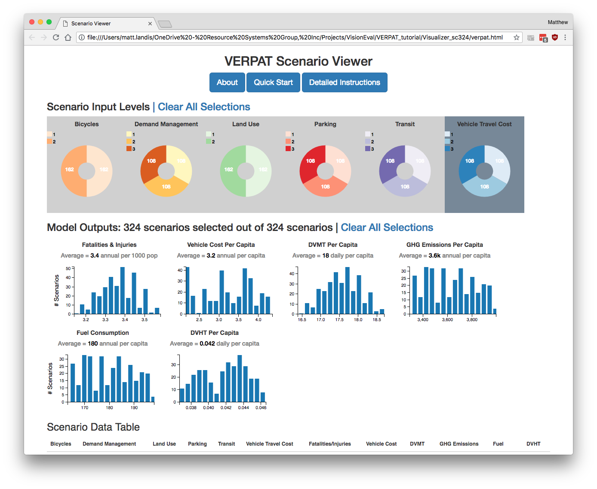

A large number of performance metrics are produced during the run of the RPAT model, including environment and energy impacts, financial and economic impacts, and community impacts.

Performance metrics are calculated by the [ReportRPATMetrics module](https://github.com/visioneval/VisionEval/blob/master/sources/modules/VEReports/R/ReportRPATMetrics.R), located in the  [VEReports](https://github.com/visioneval/VisionEval/tree/master/sources/modules/VEReports) package.

The full list of outputs available is shown [here](https://github.com/visioneval/VisionEval/wiki/VERPAT-Modules-and-Outputs#module-outputs-18) and is as follows:

  1. EmissionsMetric: The amount of greenhouse gas emissions per day by place-types
  2. FuelMetric: The amount of fuel consumed per day by place-types
  3. CostsMetric: The annual traveler cost (fuel + charges)
  4. FuelGallonsMetric: Average daily fuel consumption in gallons after policy
  5. FuelCo2eMetric: Average daily Co2 equivalent greenhouse gas emissions after policy
  6. FutureCostPerMileMetric: Total fuel cost per mile after policy
  7. TotalCostMetric: Total fuel cost after policy
  8. RailPowerMetric: Annual power consumption by rail
  9. TruckFuelMetric: Annual truck fuel consumption
  10. BusFuelMetric: Annual bus fuel consumption
  11. TruckCo2eMetric: Annual greenhouse gas emissions by truck
  12. BusCo2eMetric: Annual greenhouse gas emissions by bus
  13. RailCo2eMetric: Annual greenhouse gas emissions by rail
  14. HighwayCostMetric: Regional highway infrastructure costs
  15. TransitCapCostMetric: Regional transit infrastructure costs
  16. TransitOpCostMetric: Regional transit operating costs
  17. TransitRevenueMetric: Annual fare revenue
  18. FatalIncidentMetric: Number of fatal incidents
  19. InjuryIncidentMetric: Number of incidents with injuries
  20. PropertyDamageMetric: Amount of incidents with property damage
  21. TruckConsumptionMetric: Annual truck fuel consumption by fuel type
  22. BusConsumptionMetric: Annual bus fuel consumption by fuel type

For simplicity, six key metrics are calculated from multiple scenario runs and are shown on the Scenario Viewer output page:

  + Fatalities & Injuries:  annual traffic fatalities and injuries per 1000 persons
  + Vehicle Cost Per Capita: average annual cost for owning and operating vehicles per person
  + DVMT Per Capita:  average daily vehicle miles traveled per person
  + GHG Emissions Per Capita: average annual metric tons of greenhouse gas emissions per person
  + Fuel Consumption: average annual gallons of gasoline and other fuels consumed per person
  + DVHT Per Capita: average daily vehicle hours of travel per person
  
Each one is displayed as a histogram of the number of scenarios.

More detail on how to view and select results is described in [Multiple Scenarios](Multiple_Scenarios.md.

[Overview](Main.md)
