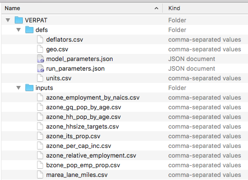
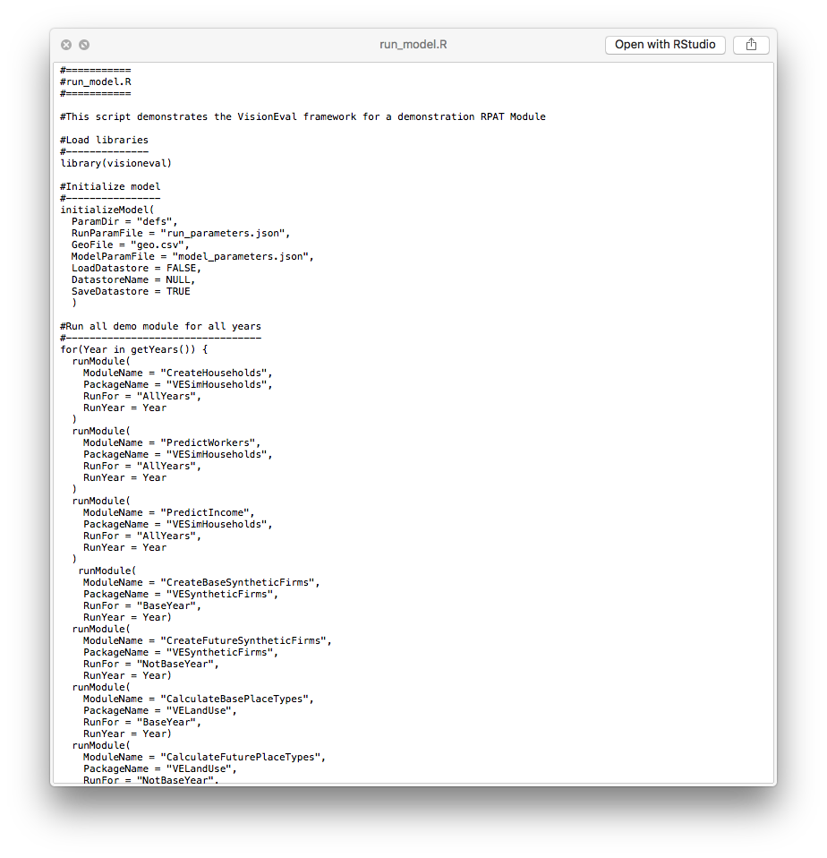
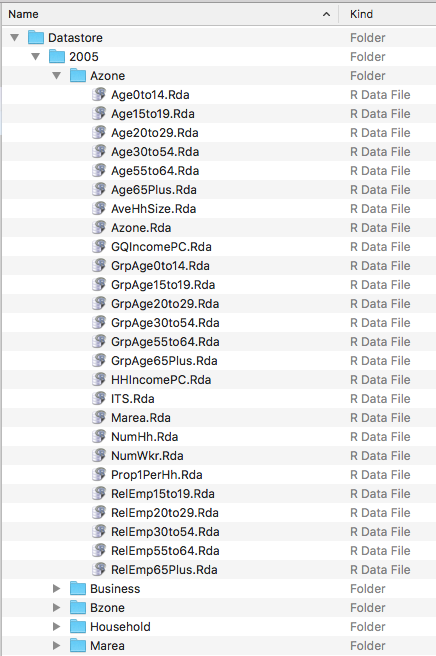
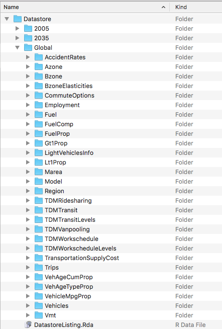

This section describes the installation and usage of VERPAT.

## Installation of VisionEval and VERPAT

VERPAT and the VisionEval framework are implemented in R, a statistical programming language and environment.  Both R and VERPAT are open source and freely available.  The installation of VERPAT is a two-step process.

1. Install R
2. Install VisionEval and VERPAT

These are described in [[Getting Started: Installation and Setup | Getting-Started#installation-and-setup]].  

## Running the VERPAT model

Once VisionEval and VERPAT have been installed, a directory with sample data for Multnomah County, Oregon will be present at `../VisionEval/sources/models/VERPAT`. (Note `..` refers to the parent directory of the installation directory). 

The `VERPAT` directory serves the dual purposes of providing sample data and serving as a template for local modification to other locations. 

It contains two subdirectories and several files:

The `defs` directory contains five [[model definition files | VERPAT-Inputs-and-Parameters#model-definition-files]], also described in the [Model System Design document](https://github.com/visioneval/VisionEval/blob/master/api/model_system_design.md#61-model-directory-structure).  These contain settings that define the model run.

The `inputs` directory contains a number of CSV and JSON files that provide inputs for the modules.  Each module specifies what input files it needs.  These are described in [[Input Files | VERPAT-Inputs-and-Parameters#input-files]] and in the [Model System Design document](https://github.com/visioneval/VisionEval/blob/master/api/model_system_design.md#64-model-inputs).  

To change the conditions in the model, these input files are modified (see [Modifying the scenario](#modifying-the-scenario)). 

The `run_model.R` file is described in the [Model System Design document](https://github.com/visioneval/VisionEval/blob/master/api/model_system_design.md#5-model-system-layers) and consists of calls to the modules that make up the model. 

To run this file in R, see instructions at [[Getting Started: Running VE Models | Getting-Started#running-ve-models]].  That page describes running VERPAT via both the [R console](https://github.com/visioneval/VisionEval/wiki/Getting-Started#running-verpat-or-verspm-from-within-r) and using [VEGUI](https://github.com/visioneval/VisionEval/wiki/Getting-Started#running-vegui-from-github-to-run-verpat-or-verspm).   

The remaining files in the directory are `README.md`, a brief text file with a link to [[Getting Started]], and `VERPAT.Rproj`, a file for use with RStudio (a text editor and integrated development environment for R).

### Modifying the scenario

As described above, the `VisionEval/sources/models/VERPAT` directory contains sample input files for Multnomah County, Oregon.  These can be modified or replaced to investigate the impacts of policy changes or to model a different region.  

To modify a scenario, the appropriate input files are edited.  For example, to increase bicycle usage, the file [`inputs/region_light_vehicles.csv`](https://github.com/visioneval/VisionEval/wiki/VERPAT-Inputs-and-Parameters#region_light_vehiclescsv) would be modified in Excel, LibreOffice, or a text editor to change the `DataValue` of `TargetProp` from 0.2 to 0.4:

The required input files are described in detail in the [Model System Design document](https://github.com/visioneval/VisionEval/blob/master/api/model_system_design.md#6-model-layer-description).  

### Model output

The output data are contained in a *datastore*, which can be either an HDF5 file or a directory of RData files.  The datastore is described in detail in the [Model System Design document](https://github.com/visioneval/VisionEval/blob/master/api/model_system_design.md#65-the-datastore).  

In this case (below), the datastore is a directory of RData files. It has a hierarchical structure, with directories for each year that the model is run, plus a `Global` folder for output that is not year specific.  

The year directories contain subdirectories for each geographic level, each containing RData files.

The `Global` directory contains data that do not vary by model run year such as model parameters or geographic tables.

Each of the Rda files contains a single R vector called `Dataset` with attributes describing the data.

### Exporting Data to CSV

At the end of the model run, a subset of the data are automatically exported from the Datastore to a set of CSV files.  These files will be placed in the model directory in a subfolder called `outputs`.   To export data manually, the script located in `../sources/models/export_output_to_csv.R` can be modified to suit.

[Overview](Main.md)
