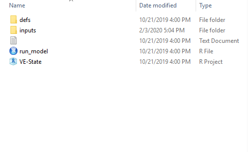

# VESTATE Software Execution
----

This section describes the installation and use of VESTATE.

## Installation of VisionEval and VESTATE

VESTATE and VisionEval framework are implemented in R, a statistical programming language and environment.  Both R and VisionEval are open source and freely available. For running VESTATE you need to follow these steps:

1. [Install R](https://cran.r-project.org/) (users are encouraged to also install [RStudio](https://www.rstudio.com/products/rstudio/download/), a free and open-source integrated development environment for R)
2. [Install VisionEval](https://visioneval.org/category/download.html.)
3. Run VESTATE

The VisionEval installer is available [here](https://download.visioneval.org/). Follow the instructions on this page carefully to install the Visioneval on your system.

## Running VESTATE Base Scenario

### Preparing inputs
Once VisionEval and VESTATE have been installed, a directory with sample data will be available at `../models/VESTATE/`. (Note `..` refers to the parent directory of the unzipped installer file). 

The `VESTATE` directory serves the dual purposes of providing sample data and serving as a template for local modification to other locations. 

The `../models/VESTATE/` directory contains sample input files for the Rogue Valley region in Oregon. These inputs can be modified or replaced to investigate the impacts of policy changes or to model a different region.  The folder contains multiple files and subfolders:



`run_model.R` is the core script for running the model. It consists of calls to the modules that make up the model. The user may modify the script to call the  desired modules.


The `defs` directory contains five model definition files which is introduced in [Model Definition Files](Inputs_and_Parameters.md)

The `inputs` directory contains a number of `CSV` and `JSON` files that provide inputs for the modules. Each module specifies what input files it needs. If you would like to know 
the description of each input file and how you can change those files for your desired testing see [Inputs_and_Parameters](Inputs_and_Parameters.md/#input-files)


There is complete set of test data for RVMPO which you will find out in the Test1 folder. You can use those data to test VERRSPM run.

 the `../models/VESTATE` directory contains sample input files for state of Oregon.  These can be modified or replaced to investigate the impacts of policy changes or to model a different state.  

To modify a scenario, the appropriate input files are edited.  For example, to change the flat rate tax of vehicles for future [`azone_hh_veh_own_taxes.csv`](link) would be modified in Excel, LibreOffice, or a text editor to change the `VehOwnFlatRateFee` of year 2038


### Running the Model

There are multiple ways to run VisionEval models. VisionEval models can be run via the command line or via the GUI, and can be run for one scenario or multiple scenarios in parallel. Results can be viewed in tabular form or with the interactive VEScenarioViewer.

#### Running VESTATE from the R command line

1. Start R (or Rstudio) and make sure your directory is set to the installer folder
2. Run the following commands:

```
source("Install-VisionEval.R")
load("RunVisionEval.Rdata")
vestate()
```

By defult this will run the model in `../models/VESTATE/` directory. It will be dicussed how to run scnerios in another folder later in this tutorial.

After running the scipt you will see how the modules will be running in order.

#### Running VESTATE from GUI

1. Start R (or Rstudio) and make sure your directory is set to the installer folder
2. Run the following commands:

```
source("Install-VisionEval.R")
load("RunVisionEval.Rdata")
vegui()
```

By defult this will run the model in `../models/VESTATE/` directory. It will be dicussed how to run scnerios in another folder later in this tutorial.

After running the script a new window will pop up: 


click the `Select Scenario run script` and choose ve-state to read the run.model script


Go to `Inputs` tab to view all the inputs.


Finally go to `Run` and click `Run Model` button to start running the model


Once run is finished output are exported to `../models/VESTATE/outputs` in 3 different zone levels


Return to [Tutorial](Main.md). 