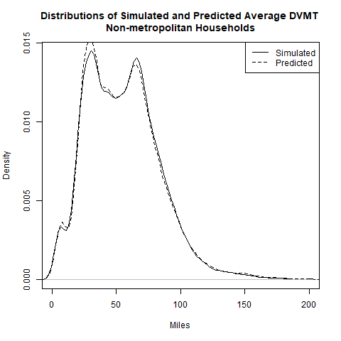

# CalculateHouseholdDvmt Module
### November 12, 2018

 This script is the DVMT model estimation from VEHouseholdTravel Package. This is required to get the DVMT percentiles

The estimation of household DVMT models is a five-step process. In the first step, binomial logit models are estimated to predict the likelihood that there is no household DVMT on the travel day. Separate models are estimated for metropolitan and non-metropolitan households. In the second step, linear regression models are estimated which predict power-transformed DVMT for households that have DVMT on the travel day. The DVMT power transformation factor is calculated to normalize the distribution. The linear models and power transformations are estimated separately for metropolitan and non-metropolitan households. In the third step, dispersion factors are estimated for adding variance to the linear models so that the variance of the results equals the observed variance. In the fourth step, the binomial and linear models are applied stochastically to simulate day-to-day variation in DVMT over 1000 days. These simulated results are used to calculate average DVMT and DVMT quantiles (at 5% intervals and 99%) for each household. In the fifth step, linear models are estimated to predict the simulated average DVMT. As with the other models, separate models are estimated for metropolitan and non-metropolitan households. Finally, linear models are estimated to predict the DVMT for each quantile from the average DVMT. Following is a more detailed presentation of these models including model estimation statistics and explanatory tables and figures. More model estimation statistics are included in the 'EstimationStats' component of the 'DvmtModel_ls' object stored in the 'DvmtModel_ls.Rda' file in the 'data' directory of this package.

The binary logit model for predicting the probability that non-metropolitan area households had no DVMT on the travel survey day includes the following terms:

* Drivers - number of drivers in the household

* LogInc - natural log of annual household income ($2001)

* Hbppopdn - density (pop/sq mi) of the census block group

* NumVeh - number of vehicles owned or leased by the household

* ZeroVeh - dummy variable identifying whether the household has no vehicles

* Workers - number of workers in the household

Following are the summary statistics for the non-metropolitan household zero DVMT binary logit model:

```

Call:
glm(formula = makeFormula("ZeroDvmt", IndepVars_), family = binomial, 
    data = TestHh_df)

Deviance Residuals: 
    Min       1Q   Median       3Q      Max  
-1.8222  -0.5274  -0.3469  -0.2588   3.6247  

Coefficients:
              Estimate Std. Error z value Pr(>|z|)    
(Intercept)  2.344e+00  2.344e-01  10.000  < 2e-16 ***
Drivers     -5.394e-01  3.898e-02 -13.837  < 2e-16 ***
LogIncome   -5.930e+00  4.856e-01 -12.210  < 2e-16 ***
Hbppopdn     1.231e-05  3.961e-06   3.108  0.00188 ** 
NumVeh      -6.044e-02  2.868e-02  -2.108  0.03505 *  
ZeroVeh      1.338e+00  7.503e-02  17.838  < 2e-16 ***
Workers     -3.682e-01  2.756e-02 -13.358  < 2e-16 ***
Age0to14    -2.127e-01  2.752e-02  -7.727  1.1e-14 ***
---
Signif. codes:  0 ‘***’ 0.001 ‘**’ 0.01 ‘*’ 0.05 ‘.’ 0.1 ‘ ’ 1

(Dispersion parameter for binomial family taken to be 1)

    Null deviance: 26172  on 35502  degrees of freedom
Residual deviance: 21915  on 35495  degrees of freedom
AIC: 21931

Number of Fisher Scoring iterations: 6

```

The following table shows correlations between the independent variables of the non-metropolitan model.


|          | Drivers| LogIncome| Hbppopdn| NumVeh| ZeroVeh| Workers| Age0to14|
|:---------|-------:|---------:|--------:|------:|-------:|-------:|--------:|
|Drivers   |    1.00|      0.46|    -0.12|   0.67|   -0.37|    0.65|     0.15|
|LogIncome |    0.46|      1.00|    -0.06|   0.45|   -0.31|    0.46|     0.13|
|Hbppopdn  |   -0.12|     -0.06|     1.00|  -0.18|    0.13|   -0.04|    -0.03|
|NumVeh    |    0.67|      0.45|    -0.18|   1.00|   -0.38|    0.52|     0.11|
|ZeroVeh   |   -0.37|     -0.31|     0.13|  -0.38|    1.00|   -0.19|    -0.07|
|Workers   |    0.65|      0.46|    -0.04|   0.52|   -0.19|    1.00|     0.23|
|Age0to14  |    0.15|      0.13|    -0.03|   0.11|   -0.07|    0.23|     1.00|

The metropolitan household zero DVMT binary logit model includes the following terms in addition to the terms in the non-metropolitan household model:

* BusEqRevMiPC - urbanized area per capita bus-equivalent transit revenue miles

* UrbanDev - whether the block group is characterized by urban mixed-use development

Following are the summary statistics for the metropolitan household zero DVMT binary logit model:

```

Call:
glm(formula = makeFormula("ZeroDvmt", IndepVars_), family = binomial, 
    data = TestHh_df)

Deviance Residuals: 
    Min       1Q   Median       3Q      Max  
-2.3880  -0.5236  -0.3414  -0.2329   3.2925  

Coefficients:
               Estimate Std. Error z value Pr(>|z|)    
(Intercept)   7.880e-01  3.045e-01   2.588  0.00966 ** 
Drivers      -5.618e-01  5.050e-02 -11.123  < 2e-16 ***
LogIncome    -3.435e+00  6.192e-01  -5.547 2.90e-08 ***
Hbppopdn      3.224e-05  3.406e-06   9.465  < 2e-16 ***
BusEqRevMiPC  4.350e-03  8.135e-04   5.347 8.92e-08 ***
NumVeh       -1.307e-01  4.362e-02  -2.997  0.00272 ** 
ZeroVeh       1.839e+00  8.654e-02  21.247  < 2e-16 ***
UrbanDev      1.533e-01  6.484e-02   2.365  0.01804 *  
Workers      -3.057e-01  3.619e-02  -8.447  < 2e-16 ***
Age0to14     -1.749e-01  3.155e-02  -5.545 2.95e-08 ***
---
Signif. codes:  0 ‘***’ 0.001 ‘**’ 0.01 ‘*’ 0.05 ‘.’ 0.1 ‘ ’ 1

(Dispersion parameter for binomial family taken to be 1)

    Null deviance: 17847  on 19630  degrees of freedom
Residual deviance: 12608  on 19621  degrees of freedom
AIC: 12628

Number of Fisher Scoring iterations: 6

```

The following table shows correlations between the independent variables of the metropolitan model.


|             | Drivers| LogIncome| Hbppopdn| BusEqRevMiPC| NumVeh| ZeroVeh| UrbanDev| Workers| Age0to14|
|:------------|-------:|---------:|--------:|------------:|------:|-------:|--------:|-------:|--------:|
|Drivers      |    1.00|      0.51|    -0.30|        -0.09|   0.74|   -0.48|    -0.26|    0.64|     0.14|
|LogIncome    |    0.51|      1.00|    -0.21|         0.05|   0.50|   -0.39|    -0.21|    0.47|     0.11|
|Hbppopdn     |   -0.30|     -0.21|     1.00|         0.33|  -0.39|    0.40|     0.67|   -0.10|    -0.05|
|BusEqRevMiPC |   -0.09|      0.05|     0.33|         1.00|  -0.14|    0.17|     0.19|    0.00|     0.01|
|NumVeh       |    0.74|      0.50|    -0.39|        -0.14|   1.00|   -0.54|    -0.33|    0.52|     0.10|
|ZeroVeh      |   -0.48|     -0.39|     0.40|         0.17|  -0.54|    1.00|     0.33|   -0.22|    -0.06|
|UrbanDev     |   -0.26|     -0.21|     0.67|         0.19|  -0.33|    0.33|     1.00|   -0.10|    -0.06|
|Workers      |    0.64|      0.47|    -0.10|         0.00|   0.52|   -0.22|    -0.10|    1.00|     0.19|
|Age0to14     |    0.14|      0.11|    -0.05|         0.01|   0.10|   -0.06|    -0.06|    0.19|     1.00|

Linear models for metropolitan and non-metropolitan area households were estimated to predict the power-transformed household travel day DVMT. Power transformation is necessary because the distribution of household travel day DVMT is skewed with a long right-hand tail. The values of the transforming powers were calculated separately for metropolitan and non-metropolitan households. The transforming power was found which minimizes the skewness of the distribution. Skewness was measured using the skewness function from the e1071 package.

The non-metropolitan power transform is:

```
[1] 0.2
```

The metropolitan power transform is:

```
[1] 0.24
```

The non-metropolitan linear model of power-transformed household travel day DVMT includes the following terms:

* Drivers - number of drivers in the household

* LogIncome - natural log of annual household income ($2001)

* Hbppopdn - density (pop/sq mi) of the census block group

* NumVeh - number of vehicles owned or leased by the household

* ZeroVeh - dummy variable identifying whether the household has no vehicles

* OneVeh - dummy variable identifying whether the household has only one vehicle

* Workers - number of workers in the household

* Age0to14 - number of persons in the 0 - 14 age group in the household

Following are the summary statistics for non-metropolitan household power-transformed travel day DVMT linear model:

```

Call:
lm(formula = makeFormula("PowDvmt", IndepVars_), data = TestHh_df)

Residuals:
     Min       1Q   Median       3Q      Max 
-2.00299 -0.27032 -0.00136  0.26951  1.78597 

Coefficients:
              Estimate Std. Error t value Pr(>|t|)    
(Intercept)  1.282e+00  3.881e-02  33.046  < 2e-16 ***
Drivers      8.429e-02  4.959e-03  16.998  < 2e-16 ***
LogIncome    1.003e+00  7.219e-02  13.897  < 2e-16 ***
Hbppopdn    -1.484e-05  6.236e-07 -23.794  < 2e-16 ***
NumVeh       3.601e-02  3.724e-03   9.669  < 2e-16 ***
ZeroVeh     -8.059e-02  2.128e-02  -3.787 0.000153 ***
OneVeh      -5.771e-02  7.773e-03  -7.424 1.16e-13 ***
Workers      6.212e-02  3.459e-03  17.961  < 2e-16 ***
Age0to14     5.716e-02  2.631e-03  21.724  < 2e-16 ***
---
Signif. codes:  0 ‘***’ 0.001 ‘**’ 0.01 ‘*’ 0.05 ‘.’ 0.1 ‘ ’ 1

Residual standard error: 0.4157 on 31204 degrees of freedom
Multiple R-squared:  0.1967,	Adjusted R-squared:  0.1965 
F-statistic:   955 on 8 and 31204 DF,  p-value: < 2.2e-16

```

The following table shows correlations between the independent variables of the non-metropolitan model.


|          | Drivers| LogIncome| Hbppopdn| NumVeh| ZeroVeh| OneVeh| Workers| Age0to14|
|:---------|-------:|---------:|--------:|------:|-------:|------:|-------:|--------:|
|Drivers   |    1.00|      0.40|    -0.09|   0.64|   -0.23|  -0.53|    0.64|     0.13|
|LogIncome |    0.40|      1.00|    -0.04|   0.40|   -0.19|  -0.39|    0.42|     0.11|
|Hbppopdn  |   -0.09|     -0.04|     1.00|  -0.16|    0.07|   0.14|   -0.03|    -0.02|
|NumVeh    |    0.64|      0.40|    -0.16|   1.00|   -0.26|  -0.64|    0.50|     0.08|
|ZeroVeh   |   -0.23|     -0.19|     0.07|  -0.26|    1.00|  -0.08|   -0.11|    -0.04|
|OneVeh    |   -0.53|     -0.39|     0.14|  -0.64|   -0.08|   1.00|   -0.42|    -0.16|
|Workers   |    0.64|      0.42|    -0.03|   0.50|   -0.11|  -0.42|    1.00|     0.21|
|Age0to14  |    0.13|      0.11|    -0.02|   0.08|   -0.04|  -0.16|    0.21|     1.00|

The metropolitan linear model of power-transformed household travel day DVMT includes the following terms in addition to the terms included in the non-metropolitan household model:

* UrbanDev - whether the block group is urban mixed-use

* FwyLaneMiPC - ratio of freeway lane miles to urbanized area population

Following are the summary statistics for the metropolitan household power-transformed travel day DVMT linear model:

```

Call:
lm(formula = makeFormula("PowDvmt", IndepVars_), data = TestHh_df)

Residuals:
     Min       1Q   Median       3Q      Max 
-2.00573 -0.36413  0.00919  0.36134  2.38271 

Coefficients:
              Estimate Std. Error t value Pr(>|t|)    
(Intercept)  1.085e+00  7.540e-02  14.384  < 2e-16 ***
Drivers      8.663e-02  9.165e-03   9.453  < 2e-16 ***
LogIncome    1.849e+00  1.311e-01  14.106  < 2e-16 ***
Hbppopdn    -9.097e-06  7.838e-07 -11.606  < 2e-16 ***
NumVeh       4.260e-02  7.757e-03   5.491 4.06e-08 ***
ZeroVeh     -1.269e-01  3.393e-02  -3.739 0.000186 ***
OneVeh      -8.417e-02  1.458e-02  -5.772 7.98e-09 ***
Workers      1.208e-01  6.443e-03  18.756  < 2e-16 ***
UrbanDev    -6.023e-02  1.352e-02  -4.456 8.41e-06 ***
Age0to14     7.250e-02  4.743e-03  15.283  < 2e-16 ***
FwyLaneMiPC  7.554e+01  2.372e+01   3.184 0.001453 ** 
---
Signif. codes:  0 ‘***’ 0.001 ‘**’ 0.01 ‘*’ 0.05 ‘.’ 0.1 ‘ ’ 1

Residual standard error: 0.5501 on 16299 degrees of freedom
Multiple R-squared:  0.2402,	Adjusted R-squared:  0.2397 
F-statistic: 515.3 on 10 and 16299 DF,  p-value: < 2.2e-16

```

The following table shows correlations between the independent variables of the metropolitan model.


|            | Drivers| LogIncome| Hbppopdn| NumVeh| ZeroVeh| OneVeh| Workers| UrbanDev| Age0to14| FwyLaneMiPC|
|:-----------|-------:|---------:|--------:|------:|-------:|------:|-------:|--------:|--------:|-----------:|
|Drivers     |    1.00|      0.42|    -0.18|   0.69|   -0.24|  -0.54|    0.64|    -0.15|     0.11|        0.01|
|LogIncome   |    0.42|      1.00|    -0.13|   0.42|   -0.23|  -0.39|    0.43|    -0.13|     0.10|       -0.05|
|Hbppopdn    |   -0.18|     -0.13|     1.00|  -0.26|    0.18|   0.22|   -0.05|     0.62|    -0.04|       -0.20|
|NumVeh      |    0.69|      0.42|    -0.26|   1.00|   -0.32|  -0.65|    0.50|    -0.21|     0.07|        0.06|
|ZeroVeh     |   -0.24|     -0.23|     0.18|  -0.32|    1.00|  -0.11|   -0.11|     0.15|    -0.02|       -0.03|
|OneVeh      |   -0.54|     -0.39|     0.22|  -0.65|   -0.11|   1.00|   -0.41|     0.18|    -0.16|       -0.04|
|Workers     |    0.64|      0.43|    -0.05|   0.50|   -0.11|  -0.41|    1.00|    -0.05|     0.16|        0.00|
|UrbanDev    |   -0.15|     -0.13|     0.62|  -0.21|    0.15|   0.18|   -0.05|     1.00|    -0.05|       -0.14|
|Age0to14    |    0.11|      0.10|    -0.04|   0.07|   -0.02|  -0.16|    0.16|    -0.05|     1.00|       -0.02|
|FwyLaneMiPC |    0.01|     -0.05|    -0.20|   0.06|   -0.03|  -0.04|    0.00|    -0.14|    -0.02|        1.00|

The models include dummy variables identifying zero-vehicle and one-vehicle households to better capture the observed non-linear relationship between DVMT and vehicle ownership at low levels of vehicle ownership.

The linear model (metropolitan and non-metropolitan) doesn't reproduce the observed variability in household DVMT and so is used to predict the mean values of a normal sampling distribution from which a DVMT value is drawn. The value of the standard deviation of the sampling distribution is estimated using a binary search algorithm so that the observed variation of household DVMT is matched. This is done separately for the metropolitan and non-metropolitan households.

The binomial and linear models are run stochastically in combination 1000 times for each of the households in the estimation dataset to simulate 1000 travel days. The binomial model with sampling is used to determine whether the household has any DVMT on the simulated travel day and the linear model with sampling determines how much DVMT. From these simulated data, the average DVMT and DVMT quantiles (at 5% intervals and 99%) are calculated for each household.

Linear models are estimated to predict power-transformed simulated average household DVMT for non-metropolitan and metropolitan households. The power transformation factors are those described above. The non-metropolitan linear model of power-transformed household average DVMT includes the following terms:

* Drivers - number of drivers in the household

* LogIncome - natural log of annual household income ($2001)

* Hbppopdn - density (pop/sq mi) of the census block group

* NumVeh - number of vehicles owned or leased by the household

* ZeroVeh - dummy variable identifying whether the household has no vehicles

* OneVeh - dummy variable identifying whether the household has only one vehicle

* Workers - number of workers in the household

* Age0to14 - number of persons in the 0 - 14 age group in the household

Following are the summary statistics for non-metropolitan household power-transformed simulated average DVMT linear model:

```

Call:
lm(formula = makeFormula("PowDvmt", IndepVars_), data = TestHh_df)

Residuals:
      Min        1Q    Median        3Q       Max 
-0.181251 -0.012334  0.000368  0.012646  0.205094 

Coefficients:
              Estimate Std. Error t value Pr(>|t|)    
(Intercept)  1.213e+00  1.931e-03   628.1   <2e-16 ***
Drivers      9.806e-02  2.537e-04   386.5   <2e-16 ***
LogIncome    1.285e+00  3.595e-03   357.5   <2e-16 ***
Hbppopdn    -1.386e-05  3.040e-08  -455.9   <2e-16 ***
NumVeh       2.998e-02  1.952e-04   153.5   <2e-16 ***
ZeroVeh     -3.210e-01  8.304e-04  -386.6   <2e-16 ***
OneVeh      -6.240e-02  4.005e-04  -155.8   <2e-16 ***
Workers      6.984e-02  1.782e-04   391.9   <2e-16 ***
Age0to14     6.052e-02  1.391e-04   435.2   <2e-16 ***
---
Signif. codes:  0 ‘***’ 0.001 ‘**’ 0.01 ‘*’ 0.05 ‘.’ 0.1 ‘ ’ 1

Residual standard error: 0.02269 on 35494 degrees of freedom
Multiple R-squared:  0.9923,	Adjusted R-squared:  0.9923 
F-statistic: 5.744e+05 on 8 and 35494 DF,  p-value: < 2.2e-16

```

The mean values of the survey DVMT, simulated average DVMT, and predicted average DVMT for the non-metropolitan households are close to one another.


|                       |    Miles|
|:----------------------|--------:|
|Survey Day DVMT        | 55.44947|
|Simulated Average DVMT | 55.50157|
|Predicted Average DVMT | 55.56454|

The metropolitan linear model of household power-transformed simulated average DVMT includes the following terms in addition to the terms included in the non-metropolitan household model:

* BusEqRevMiPC - urbanized area per capita bus-equivalent transit revenue miles

* UrbanDev - whether the block group is urban mixed-use

* FwyLaneMiPC - ratio of freeway lane miles to urbanized area population

Following are the summary statistics for metropolitan household power-transformed simulated average DVMT linear model:

```

Call:
lm(formula = makeFormula("PowDvmt", IndepVars_), data = TestHh_df)

Residuals:
     Min       1Q   Median       3Q      Max 
-0.23390 -0.01773 -0.00035  0.01763  0.32630 

Coefficients:
               Estimate Std. Error t value Pr(>|t|)    
(Intercept)   1.106e+00  4.337e-03  254.97   <2e-16 ***
Drivers       1.197e-01  5.477e-04  218.61   <2e-16 ***
LogIncome     2.003e+00  7.523e-03  266.21   <2e-16 ***
Hbppopdn     -1.147e-05  4.455e-08 -257.39   <2e-16 ***
NumVeh        3.000e-02  4.956e-04   60.54   <2e-16 ***
ZeroVeh      -5.899e-01  1.594e-03 -370.13   <2e-16 ***
OneVeh       -8.809e-02  9.158e-04  -96.19   <2e-16 ***
Workers       1.265e-01  3.904e-04  324.09   <2e-16 ***
UrbanDev     -6.446e-02  8.062e-04  -79.96   <2e-16 ***
Age0to14      7.726e-02  2.962e-04  260.88   <2e-16 ***
BusEqRevMiPC -3.585e-04  1.037e-05  -34.57   <2e-16 ***
FwyLaneMiPC   6.580e+01  1.716e+00   38.34   <2e-16 ***
---
Signif. codes:  0 ‘***’ 0.001 ‘**’ 0.01 ‘*’ 0.05 ‘.’ 0.1 ‘ ’ 1

Residual standard error: 0.03656 on 19619 degrees of freedom
Multiple R-squared:  0.9941,	Adjusted R-squared:  0.9941 
F-statistic: 3.015e+05 on 11 and 19619 DF,  p-value: < 2.2e-16

```

The mean values of the survey DVMT, simulated average DVMT, and predicted average DVMT for the metropolitan households are close to one another.


|                       |    Miles|
|:----------------------|--------:|
|Survey Day DVMT        | 53.45152|
|Simulated Average DVMT | 53.47102|
|Predicted Average DVMT | 53.59285|

The following charts compare the distributions of the household average DVMT for survey households predicted by the linear model with the distributions simulated for the survey households by stochastically applying the binomial and linear models of survey day DVMT. This shows that the linear model of average household DVMT can be substituted for the stochastic simulation. This enables the module to run much faster than would be the case if average DVMT had to be simulated.




Linear models are also estimated to predict each simulated DVMT quantile at 5% intervals and 99%. Models are estimated as 3rd degree polynomials of average DVMT. Models are estimated for each quantile separately for metropolitan and non-metropolitan households. Following are the summary statistics for the estimation of the 95th percentile DVMT model for non-metropolitan households:

```

Call:
lm(formula = PctlDvmt ~ Dvmt + DvmtSq + DvmtCu, data = TestHh_df)

Residuals:
    Min      1Q  Median      3Q     Max 
-34.954  -4.202  -0.068   4.150  73.317 

Coefficients:
              Estimate Std. Error t value Pr(>|t|)    
(Intercept)  2.286e+01  1.180e-01  193.69   <2e-16 ***
Dvmt         2.728e+00  3.670e-03  743.12   <2e-16 ***
DvmtSq      -2.517e-03  2.877e-05  -87.48   <2e-16 ***
DvmtCu       1.885e-06  2.868e-08   65.71   <2e-16 ***
---
Signif. codes:  0 ‘***’ 0.001 ‘**’ 0.01 ‘*’ 0.05 ‘.’ 0.1 ‘ ’ 1

Residual standard error: 6.758 on 35499 degrees of freedom
Multiple R-squared:  0.9909,	Adjusted R-squared:  0.9909 
F-statistic: 1.282e+06 on 3 and 35499 DF,  p-value: < 2.2e-16

```

Following are the summary statistics for the estimation of the 95th percentile DVMT model for metropolitan households:

```

Call:
lm(formula = PctlDvmt ~ Dvmt + DvmtSq + DvmtCu, data = TestHh_df)

Residuals:
    Min      1Q  Median      3Q     Max 
-60.171  -3.933   0.076   3.829  30.712 

Coefficients:
              Estimate Std. Error t value Pr(>|t|)    
(Intercept)  1.544e+01  1.512e-01  102.09   <2e-16 ***
Dvmt         3.015e+00  7.359e-03  409.72   <2e-16 ***
DvmtSq      -8.415e-03  9.972e-05  -84.39   <2e-16 ***
DvmtCu       2.142e-05  3.728e-07   57.46   <2e-16 ***
---
Signif. codes:  0 ‘***’ 0.001 ‘**’ 0.01 ‘*’ 0.05 ‘.’ 0.1 ‘ ’ 1

Residual standard error: 6.463 on 19627 degrees of freedom
Multiple R-squared:  0.9922,	Adjusted R-squared:  0.9922 
F-statistic: 8.358e+05 on 3 and 19627 DF,  p-value: < 2.2e-16

```

## How the Module Works

This module is run at the region level. It also is a callable module and is called by several other modules.

The metropolitan and non-metropolitan area linear models are used to compute power transformed average DVMT for each metropolitan (urbanized area) and non-metropolitan area household respectively. The inverse powers of the power transform factors are then applied to calculate average DVMT. To eliminate unreasonable predictions, average household DVMT is capped at the 99th percentile value for average DVMT of households in the region.

The module also computes the 95th percentile DVMT for each household from the household average DVMT using the 95th percentile model.

Finally, the module sums up the total DVMT of households located in the metropolitan (urbanized) area and located in the non-metropolitan (rural) area of each Marea.


## User Inputs
This module has no user input requirements.

## Datasets Used by the Module
This module uses no datasets that are in the datastore.

## Datasets Produced by the Module
This module produces no datasets to store in the datastore.
